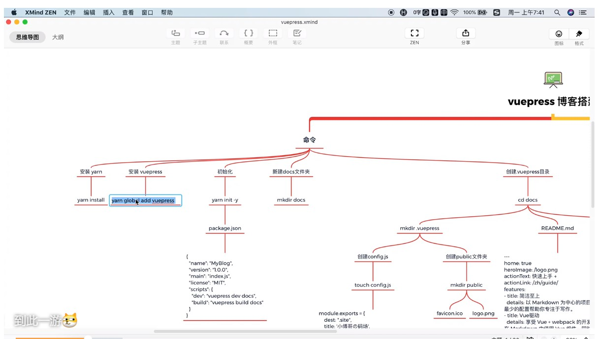
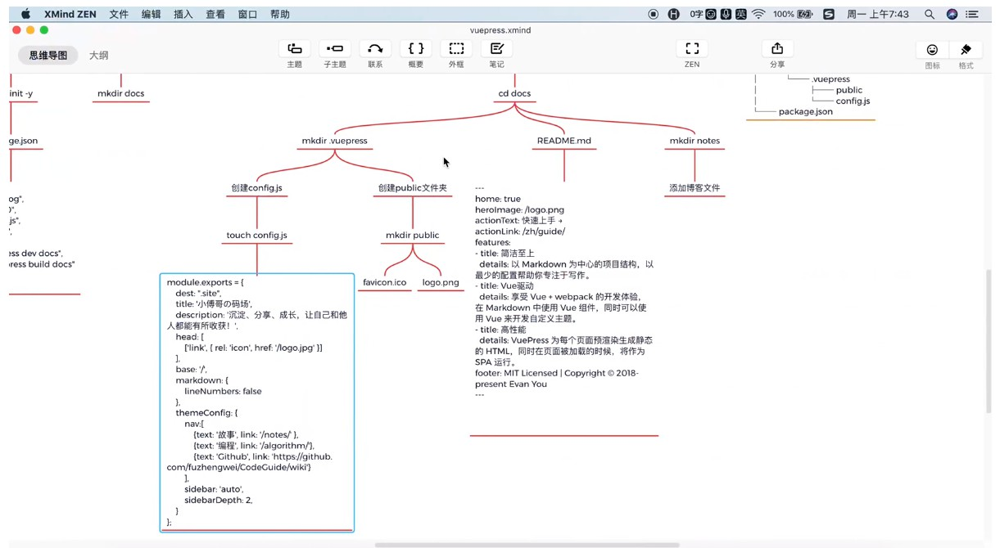
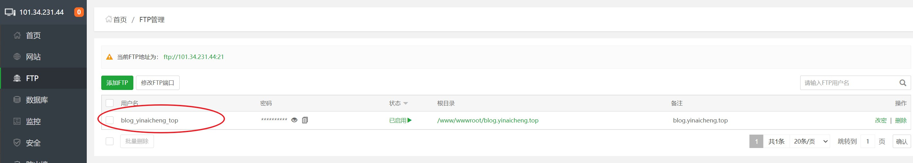
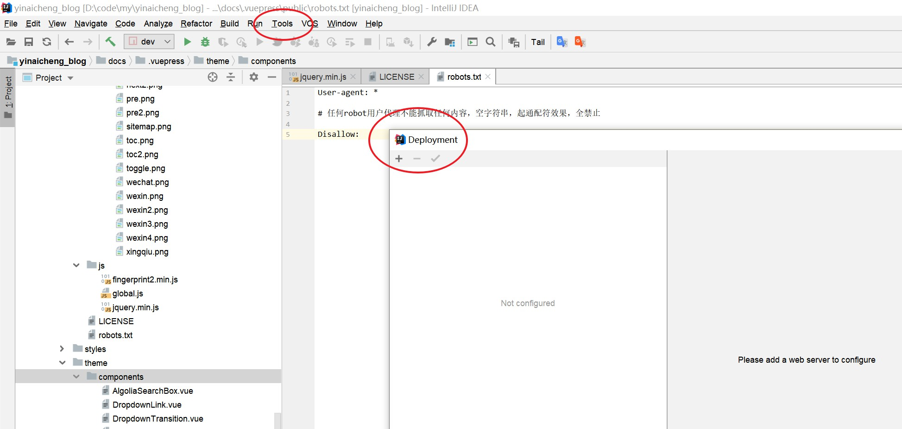
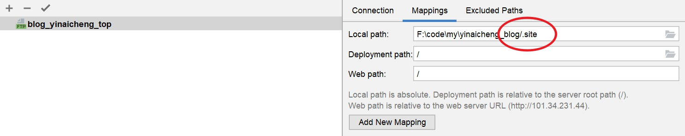
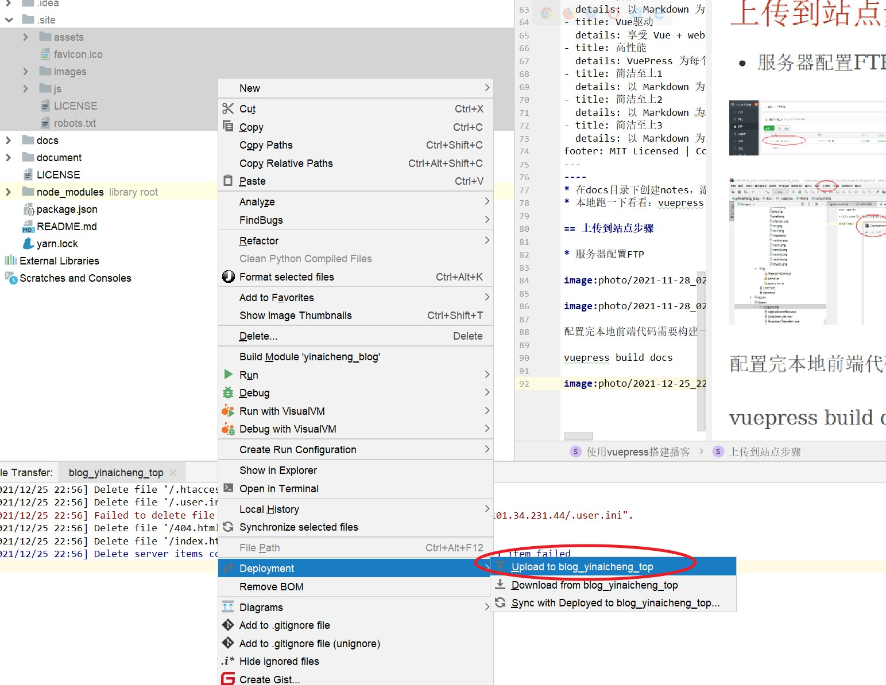

= 使用vuepress搭建播客

== 搭建步骤

* 安装yarn
** nvm use 16.13.1
** npm install --global yarn
** yarn install
* 安装vuepress：yarn global add vuepress
* yarn add -D vuepress
* 初始化：yarn init -y
* 获取yarn全局安装包路径：yarn global bin，并且添加到系统环境变量中
* 在package.json里添加内容，构建博客和运行博客需要这两条
[source,text]
----
"scripts":{
    "dev":"vuepress dev docs",
    "build":"vuepress build docs"
}
----
* 创建docs文件夹：mkdir docs
* 进入docs文件夹：cd docs
* 创建.vuepress：mkdir .vuepress，放置一些配置信息和公共内容
* 在.vuepress里面创建config.js
[source,javascript]
----
module.export={
  dest:"yinaicheng_site",
  title:'印爱成的IT技术分享',
  description:'沉淀、分享、成长，让自己和他人都能有所收获!',
  head:[
    ['link',{rel:'icon',href:'/logo.jpg'}]
  ],
  base:'/',
  markdown:{
    lineNumbers:false
  },
  themeConfig:{
    nav:[
      {text:'故事',link:'/notes'},
      {text:'编程',link:'/algorithm'},
      {text:'Github',link:'https://github.com/fuzhengwei/CodeGuide/wiki'}
    ],
    sidebar:'auto',
    sidebarDepth:2
  }
};
----
* 创建public文件夹，和config.js在同一个目录
* 准备两个文件信息，粘贴进来：logo.png favicon.ico，一个是图片，一个是浏览器上的小图标
* 在docs目录下创建README.md
[source,text]
----
---
home: true
heroImage: /hero.png
heroText: Hero 标题
tagline: Hero 副标题
actionText: 快速上手 →
actionLink: /zh/guide/
features:
- title: 简洁至上
  details: 以 Markdown 为中心的项目结构，以最少的配置帮助你专注于写作。
- title: Vue驱动
  details: 享受 Vue + webpack 的开发体验，在 Markdown 中使用 Vue 组件，同时可以使用 Vue 来开发自定义主题。
- title: 高性能
  details: VuePress 为每个页面预渲染生成静态的 HTML，同时在页面被加载的时候，将作为 SPA 运行。
- title: 简洁至上1
  details: 以 Markdown 为中心的项目结构，以最少的配置帮助你专注于写作。
- title: 简洁至上2
  details: 以 Markdown 为中心的项目结构，以最少的配置帮助你专注于写作。
- title: 简洁至上3
  details: 以 Markdown 为中心的项目结构，以最少的配置帮助你专注于写作。
footer: MIT Licensed | Copyright © 2019-present lnden
---
----
* 在docs目录下创建notes，添加些文件
* 本地跑一下看看：vuepress dev docs 或者 npx vuepress dev docs

== 上传到站点步骤

* 服务器配置FTP

配置完本地前端代码需要构建一下

vuepress build docs

选中进行一个上传操作

以后不用手动上传了

手动维护要少量成本