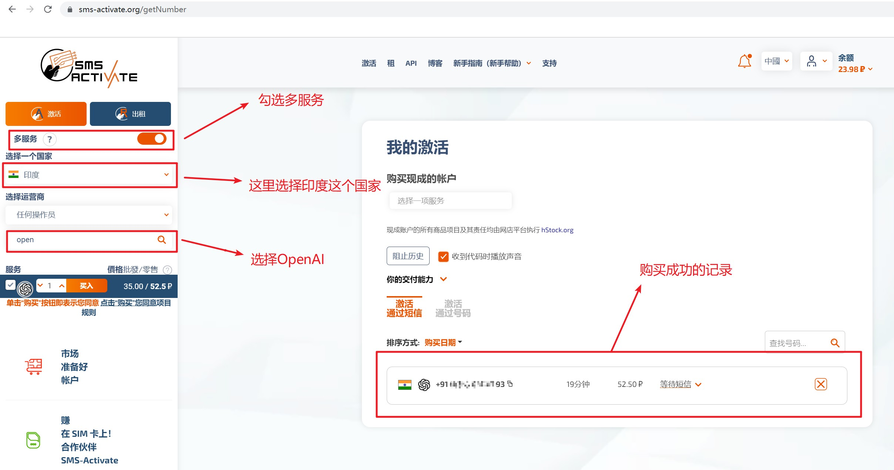

# ChatGPT使用

## 注册账号

> 使用sms-activate.org注册虚拟电话号码



1. 使用支付宝充值，最少充值1美元。
2. 购买虚拟电话号码，这个号码可以用来接收后面需要用到的短信验证码。

> 使用beta.openai.com/signup注册账号

注册过程中会让我们填写虚拟电话号码，并且收取短信验证码。如果收不到短信，系统会自动退费，可以重新购买。  
备注：使用印度的虚拟手机号码并没有收到短信验证码，使用英国的才收到，如果出现类似的问题可以多次尝试。

> chat.openai.com/auth/login

注册完成后登录，就可以和OpenAI对话了。


## API keys申请

OpenAI提供了接入API的给你，只能申请了这个API keys才能完成后续的接入动作。

访问地址：https://beta.openai.com/account/api-keys


## 接口调用

> OpenAI接口调用类

```java
import org.apache.http.HeaderElement;
import org.apache.http.HeaderElementIterator;
import org.apache.http.client.config.RequestConfig;
import org.apache.http.client.methods.CloseableHttpResponse;
import org.apache.http.client.methods.HttpPost;
import org.apache.http.config.Registry;
import org.apache.http.config.RegistryBuilder;
import org.apache.http.conn.ConnectionKeepAliveStrategy;
import org.apache.http.conn.socket.ConnectionSocketFactory;
import org.apache.http.conn.socket.PlainConnectionSocketFactory;
import org.apache.http.conn.ssl.NoopHostnameVerifier;
import org.apache.http.conn.ssl.SSLConnectionSocketFactory;
import org.apache.http.conn.ssl.TrustStrategy;
import org.apache.http.entity.ContentType;
import org.apache.http.entity.StringEntity;
import org.apache.http.impl.client.*;
import org.apache.http.impl.conn.PoolingHttpClientConnectionManager;
import org.apache.http.message.BasicHeaderElementIterator;
import org.apache.http.protocol.HTTP;
import org.apache.http.ssl.SSLContextBuilder;
import org.slf4j.Logger;
import org.slf4j.LoggerFactory;
import org.springframework.stereotype.Service;
import java.io.IOException;
@Service
public class OpenAI{

    /*httpClient*/
    private static CloseableHttpClient httpClient;

    /*请求配置*/
    private static RequestConfig requestConfig;


    /*
     * 由于服务端使用自认证生成证书，导致客户端无法验证证书，因此在程序中设置默认信任所有证书
     * 初始化httpClient 默认信任所有证书
     */

    static {
        try {
            /*忽视客户端证书*/
            TrustStrategy acceptingTrustStrategy = (x509Certificates, authType) -> true;
            SSLContextBuilder sslContextBuilder = new SSLContextBuilder().loadTrustMaterial(null, acceptingTrustStrategy);
            SSLConnectionSocketFactory sslConnectionSocketFactory = new SSLConnectionSocketFactory(sslContextBuilder.build(),new NoopHostnameVerifier());

            ConnectionKeepAliveStrategy connectionKeepAliveStrategy= (response, httpContext) -> {
                HeaderElementIterator it=new BasicHeaderElementIterator(response.headerIterator(HTTP.CONN_KEEP_ALIVE));
                while(it.hasNext()){
                    HeaderElement headerElement=it.nextElement();
                    String param=headerElement.getName();
                    String value=headerElement.getValue();
                    if(value!=null && param.equalsIgnoreCase("timeout")){
                        return Long.parseLong(value)*1000;
                    }
                }
                return 120*1000; /*如果没有约定，则默认定义时长为120s*/
            };

            Registry<ConnectionSocketFactory> socketFactoryRegistry= RegistryBuilder.<ConnectionSocketFactory>create()
                    .register("http", PlainConnectionSocketFactory.INSTANCE)
                    .register("https", sslConnectionSocketFactory).build();

            PoolingHttpClientConnectionManager poolingHttpClientConnectionManager=new PoolingHttpClientConnectionManager(socketFactoryRegistry);
            poolingHttpClientConnectionManager.setMaxTotal(500);
            poolingHttpClientConnectionManager.setDefaultMaxPerRoute(50);

            /*初始化HTTP请求配置*/
            requestConfig = RequestConfig.custom()
                    .setStaleConnectionCheckEnabled(true) /*设置开启可用性检查*/
                    .setContentCompressionEnabled(true) /*确实是否应该自动压缩解压缩实体*/
                    .setSocketTimeout(60*1000) /*设置连接超时时间，即socket读写超时时间*/
                    .setAuthenticationEnabled(true)
                    .setConnectionRequestTimeout(60*1000) /*设置连接池申请连接的超时时间*/
                    .setConnectTimeout(30*1000).build(); /*设置socket进行3次握手建立连接的超时时间*/

            HttpClientBuilder httpClientBuilder = HttpClients.custom().
                    setSSLSocketFactory(sslConnectionSocketFactory).
                    setKeepAliveStrategy(connectionKeepAliveStrategy). /*长连接*/
                    setConnectionManager(poolingHttpClientConnectionManager). /*池化*/
                    setRetryHandler(new DefaultHttpRequestRetryHandler(1,true)). /*重试一次*/
                    setDefaultRequestConfig(requestConfig);

            httpClient = httpClientBuilder.build();
        }
        catch (Exception exception) {
            exception.printStackTrace();
        }
    }

    private Logger logger = LoggerFactory.getLogger(OpenAI.class);

    public String doChatGPT(String openAiKey, String question) throws IOException {

        HttpPost post = new HttpPost("https://api.openai.com/v1/completions");
        post.addHeader("Content-Type", "application/json");
        post.addHeader("Authorization", "Bearer " + openAiKey);

        String paramJson = "{\"model\": \"text-davinci-003\", \"prompt\": \"" + question + "\", \"temperature\": 0, \"max_tokens\": 1024}";

        StringEntity stringEntity = new StringEntity(paramJson, ContentType.create("text/json", "UTF-8"));
        post.setEntity(stringEntity);

        CloseableHttpResponse response = httpClient.execute(post);

        /*对openai的返回结果进行下一步处理，这里忽略，根据开发者需要进行处理*/
        return null;
    }

}
```

> 测试类

```java
import org.junit.Test;
import org.junit.runner.RunWith;
import org.slf4j.Logger;
import org.slf4j.LoggerFactory;
import org.springframework.beans.factory.annotation.Value;
import org.springframework.boot.test.context.SpringBootTest;
import org.springframework.test.context.junit4.SpringRunner;
import top.yinaicheng.service.openai.OpenAI;
import javax.annotation.Resource;
import java.io.IOException;
/**
 * @author yinaicheng
 */
@RunWith(SpringRunner.class)
@SpringBootTest
public class SpringBootRunTest {

    private Logger logger = LoggerFactory.getLogger(SpringBootRunTest.class);

    @Value("${chatgpt.openAiKey}")
    private String openAiKey;

    @Resource
    private OpenAI openAI;

    @Test
    public void test_openAi() throws IOException {
        String response = openAI.doChatGPT(openAiKey, "测试问题");
        logger.info("测试结果：{}", response);
    }

}
```

> yml配置文件

```yml
chatgpt:
    openAiKey: sk-R6TsO*********************************************ecojeGBQVU # 自行申请 https://beta.openai.com/overview
```
