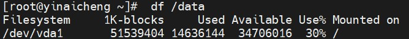
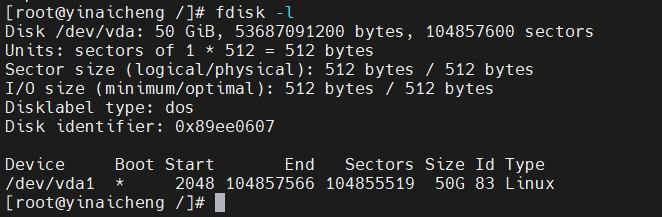

# Centos常用操作

## Centos与Debian对比：
Debian和CentOS是两种广泛使用的Linux操作系统。它们都有一些共同之处，例如都是免费和开源的，都具有稳定性和安全性等特点。但是，它们之间也存在一些差异。  
* 源代码和软件包管理：Debian使用apt-get包管理器和.deb软件包，而CentOS使用yum包管理器和.rpm软件包。apt-get和.deb是Debian的核心工具，而yum和.rpm是CentOS的核心工具。  
* 更新周期：Debian的更新周期相对较短，通常每2年发布一个新版本。CentOS则更新周期相对较长，通常每3-4年发布一个新版本。这也意味着Debian有更多的软件包更新和更快的修复漏洞的速度。  
* 社区和支持：Debian的社区比较庞大，有大量的用户和开发者。它也有官方支持和文档。CentOS由于其商业背景，有更多的企业用户和开发者，也有官方支持和文档。  
* 默认安装的软件包：Debian默认安装的软件包比较少，需要手动安装其他软件包。CentOS则默认安装了很多软件包，可以满足大多数用户的需求。  
* 适用场景：Debian通常被用于桌面系统和服务器，CentOS则更适合于企业级服务器和生产环境。  
总的来说，Debian更适合那些需要快速更新软件包和更灵活的用户，而CentOS更适合那些需要更长时间的支持和更稳定的环境的用户。  

## 查看Centos版本

```log
cat /etc/redhat-release
CentOS Linux release 7.6.1810 (Core)
```

## Linux下不重启修改主机名方法

```
# 查看主机名
hostname

# 修改主机名
hostname yinaicheng
```

## 系统安全性措施

1. 确保系统密码复杂度足够高，建议使用包含大小写字母、数字和特殊字符的复杂密码。
2. 禁用不必要的服务或端口，避免暴露系统在互联网上。
3. 安装并配置fail2ban（防爆破）来自动阻止频繁失败的登录尝试。
4. 使用SSH密钥对进行认证，禁用密码登录。
5. 定期审查系统日志，查看是否有异常登录行为。
6. 及时更新和维护系统。

## 网络

> ping

用于检查网络连接

* Linux的ping命令使用方法：
1. 检查某个IP地址的连通性：ping ip地址  
   例：ping 192.168.1.1
2. 检查某个域名的连通性：ping 域名  
   例：ping www.baidu.com
3. 指定发送报文数：ping -c 数量 ip地址或域名  
   例：ping -c 5 www.baidu.com
4. 修改发送报文的时间间隔：ping -i 时间间隔 ip地址或域名  
   例：ping -i 2 www.baidu.com
5. 显示详细信息：ping -v ip地址或域名  
   例：ping -v www.baidu.com

> ifconfig

查看网络接口和IP地址等信息

> netstat

显示网络连接，路由表和网络接口状态，netstat是一个用于列出和报告有关TCP/IP协议的网络统计信息的Unix/Linux命令行工具。它可以报告有关连接到网络的机器，正在运行的网络服务，和网络连接状态等信息。netstat命令可以报告主机的网络活动，以确定网络连接是否正常，或者查找网络上的服务器。

> ssh

安全登录远程主机

> telnet

登录远程主机

> curl

curl是一款功能强大的网络工具，用来模拟发送HTTP/HTTPS/FTP等协议的请求，可以用来下载文件、检查网站的性能、调试Web服务等等，在Linux系统中可以通过命令行来运行curl：`curl [options] [URL]`。  
如：curl https://www.baidu.com

> 获取本机出口IP方法

1. curl ipinfo.io  
2. curl members.3322.org/dyndns/getip  
3. curl ifconfig.me  
4. curl myip.ipip.net  
5. curl cip.cc

>  解决ping某些网站超时方案

以github.com为例

访问该网站：https://sites.ipaddress.com/github.com

浏览器搜索IP address，复制出里面的IP Address并粘贴到hosts里面

再次ping github.com测试

## 防火墙操作

```log
# 开启防火墙
systemctl start firewalld.service
# 放开端口
firewall-cmd --permanent --add-port={端口号}/tcp
如
firewall-cmd --permanent --add-port=8080/tcp

#关闭端口
firewall-cmd --zone=public --remove-port={端口号}/tcp --permanent
如
firewall-cmd --zone=public --remove-port=22122/tcp --permanent

# 重启防火墙
firewall-cmd --reload

# 关闭防火墙
systemctl stop firewalld

# 查看已经开发的防火墙端口号
firewall-cmd --zone=public --list-ports
```

## Linux查看文件夹所在分区（挂载点）
Linux下没有盘符的概念，而是将各分区通过挂载到目录来访问实际的磁盘分区，有时候我们想知道某个文件或者文件夹是在哪个分区上

> df命令查看分区挂载情况

  

df（disk free）命令用于显示目前在Linux系统上的文件系统磁盘使用情况统计。第一列指定文件系统的名称，第二列指定一个特定的文件系统1K-块1K是1024字节为单位的总内存。用和可用列正在使用中，分别指定的内存量。 使用列指定使用的内存的百分比，而最后一栏"安装在"指定的文件系统的挂载点。

> fdisk -l命令查看分区挂载情况

列出Linux下所有分区表，确定数据盘



Linux系统中设备都是以文件的形式体现的，这里磁盘是在一个叫做为/dev目录下名为vdb的文件，如果对磁盘进行分区，则主分区和扩展区的文件名称即为在磁盘文件名称追加1~4的后缀，即它们的名称为/dev/vdb1~/dev/vdb4

> 对磁盘进行分区并且初始化

输入命令fdisk+磁盘文件名的绝对路径，如fdisk /dev/vdb

> 检查文件系统，查看文件、扇区是否有错误

 e2fsck -p /dev/vdb1

> 将目标文件夹挂载在数据盘上

1. 列出Linux下所有分区表，确定数据盘，命令：fdisk -l
2. 给分区指定文件系统格式，这里使用ext4文件系统，命令：mkfs.ext4 /dev/vda1
3. 创建目标目录，命令：mkdir /yinaicheng
4. 将分区挂载到某个挂载点，这里挂载到/data**，命令：mount /dev/vda1 /yinaicheng
5. 重启自动挂载/dev/vdb至/data，命令：echo "/dev/vda1 /yinaicheng ext4  defaults 1  1" >>/etc/fstab
6. 输入df -h或者lsblk命令查看磁盘分区结构

## 日志文件中查找关键词

* 查看log-2022-11-30.log日志文件中出现test字符串的行：  
```log
cat log-2022-11-30.log | grep "test"
grep "test" log-2022-11-30.log
```

* 想获取关键词test所在日志行的前10行和后10行
```log
grep -C 10 "test" log-2022-11-30.log
```

* 查询2022-11-30 19:48:40到2022-11-30 19:48:59区间的日志
```log
grep '2022-11-30T19:48:[40-59]' log-2022-11-30.log
```

* 查看log-2022-11-30.log日志文件中出现test字符串的行，并且标记test颜色
```log
grep --color "test" log-2022-11-30.log
```

* 查看统计次数

查看log-2022-11-30.log日志文件test字符串出现的次数：
```log
cat log-2022-11-30.log | grep "test" | wc -l
```

* Linux下grep的时候报Binary file ***.log matches解决办法

-a指的是将二进制文件以text文件的方式匹配

因为查询文件某些情况下会被认为是二进制文件，在grep后面关键字前面加个-a就好了，例如：grep -a "xxx" a.log