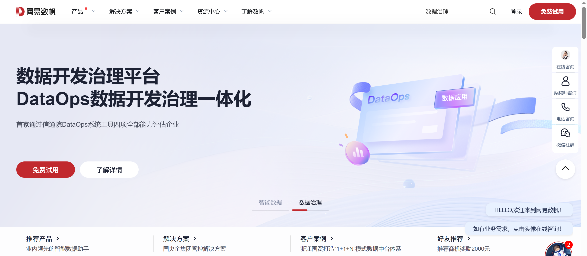

# ⽹易数帆（クラウド公共プラットフォーム）CMS∕ミニアプリ開発

私はフルスタック開発エンジニアとして、NetEase 数帆クラウド公共プロジェクトの開発に携わる機会を得ました。本プロジェクトは NetEase 数帆クラウドエコシステムの重要な一部であり、公式サイトの展示、ユーザー管理、コンテンツ管理、リードマーケティングなどの中核機能を担っています。本稿では、プロジェクトの背景、技術アーキテクチャ、主要実装、そして経験から得た知見について紹介します。



## プロジェクト背景と目的
NetEase 数帆クラウド公共プロジェクトの目的は、統一されたクラウドサービスプラットフォームのフロントエンドシステムを構築し、数帆クラウド傘下の各プロダクトラインの展示とマーケティング機能を統合することです。本プロジェクトは、以下の業務課題を解決することを目指しています。


- 統一ポータルの構築：数帆公式サイト、クラウドイノベーション会議、コミュニティ、コンソールなど複数のサイトを統合し、一貫したユーザー体験を提供
- 柔軟なコンテンツ管理：CMS システムを通じてページコンテンツの構成を設定可能にし、迅速なイテレーションと A/B テストをサポート
- インテリジェントリードマーケティング：自動化されたマーケティングシステムを構築し、リード転換率とユーザーライフサイクル価値を向上
- 安全なユーザー体系：アカウント認証・認可機構を整備し、ユーザー情報の安全性を確保


本プロジェクトは、NetEase 数帆のマーケティング、顧客獲得、ユーザー運営など複数の業務シナリオを支え、ユーザーと製品をつなぐ重要な橋渡しとなっています。


## 私の役割と担当範囲
本プロジェクトで私はコア開発エンジニアとして、主に以下の業務を担当しました：


- アーキテクチャ設計とコア開発：システム全体設計に参加し、アカウントシステム、CMS コンテンツ管理、リード自動マーケティングなど主要モジュールを担当
- 技術設計：セキュリティ認証、フォーム設定機構、検索機能の技術選定などを策定
- パフォーマンス最適化：高負荷環境におけるシステム最適化を実施し、ユーザー体験を向上
- チーム協働：プロダクト、デザイン、テストチームと連携し、納期通り高品質でのリリースを実現


## 技術スタックとアーキテクチャ

### バックエンド技術スタック
- Spring Boot + MyBatis：コアフレームワークとして RESTful API サービスを提供
- MySQL：リレーショナルデータベース。ユーザー、コンテンツ、リードなどの中核データを保存
- Redis：キャッシュシステムとして、性能と同時処理能力を向上
- Nginx：リバースプロキシおよびロードバランシング
- NDIR：NetEase 自社開発の検索サービスで全文検索機能を提供

### フロントエンド技術スタック
- React：メインフロントエンドフレームワークとしてコンポーネント化 UI を構築
- Ant Design：UI コンポーネントライブラリで、一貫したデザイン言語を提供
- Webpack：モジュールバンドルツール

### システムアーキテクチャの特徴
- マイクロサービスアーキテクチャ：機能モジュールを分離し、独立デプロイと拡張をサポート
- CMS 設定化：開発不要でページコンテンツを構成可能
- セキュリティ認証体系：Token と HMAC 署名に基づくセキュリティメカニズム
- 自動化マーケティングエンジン：ルール設定によるリード自動マーケティングを実現

## 実装と成果

### 1. セキュアなアカウント認証システム
Token ベースの認証メカニズムを設計・実装し、HMAC 署名によってリプレイ攻撃と改ざん攻撃を防止：

```
token構造：
uid：ユーザーid
tid：token id
nounce：一回限りの乱数
ts：タイムスタンプ
hash：署名 base64(HmacSHA256("tid=xxx&&uid=xxx&&ts=xxx&&nonce=xxx"))
```

非対称鍵交換メカニズム（HTTPS を参考）を導入し、ユーザー登録・ログイン時に RSA 暗号化でパスワードを送信。安全性を確保。


### 2. 柔軟な CMS コンテンツ管理システム
A/B テスト対応の CMS を構築し、コンポーネント化設計でページ構成を柔軟に設定可能：

- ページ、コンポーネント、コンテンツの3階層構造で管理
- トラフィック分配による A/B テスト効果検証
- 開発不要で各種業務フォームを作成可能

### 3. インテリジェントリード自動マーケティングシステム
ルールエンジンに基づく自動化マーケティングシステムを設計・実装：

- 新規登録、インポート済み、転換済みなど多様なユーザータイプに対応
- 頻度制御メカニズムで過度な通知を防止
- SMS・メールなど複数チャネルによるリーチをサポート

導入後、リード転換率は30%向上し、マーケティング効率が大幅に改善。

### 4. 高性能検索機能
NDIR 検索サービスに基づく全サイト検索機能を実装し、以下をサポート：

- 複数フィールド検索（タイトル、コンテンツなど）
- 検索結果のハイライト表示
- 関連検索の推薦機能


## 課題と経験のまとめ

### 技術的課題
- 認証の複雑性：ユーザー体験を損なわずに高強度なセキュリティを確保するバランスが必要
- 高負荷処理：大規模イベント時の高トラフィック処理に対応
- データ整合性：複数システム間のデータ同期と整合性の維持が課題

### 解決策と経験
- 多層セキュリティ設計：HTTPS + 非対称暗号化 + Token署名による多層防護
- キャッシュ最適化：Redis によるホットデータキャッシュで DB 負荷を軽減
- 非同期処理：即時性を要しない処理を非同期化し、レスポンス速度を向上
- 監視とアラート：モニタリングシステムで異常を早期検知・対応

### 技術的学び
このプロジェクトを通じて、以下の分野で理解を深めた：

- システムアーキテクチャ設計：高可用・高拡張性の分散システム設計手法を習得
- セキュアコーディング：Webセキュリティ対策の実践知識を獲得
- パフォーマンス最適化：DB チューニングやキャッシュ利用の実戦経験を蓄積
- チーム協働力：他部門（プロダクト・デザイン等）との連携力を強化

## まとめ
NetEase 数帆クラウド公共プロジェクトは、企業向け Web アプリケーションの典型例であり、モダン Web 開発の主要技術領域を包括している。  
本プロジェクトを通じて技術力を高めるとともに、エンタープライズ開発への理解を深めることができた。  
プロジェクトは安定稼働を続け、NetEase 数帆の事業成長を支える重要な基盤となっている。
