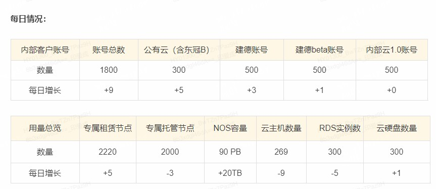
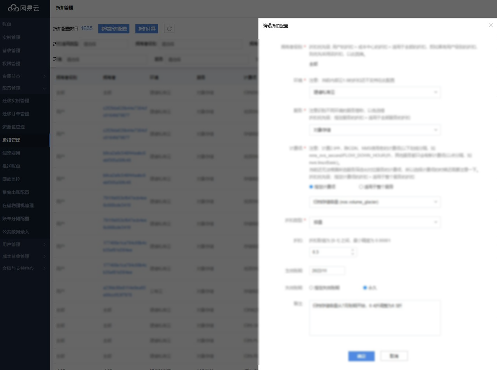
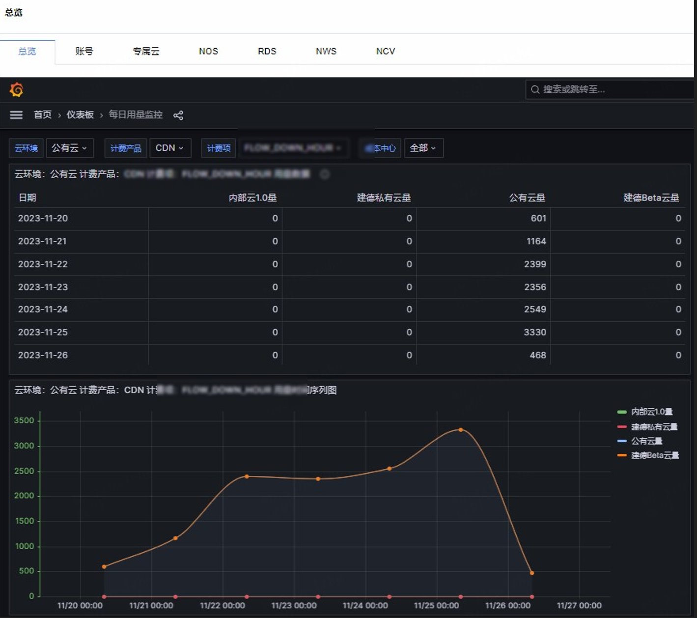

# ⽹易クラウド 計費‧出帳システム開発

私はフルスタック開発エンジニアとして、NetEase Cloud Computing の課金・請求システムの開発および保守業務に携わりました。  
このプロジェクトを通じて、クラウド課金の複雑性を深く理解するとともに、マイクロサービスアーキテクチャや分散システム設計において貴重な経験を積むことができました。  
以下では、プロジェクトの技術アーキテクチャ、実装の詳細、そして得られた知見について紹介します。

## 1. プロジェクト背景と目的
NetEase Cloud Computing 事業の急速な拡大に伴い、ユーザーは課金の正確性と請求の迅速性に対してより高い要求を持つようになりました。  
既存の課金システムは、マルチ環境・マルチ製品ラインといった複雑なシナリオにおいて、拡張性の不足やデータ処理効率の低下といった課題が顕在化していました。

課金・請求システムの主な目標は以下の通りです：

- マルチクラウド環境（パブリッククラウド、プライベートクラウド、専用クラウドなど）における統一課金の実現
- 従量課金、年額・月額課金など複数の課金モデルに対応
- 正確で迅速な請求書生成と通知サービスの提供
- システムの安定稼働を確保するための監視体制の構築

## 2. 私の役割と担当範囲
本プロジェクトでは、コア開発エンジニアとして以下の業務を担当しました：

- **バックエンドサービス開発**：SpringBoot フレームワークを用いて課金コアサービスを開発。請求計算、データ同期、スケジュールタスクなどを実装。
- **データ処理最適化**：大規模データ環境での請求計算性能を向上させるため、分割データベース・インデックス最適化などを実施。
- **システム統合**：NOS、RDS、NVS などのクラウドサービス製品とデータ連携を行い、課金データの正確な収集を保証。
- **監視システム構築**：Redis を利用したホットデータキャッシュによるビジネス監視設計を担当し、監視クエリ性能を向上。
- **問題解析と修正**：専用クラウドノードでの請求欠損や割引計算エラーなどの重要問題を特定・修正。

## 3. 技術スタックとアーキテクチャ

本プロジェクトはモダンなマイクロサービスアーキテクチャを採用し、主な技術スタックは以下の通りです。

### バックエンド技術
- SpringBoot + MyBatis：コアサービスフレームワーク
- Redis：ホットデータキャッシュ、分散ロック、スロットリング制御
- RabbitMQ：サービス間の非同期通信
- Elastic-job：分散スケジュールタスク管理
- Apollo：分散構成管理
- NDC：データ移行および同期

### フロントエンド技術
- Vue.js および関連エコシステムコンポーネント
- Node.js ベースのフロントエンドビルド

### データベース
- MySQL：メインストレージ。複数の業務DB（`pub_bill_analysis`、`atlantis`、`private_cloud_bill_online` など）を管理
- 複数データソース設定により異なる環境でのデータアクセスをサポート

### デプロイと監視
- Docker コンテナ化デプロイ
- Grafana + ECharts によるデータ可視化

システム全体はレイヤー設計を採用し、メッセージキューによって各サービスモジュールを疎結合化。  
分散構成センターによる設定統一管理、およびスケジュールタスクフレームワークを用いた定期的な請求処理を実現。

## 4. 実装と成果

### コア機能実装

**日次請求書機能の開発**  
業務側の精緻な課金要求に応えるため、`PaymentDayPeriod` クラスを拡張し、日次単位での請求期間管理を実現。  
関連する請求計算ロジックを再設計しました。

**マルチ環境対応**  
システムは `inner`（パブリッククラウド）、`jd`（建徳プライベートクラウド）、`jdbeta`（建徳βクラウド）、`pri`（内部クラウド1.0）など、複数の環境に対応。  
`user_distributor` テーブルで環境設定を管理。

**割引計算の最適化**  
割引計算モジュールを再構築し、コストセンター、サービス種別、インスタンスタイプなど複数の次元で割引を設定可能に。  
`user_discount_config_v2` テーブルを用いて柔軟な割引ポリシーを管理。

### パフォーマンス最適化の成果
- **請求計算性能を300%向上**：SQL最適化およびキャッシュ導入により、月次請求処理時間を数時間から数十分へ短縮。
- **システム安定性の大幅向上**：監視・アラート機構の強化により、障害検知時間を80%短縮。
- **大規模データ処理対応**：数千万件の請求レコードを安定処理可能に。

## 5. 課題と経験のまとめ

### 技術的課題
- **データ整合性の確保**：分散環境下で課金データの一貫性を保つことが最大の課題。分散ロックとトランザクション補償を導入し、重要計算処理の整合性を保証。
- **複雑なビジネスロジック処理**：環境・製品ごとに異なる課金ルールを統合するため、柔軟な設定体系を設計し、ハードコーディングを排除。
- **性能ボトルネックの解消**：大規模データ処理時のDBボトルネックを、分割DB、リードライト分離、キャッシュ最適化で解決。

### 経験のまとめ
- **設定駆動はハードコーディングに勝る**：複雑な業務システムでは、設定方式によるロジック制御の方が拡張性が高い。
- **監視を最初から設計に含める**：安定稼働を確保するため、初期段階から監視設計を考慮すべき。
- **データ安全とバックアップの重要性**：課金データは収益に直結するため、バックアップと復旧体制を必須とする。
- **段階的リファクタリング**：レガシーシステムには一括再構築ではなく段階的リファクタリングが効果的。

このプロジェクトを通じて、分散システム設計やパフォーマンス最適化のスキルを大きく向上させることができ、クラウド課金ビジネスの複雑性を深く理解しました。  
これらの経験は、私の今後の技術的成長において非常に重要な基盤となりました。
