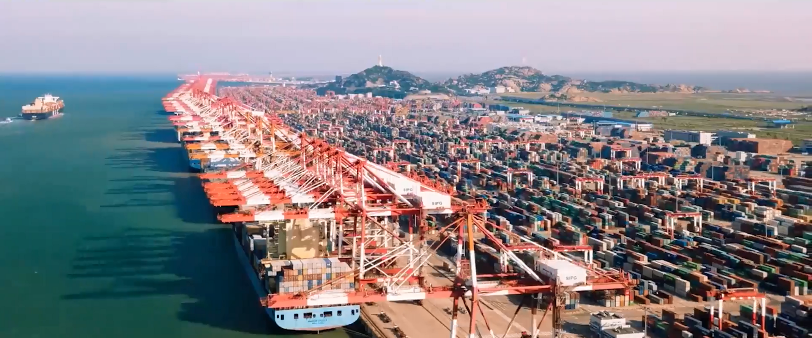

# 洋⼭四期⼤数据運営効率分析システム

## プロジェクト背景と目的

洋山深水港第4期プロジェクトは、世界を代表する全自動化ターミナルの一つであり、上海国際航運センターの重要な役割を担っています。

自動化設備の増加や作業プロセスの複雑化に伴い、従来の TOS（Terminal Operation System）では日常のスケジュール管理は可能でも、全体的な運用効率の分析や最適化判断を高効率で行うことが困難になっていました。

そのため、本プロジェクトでは「洋山第4期ビッグデータ運用効率分析システム」の構築を目的としました。  
TOS、ECS、AGV、ASC など各システムの作業ログやステータス情報を統合し、統一されたデータウェアハウスおよび可視化分析プラットフォームを構築。  
データ収集・クレンジング・モデリング・分析・可視化までを自動化する全プロセスの実現を目指しました。

プロジェクトの目標：

- ターミナルレベルのビッグデータウェアハウスを構築し、4時間ごとの増分更新を実現；
- 設備作業効率・待機ボトルネック・エネルギー消費パターンを分析；
- リアルタイムの可視化分析とKPIレポートを提供し、経営判断を支援。

---

<video src="./photo/1/咪啰核心产品系列码头数字孪生系统.mp4"  width="600"  controls  autoplay  muted  playsinline></video>

## 私の役割と担当範囲

本プロジェクトでは、私はフルスタックエンジニア兼コアモジュール担当として、主に以下の業務を担当しました：

- バックエンドのマイクロサービスアーキテクチャ設計と実装（Spring Boot + MyBatis + Redis）
- ビッグデータエンジニアの指導のもと、データウェアハウスモデルおよび指標アルゴリズムの開発（Spark + Hive + Impala）
- 設備効率分析アルゴリズムの実装（クレーン・AGV・ASC の時間方程式モデル）
- フロントエンド可視化プラットフォームの開発（React + Ant Design + ECharts）
- システム性能チューニングおよびデプロイ・運用保守

チーム内では、ETLやアルゴリズムの実装などの基盤部分から、フロントエンドのUI設計まで幅広く担当し、データから意思決定までの完全なフローを実現しました。

---

## 技術スタックとアーキテクチャ

### ⚙️ バックエンド
- **Spring Boot + MyBatis**：マイクロサービス構成および複数データソース（Impala / MySQL / MongoDB）のアクセスを実現
- **Redis + Guava**：分散キャッシュシステムを構築し、指標クエリを高速化
- **LogBack + MongoDB**：統一ログセンターを構築し、トレーサビリティを確保

### 💾 ビッグデータプラットフォーム
- **Cloudera CDH + Spark + HDFS + Hive + Impala**：データ収集・クレンジング・モデリング・クエリ最適化を担当
- **Kafka + Flume + Nifi**：設備ログおよびリアルタイムデータの取り込みをサポート

### 🧭 フロントエンド
- **React + Ant Design + ECharts**：インタラクティブな運用ダッシュボード、設備モニタリング、トレンド分析モジュールを構築
- 20種類以上のチャートコンポーネント（OEE分析、ガントチャート、レーダーチャート、設備稼働率など）を実装

### 🧰 ツールと運用
- **Maven、Docker、Git、Jira、Nginx**：バージョン管理およびデプロイに使用

---

## 実装と成果

### 1️⃣ データアーキテクチャ
- 統一された DWD/DWB/DWS の3層モデルを設計し、大規模データの多次元分析をサポート
- Spark による自動スケジュールETLジョブを実装し、4時間ごとの増分更新を実現
- パーティション＋圧縮ストレージ戦略により、クエリ性能を60％以上向上

### 2️⃣ アルゴリズムと分析
- 「時間方程式（Time Equation）」モデルを構築し、設備作業時間分布を定量化
- 複数ソースのデータ融合により、稼働率・空転率・待機時間・回転率を算出
- KPI指標体系を構築（クレーン・AGV・ASC・外部トラック効率）
- 異常検知とアラート機能を導入し、リアルタイムでボトルネックを検出

### 3️⃣ 可視化プラットフォーム
- 設備稼働状況をリアルタイム監視
- 多次元フィルタリング・指標比較・エクスポート機能を提供
- 「作業効率ダッシュボード」「クレーン作業ガントチャート」「ヤード運行ヒートマップ」などのモジュールを実装

### 4️⃣ 性能最適化
- 平均クエリ時間を5.1秒から1.9秒へ短縮
- キャッシュヒット率を85％以上に向上
- 同時接続500ユーザー以上に対応

---

## プロジェクト成果と価値

| 区分 | 成果 |
| ---- | ---- |
| 技術面 | マイクロサービス＋ビッグデータアーキテクチャを港湾業務に初導入し、リアルタイム分析を実現 |
| 業務面 | 港全体の作業効率が約15％向上、設備稼働率が20％向上 |
| 意思決定支援 | 管理層がダッシュボードでリアルタイムにボトルネックを把握可能 |
| コスト管理 | 運用コストを約8％削減し、手作業の統計作業をほぼ解消 |

---

## 課題と経験のまとめ

### 1. 複数システム間のデータ統合の難しさ
各システム（TOS、ECS、AGV、ASC）のデータ構造が異なる。  
**解決策**：統一抽象インターフェース＋Flume/Kafkaストリームパイプラインでフィールドと時刻同期を標準化。

### 2. クエリ性能と同時アクセスの負荷
データ量が多く（1日50万件以上）。  
**解決策**：Impalaパーティション、Redisホットキャッシュ、インデックス最適化によりI/O負荷を削減。

### 3. データ可視化の複雑性
リアルタイム更新と頻繁なインタラクティブ操作。  
**解決策**：フロントエンドに仮想スクロール・遅延レンダリング・部分更新を導入し、操作体験を改善。

---

## 個人としての学び

- Spark/Hive/Impala などのビッグデータコンポーネントを深く理解
- マイクロサービス設計およびフロント・バック連携能力を強化
- 「業務モデリングからデータ駆動型意思決定まで」の体系的思考を確立  
