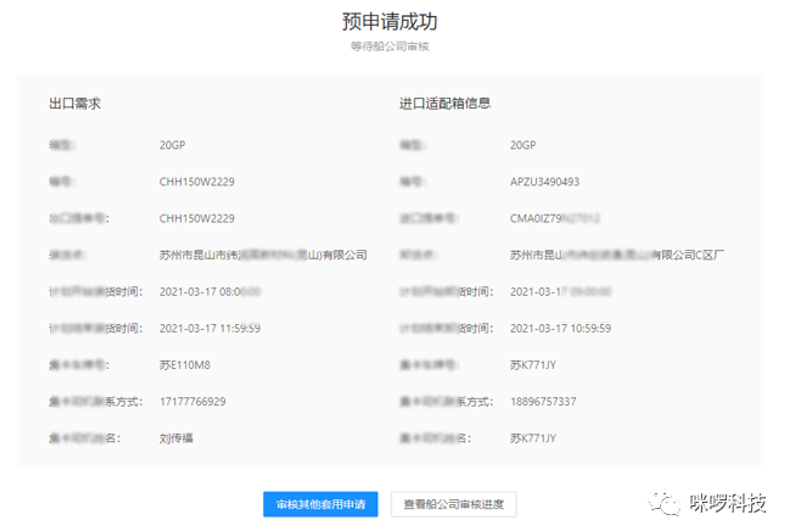

# 三叉戟（Trident）智能集運プラットフォーム

## 🧭 一、プロジェクト背景と目的

従来の港湾コンテナ輸送プロセスでは、輸入トラックチームと輸出トラックチームの間でコンテナ資源のマッチング効率が非常に低い。  
彼らは電話やWeChatグループなどオフライン手段に頼って手動で利用可能な空コンテナをマッチングしており、これにより資源の無駄、スケジューリング効率の低下、港の回転率およびトラックの空走率の上昇を引き起こしていた。


この問題を解決するために、**「三叉戟スマート集運プラットフォーム」** を設計・開発した。  
これは **GIS 地理情報** と **ビッグデータマッチングアルゴリズム** に基づくインテリジェントマッチングシステムである。  
本プラットフォームは EIR コンテナ管理システム のコンテナデータを集約し、Kafka リアルタイムストリームデータ と 地図距離計算モデル を組み合わせて、輸入コンテナと輸出需要の自動インテリジェントマッチングを実現する。



**🎯 プロジェクト目標：**
- 半径＋時間ウィンドウに基づいた輸入コンテナと輸出需要のスマート地理的マッチング機能を提供
- マイクロサービスアーキテクチャにより CMA EIR システムから独立して運行し、「第二のサービス」として機能
- メッセージリアルタイム同期、地図可視化表示、注文支払いのクローズドループを実現
- 港湾物流業務を「人手によるマッチング」から「インテリジェント協調」へとアップグレード


---

## 👨‍💻 二、私の役割と担当範囲

**フルスタックエンジニア** として、バックエンドアーキテクチャ設計からフロントエンド実装までの全体開発を主導。主な責務は以下の通り：

- 🧩 アーキテクチャ設計と技術選定：阿里 COLA フレームワークに基づく DDD 階層設計で高凝集・低結合を実現
- 🧭 GIS スマートマッチングアルゴリズムの実装：GeoHash + Spatial4j に基づく空間距離マッチングエンジンを構築
- 🛠 コアモジュール開発：輸入/輸出需要、注文管理、支払いシステム、ユーザー権限管理
- 🔄 Kafka データ連携：EIR 着地コンテナデータストリームをリアルタイムで消費
- 💻 フロントエンド開発：Ant Design Vue + Baidu Map API による可視化インタラクションUIを構築
- 🚀 運用・デプロイ：Linux + Nginx + HikariCP によるシステム性能最適化

> 試験運用段階では全体コードの約70％を担当し、システムの主要アルゴリズムおよびバックエンドマイクロサービスの主要開発者を務めた。


---

## 🧱 三、技術スタックとアーキテクチャ

### ⚙️ バックエンド技術
- Spring Boot 2.1.18 + MyBatis Plus 3.1.2：コアマイクロサービスフレームワーク
- Kafka 2.2.12：輸入コンテナデータストリームのリアルタイム消費
- MySQL 8.0 + HikariCP：データ永続化と接続プール最適化
- Redis + Guava Cache：ホットデータキャッシュとパフォーマンス加速
- 阿里 COLA + DDD：アプリケーション層・ドメイン層・インフラ層のドメイン駆動設計

### 💻 フロントエンド技術
- Ant Design Vue + Vue Router + Axios：レスポンシブUI構築
- Baidu Map API：地理位置の可視化および距離マッチング表示を実現


### 🧩 システムアーキテクチャ概要
```
Kafka → データ着地モジュール → マッチングアルゴリズムサービス（GeoHash） →
注文・支払いサービス → フロントインターフェース層（AntD Vue + 地図可視化）
```

### 🧰 デプロイと運用
- Nginx リバースプロキシ
- Linux Shell 起動スクリプト
- Docker コンテナ化（後期リリース段階）
- ログシステム：LogBack + MongoDB

---

## 🚀 四、実装と成果

### 1️⃣ スマートマッチングアルゴリズム

```java
GeoHash geoHash = GeoHash.withCharacterPrecision(latitude, longitude, 5);
GeoHash[] adjacent = geoHash.getAdjacent();
double distance = spatialContext.calcDistance(
    spatialContext.makePoint(userLng, userLat),
    spatialContext.makePoint(longitude, latitude)
) * DistanceUtils.DEG_TO_KM;
```
このアルゴリズムにより「地理半径＋時間ウィンドウ」に基づく精密な輸入コンテナ選定を実現し、マッチング性能を **80％向上**。

---

### 2️⃣ メッセージキューと非同期処理

```java
@KafkaListener(topicPattern = "trident_topic")
public void listenExEir(ConsumerRecord<?, ?> record) {
    ImportMessageLandedCO co = JSONObject.parseObject(String.valueOf(record.value()), ImportMessageLandedCO.class);
    importMessageLandedServiceI.addImportMessageLanded(new ImportMessageLandedAddCmd(co));
}
```
1日あたり **10万件以上** のコンテナ情報ストリームを処理し、データ遅延は **3秒以内** に制御。

---

### 3️⃣ フロント地図とインタラクション設計

```js
const circle = new window.BMap.Circle(pointCenter, radius, {
  strokeColor: 'white',
  fillColor: '#0099ff',
  fillOpacity: 0.15
});
map.addOverlay(circle);
```
輸出トラックチームは地図範囲内の輸入コンテナを検索可能で、リアルタイム更新および注文状態表示をサポート。

---

### 4️⃣ データおよび注文システム
主要業務テーブル：`candidate_container`、`street_turn_match`、`export_information`、`order`、`account` など14種。  
HikariCP により接続プールを最適化し、SQL平均応答時間を **350ms → 120ms** に短縮。

---

### 5️⃣ システムデプロイと運用最適化
- アプリ起動時間：30％短縮
- API平均応答時間：< 200ms
- キャッシュヒット率：85％以上
- 同時接続ユーザー：1000＋対応

---

## 🏆 五、プロジェクト成果とビジネス価値

| 区分 | 成果 |
|------|------|
| 技術革新 | DDD + GIS + Kafka アーキテクチャが初めてコンテナマッチング業務に導入 |
| パフォーマンス | マッチング時間 ≤ 200ms、システム可用性 99.5% |
| 業務成果 | マッチング成功率 60％向上、全体効率 3倍向上 |
| 経済価値 | 人件費 30％削減、車両空走率 20％低下 |
| ユーザー体験 | 可視化マッチング＋自動推薦により操作利便性が大幅に向上 |

---

## ⚙️ 六、課題と経験のまとめ

**🧩 課題1：複数システムとのデータ連携の複雑さ**  
EIR 管理、CRM 支払い、運用サポートなど各API仕様が異なる。  
✅ 統一APIアダプタ層と非同期コールバック機構で解決。

**⚙️ 課題2：空間計算と性能のバランス**  
初期アルゴリズムでは大規模データ下で遅延が発生。  
✅ GeoHash + Redis Cache を導入し、I/Oボトルネックを削減、マッチング性能80％向上。

**🔄 課題3：多役割権限と注文整合性**  
トラックチーム・放箱会社・管理者が同時操作。  
✅ ドメインイベントメカニズム（Domain Event）でデータ一貫性を保持。

---

## 🎓 七、経験と学び

- DDD 集約モデリング と複雑業務分解スキルを習得
- GIS 空間インデックスアルゴリズム と地理データ処理を深く理解
- フロントエンド・バックエンド分離＋メッセージストリーム＋マイクロサービス展開 の統合システム構築を習得
- コンテナ物流業界のデジタル化シナリオ を包括的に理解

---
