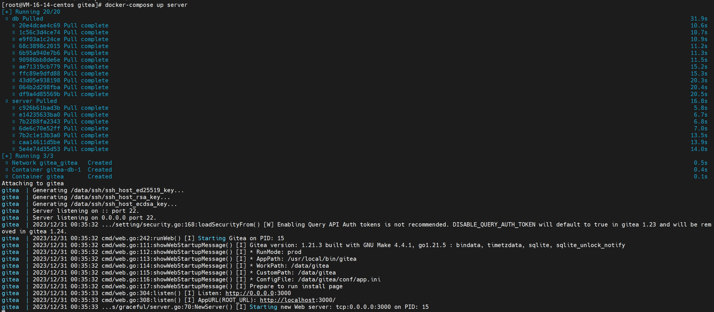
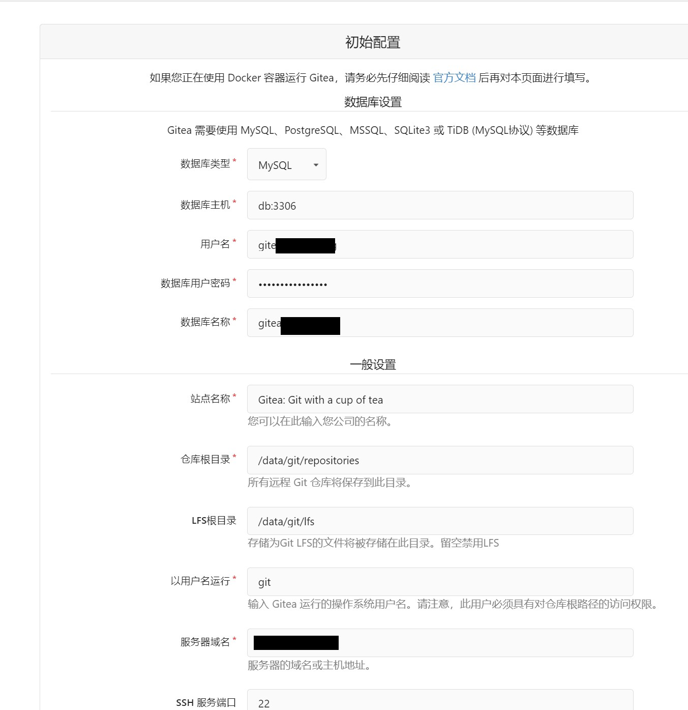
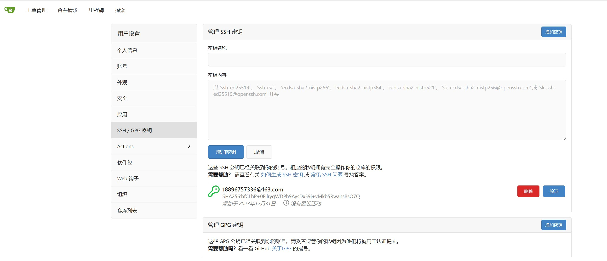

# Gitea安装

## 使用DockerCompose安装Gitea

Gitea提供了标准的容器镜像，统一支持 SQLite、MySQL、PostgreSQL 和 SQL Server 作为数据库后端。

> 安装文档  

https://docs.gitea.com/zh-cn/installation/install-with-docker

> docker-compose.yml配置

要使用Docker Compose 安装 Gitea，首先需要创建一个 Docker Compose 配置文件并在其中定义 Gitea 服务。

首先创建一个名为 docker-compose.yml 的文件，然后在 docker-compose.yml 文件中输入以下内容：

```log
version: "3"

networks:
  gitea:
    external: false

services:
  server:
    image: gitea/gitea:latest
    container_name: gitea
    environment:
      - USER_UID=1000
      - USER_GID=1000
      - DB_TYPE=mysql
      - DB_HOST=db:3306
      - DB_NAME=xxx
      - DB_USER=xxx
      - DB_PASSWD=xxx
    restart: always
    networks:
      - gitea
    volumes:
      - ./data:/data
      - /etc/timezone:/etc/timezone:ro
      - /etc/localtime:/etc/localtime:ro
    ports:
      - "3000:3000"
      - "222:222"
    depends_on:
      - db

  db:
    image: mysql:5.7
    restart: always
    environment:
      - MYSQL_ROOT_PASSWORD=xxx
      - MYSQL_USER=xxx
      - MYSQL_PASSWORD=xxx
      - MYSQL_DATABASE=xxx
    networks:
      - gitea
    volumes:
      - ./mysql:/var/lib/mysql
```

> 启动gitea

在包含 docker-compose.yml 文件的目录中，打开终端并运行以下命令来启动Gitea服务：
```log
docker-compose up -d server
```

查看容器内运行状态
```log
docker-compose ps
```



> 访问gitea网站，初始化配置（ip:3000)



> 选择SSH操作Gitea

通过Git Bash生成SSH密钥

```logcatfilter
ssh-keygen -t rsa -C "你的邮箱地址"
```

并且将公钥贴在部署的Gitea网站上

