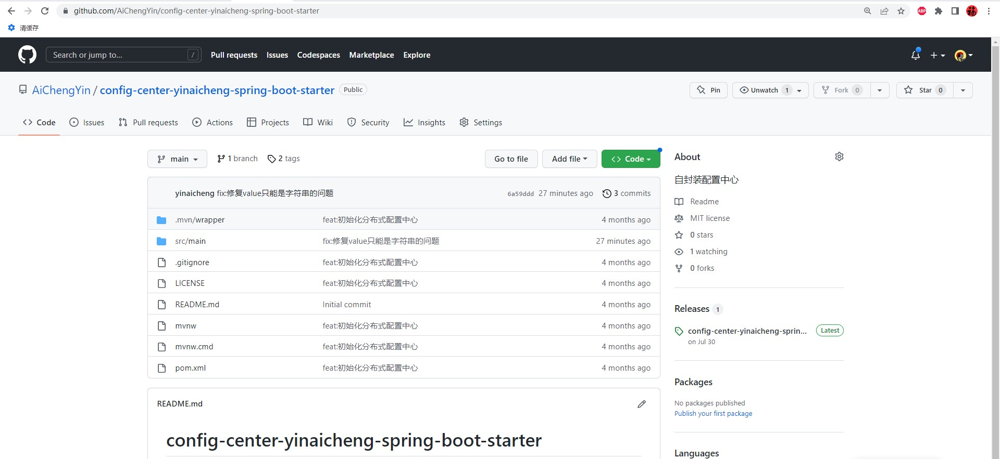
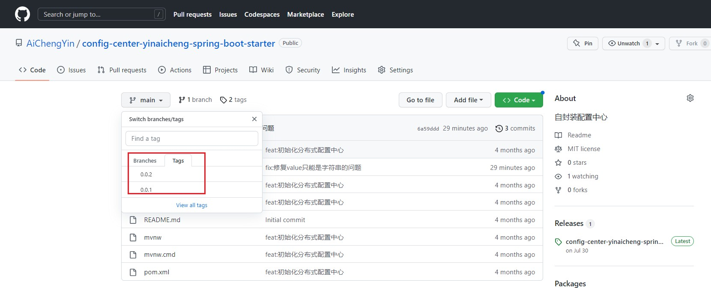
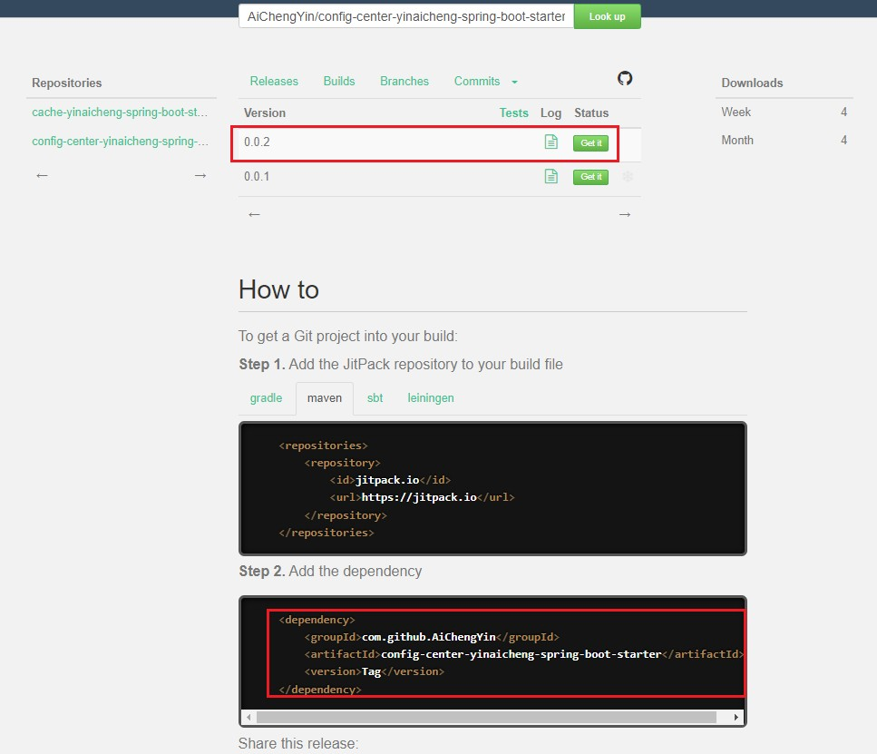

# JitPack

选择相应的Git项目代码，如AiChengYin/config-center-yinaicheng-spring-boot-starter

并且给项目打上标签代表要发布的版本

通过浏览器访问jitpack.io

将AiChengYin/config-center-yinaicheng-spring-boot-starter粘贴到Look Up搜索框，搜索功能会去寻找对应的项目标签，即发布版本

选择相应的Version即可

