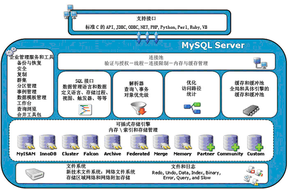
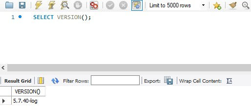

# MySQL简介

MySQL是一种流行的关系型数据库管理系统，由瑞典公司MySQL AB开发，目前属于Oracle旗下产品。 
它是一种开源软件，采用了客户端/服务器模式，支持多用户访问，拥有大量的用户和开发者社区。它提供了丰富的文档和教程，以及强大的插件和扩展功能，具有高性能、可靠性和可扩展性特点。  
MySQL所使用的SQL语言是用于访问数据库的最常用标准化语言，并且MySQL自身支持多种编程语言，包括C、C++、Java、PHP、Python等。
MySQL软件采用了双授权政策，分为社区版和商业版，由于其体积小、速度快、总体使用成本低，尤其是开放源码这一特点，一般中小型网站都选择MySQL作为网站数据库，目前该数据库广泛应用于Web应用程序、企业应用、嵌入式系统等各种领域。

MySQL架构拆分如下：
* MySQL连接器：负责连接客户端和服务器，处理用户的连接请求，并进行身份验证和权限检查。
* 查询缓存：缓存查询结果，避免重复查询相同的数据，提高查询效率。但是在现代MySQL版本中，由于查询缓存的限制和问题，已经被废弃。
* 分析器：对SQL语句进行语法解析和语义分析，生成查询执行计划。
* 优化器：根据查询执行计划，选择最优的执行方案，包括选择表的访问顺序、使用索引还是全表扫描等。
* 执行器：执行查询计划，访问存储引擎获取数据，进行排序、分组等操作，返回结果给客户端。
* 存储引擎：负责管理数据存储和检索，提供数据表的创建、读写、更新、删除等操作，MySQL支持多种存储引擎，如InnoDB、MyISAM等。不同的存储引擎有不同的性能和功能特点。

如下图所示


MySQL的核心特点包括：
1. 可靠性：MySQL是一个稳定可靠的数据库系统，支持高并发访问和数据存储。
2. 可扩展性：MySQL支持水平和垂直扩展，可以满足不同规模和复杂度的应用需求。
3. 安全性：MySQL提供多层次的安全措施，包括访问控制、数据加密、事务管理等，保障数据的安全性和完整性。
4. 灵活性：MySQL基于文件存储，支持多种存储引擎，包括InnoDB、MyISAM等，以及插件式的存储引擎，可以根据不同的应用场景选择不同的存储引擎。
5. 开放性：MySQL是一个开源数据库系统，拥有庞大的社区和活跃的开发者，可以快速响应用户需求和解决问题。
6. 性能优化：MySQL提供多种性能优化工具和技术，包括索引优化、查询优化、缓存优化等，可以提升数据库的响应速度和吞吐量。

## 查看MySQL的版本
要查看MySQL的版本，可以使用命令：  
mysql --version  

```log
[root@VM-0-8-centos ~]# mysql --version
mysql  Ver 14.14 Distrib 5.7.40, for Linux (x86_64) using  EditLine wrapper
```

或者连接到MySQL服务器后，输入以下命令：  
SELECT VERSION();  
这将返回MySQL的版本号。




## MySQL支持的常用相关函数

1. COUNT：用于统计行数。
2. SUM：用于计算数值列之和。
3. AVG：用于计算数值列的平均值。
4. MAX：用于获取数值列的最大值。
5. MIN：用于获取数值列的最小值。
6. CONCAT：用于将两个或多个字符串连接在一起。
7. SUBSTRING：用于提取字符串的一部分。
8. DATE_FORMAT：用于将日期格式化为指定格式的字符串。
9. IFNULL：用于在指定字段为空时返回默认值。
10. GROUP_CONCAT：用于将分组的结果合并为一个字符串。
11. ...

## MySQL支持的存储引擎

在MySQL中，可以使用**show engines**命令查看mysql所支持的官方存储引擎。


通过命令可以看到，一共有以下几种：

* PERFORMANCE_SCHEMA
* MRG_MYISAM
* MyISAM
* BLACKHOLE
* CSV
* MEMORY
* ARCHIVE
* InnoDB
* FEDERATED

通过这个命令，不仅能看到有哪些存储引擎，还能看到它们的特性，其中比较常见的就是InnoDB、MyISAM、MEMORY和ARCHIVE这4个。

他们的特性分别是：

| 存储引擎 | 默认值 | 特点 | 支持事务 | 支持行级锁 | 支持外键 |
| --- | --- | --- | --- | --- | --- |
| InnoDB | 是 | 支持事务、行级锁和外键 | 是 | 是 | 是 |
| MRG_MYISAM | 是 | 同一类型MyISAM表的集合 | 否 | 否 | 否 |
| MEMORY | 是 | 基于哈希存储于内存中，适用于临时表 | 否 | 否 | 否 |
| BLACKHOLE | 是 | /dev/null 存储引擎（写入的任何内容都会消失） | 否 | 否 | 否 |
| MyISAM | 是 | MyISAM 存储引擎 | 否 | 否 | 否 |
| CSV | 是 | CSV 存储引擎 | 否 | 否 | 否 |
| ARCHIVE | 是 | Archive 存储引擎 | 否 | 否 | 否 |
| PERFORMANCE_SCHEMA | 是 | 性能模式 | 否 | 否 | 否 |
| FEDERATED | 否 | MySQL 联合存储引擎 | 无 | 无 | 无 |

可以看到，只有InnoDB是支持事务、行级锁以及外键的，其他的都是不支持的，所以这也是为什么MySQL将默认存储引擎从MyISAM换成InnoDB的原因。

由于MySQL数据库开源特性，存储引擎可以分为MySQL官方存储引擎和第三方存储引擎，大致常见的存储引擎如下：

| 存储引擎    | 特点                                                                                                |
| ----------- |---------------------------------------------------------------------------------------------------|
| MylSAM      | MySQL5.0之前的默认数据库引擎，拥有较高的插入查询速度，但不支持事务，支持表级锁，支持全文索引                                                |
| InnoDB      | InnoDB事务型数据库的首选引擎，支持ACID事务，支持行级锁定，MySQL5.5起成为默认数据库引擎                                              |
| BDB         | BDB源自Berkeley DB，事务性数据库的另一种选择，支持Commit和Rollback等其他事务特性                                            |
| Memory      | Memory所有数据置于内存的存储引擎，拥有极高的插入、更新和查询效率，但是会占用和数据量成正比的内存空间，并且其内容会在MySQL重新启动时丢失                         |
| Merge       | Merge将一定数量的MylSAM表联合而成一个整体，在超大规模数据存储时很有用                                                          |
| Archive     | Archive非常适合存储大量的独立的，作为历史记录的数据，因为它们不经常被读取，Archive拥有高效的插入速度，但其对查询的支持相对较差，存档了不能修改，适合存日志                           |
| Federated   | Federated将不同的MySQL服务器联合起来，逻辑上组成一个完整的数据库，非常适合分布式应用                                                 |
| Cluster/NDB | Cluster/NDB高冗余的存储引擎，用多台数据机器联合提供服务以提高整体性能和安全性，适合数据量大，安全和性能要求高的应用                                   |
| BlackHole   | 黑洞引擎，写入的任何数据都会消失，一般用于记录binlog做复制的中继                                                               |
| TokuDB      | 第三方开发的开源存储引擎，有非常快的写速度，支持数据的压缩存储，可以在线添加索引而不影响读写操作，但是因为压缩的原因，TokuDB非常适合访问频率不高的数据或者历史数据归档，不适合大量读取的场景 |

## MylSAM与InnoDB比较

| MylSAM                                                       | InnoDB                                                       |
| ------------------------------------------------------------ | ------------------------------------------------------------ |
| 不支持事务，回滚将造成不完全回滚，不具有原子性               | 支持事务处理                                                 |
| 不支持外键                                                   | 支持外键                                                     |
| 表级锁                                                       | 行级锁                                                       |
| 支持全文索引（FULLTEXT）                                     | 5.6+版本支持全文索引（FULLTEXT）                             |
| 保存表的具体行数，不带where时，直接返回保存的行数            | 不保存表的具体行数，扫描表来计算有多少行，当执行select count(*) from table时，InnoDB需要扫描整个表来计算有多少行 |
| DELETE表时，先drop表，然后重建表                             | DELETE表时，是一行一行的删除                                 |
| MylSAM表被存放在三个文件中，.frm文件存放表格定义，数据文件是MYD（MYData），索引文件是MYI（MYIndex） | InnoDB把数据和索引存放在表空间里面，表文件定义放在.frm文件中，表数据和索引则放在.ibd文件中 |
| 跨平台很难直接拷贝使用                                       | 跨平台可直接拷贝使用                                         |
| MylSAM中可以使用AUTO_INCREMENT类型字段建立联合索引           | InnoDB中必须包含AUTO_INCREMENT类型字段的索引                 |
| 表格可以被压缩                                               | 表格很难被压缩                                               |


MySQL最常用的还是InnoDB存储引擎，其他的存储引擎的优势都有替代方案，像分布式存储、分布式缓存都可以替代MySQL的其他存储引擎，最常用的还是事务性的数据库，业务失败能提交回滚。

每个数据库都有自身优势，MySQL的默认存储引擎支持索引和事务，像Oracle的事务索引、SqlServer的事务索引、MongoDB的事务索引、HBase的事务索引，平时都可以学习推导了解，根据业务选择不同的数据库，这些数据库要不事务很强，要不索引很强，要不分布式水平扩展能力很强。
