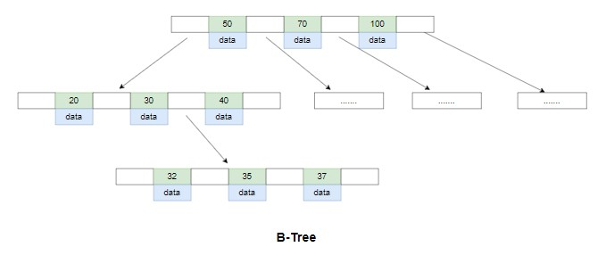
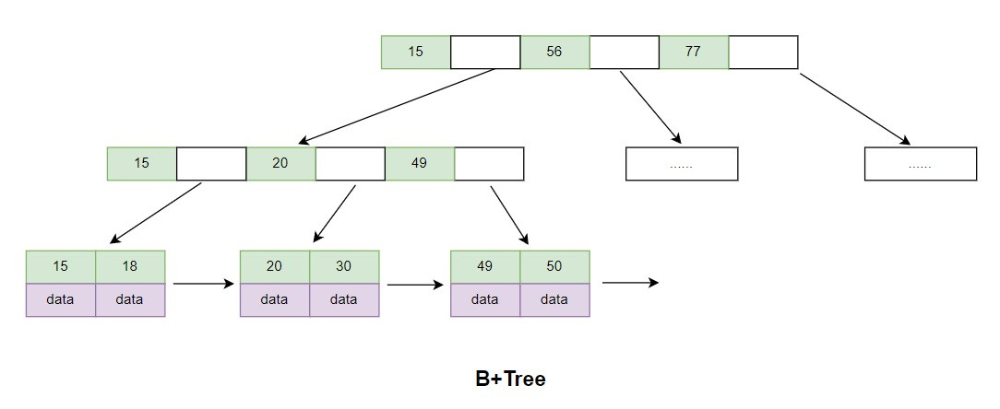

# MySQL索引底层结构简介

MySQL官方对索引的定义为：索引（Index）是帮助MySQL高效获取数据的数据结构。索引通常用于加快数据库或搜索引擎的查询速度，特别是在大型数据集或复杂查询场景下。通过创建索引，可以快速定位所需的数据，减少了数据扫描的时间和资源消耗。在实际应用中，需要权衡索引的优缺点，避免过度索引或不必要的索引，以确保系统的高效和可靠性。

常用的实现索引的数据结构：
* B+Tree索引：B+Tree索引是一种平衡树，可以高效地支持范围查询，适用于基于范围条件的查询，如大于、小于、区间查询等。
* Hash索引：Hash索引是一种基于哈希表的索引，适用于等值查询，但不支持范围查询。
* R-Tree索引：R-Tree索引是一种多维空间索引，适用于对空间数据进行查询的场景，如地理位置信息查询。
* Full-Text索引：Full-Text索引是一种全文索引，可以高效地支持文本匹配查询，适用于对文本数据进行关键词搜索的场景。

其中，B-Tree索引是MySQL中最常用的索引类型，也是默认的索引类型。

> B+Tree索引

采用B+树数据结构，特性：多叉树、叶子节点都在最后一层，树高压的低，查询路数少，时间复杂度低，通常存储引擎最多使用的数据结构来实现索引。  
像整型、浮点型、日期、布尔型、短字符串、日期型这些数据类型使用B+Tree来建立索引。

> Hash索引

散列表（m%n=address），通过address来定位它的位置，但是像再散列的方式，比如链式散列、二次再散列再定位，空间复杂度和时间复杂度就会变化。  
适用的场景是缓存，Innodb实现了自适应Hash索引做缓存加快效率，Hash索引适合小数据量，冲突比较小的数据。  
B+树索引适合大规模的，几十万甚至上亿条都能很好的把数据组织起来，几百条数据对Hash索引来说很容易，数据再多时间复杂度就上升了，会有大规模Hash碰撞。

MySQL适合使用哈希索引（Hash Index）的情况包括：
1. 需要快速的等值查询（即使用“=”进行查询）。
2. 数据集比较大，但是查询结果集比较小。
3. 数据分布比较均匀，避免哈希冲突。
需要注意的是，哈希索引不支持范围查询、排序和分组操作，因此在这些场景下使用哈希索引不太适合。此外，哈希索引的大小不能动态调整，因此需要在创建索引时考虑到数据的大小。

> R-Tree索引

存储经纬度数据，通常使用于GIS地理、三维空间坐标，这些数据可以通过R-Tree索引，快速查询地理信息坐标。  

> Full-Text索引

像MySQL使用like关键词进行字符串粗匹配，查询时间复杂度会很高，像搜索大段文本的业务，使用Full-Text索引即全文索引可以提升查询速度。  

## B-Tree

B-Tree是一个多叉树，有向下的指针，指针个数称之为度。节点包含指针节点+数据节点，间隔存放着指针和数据，数据是元组（key+value的形式）。

一般不使用B-Tree数据结构来存储数据，实际上更倾向于使用的是B+Tree数据结构，B+Tree数据结构中每一个叶子节点都包含指向下一个叶子节点的指针，这样做是为了方便叶子节点的范围遍历。

从图中可得知，B-Tree意味着所有的值都是按照顺序存储的，而且每一个叶子页到根的距离相同。

B-Tree是一种自平衡的搜索树，其特点包括：
* 支持高效地插入、查找和删除操作，时间复杂度为O(logN)。
* 叶子节点之间的距离相等，使得对树的所有操作具有相同的时间复杂度。
* 能够处理大量数据，适用于磁盘等存储介质，因为它能够最小化磁盘I/O次数。
* 叶子节点是有序的，前面的指key数值小，后面的key数值大，叶子节点有序排列，非递减排列，提供非常强的遍历和范围查询功能，因此支持范围查找操作，可以查找一个区间内的所有元素。
* B-Tree的节点可以包含多个关键字和指向子节点的指针，相比于二叉搜索树，B-Tree节点的度数更高，可以减少树的高度，查询的次数特别少，提高搜索效率。

## B+Tree

B+Tree是一种自平衡的树状数据结构，主要用于对于磁盘或其他直接存取较慢的存储设备的数据索引和排序。它具有以下特点：

* 多路平衡性：B+Tree是一种多叉树，每个节点可以拥有多个子节点，而且每个节点的子节点数目相同。
* 自平衡性：添加或删除节点时，B+Tree会自动进行平衡，使得整棵树保持平衡状态，这样可以保证查询效率。
* 顺序访问性：B+Tree中的每个节点都按照一定的顺序排列，可以通过访问一个节点的所有子节点来遍历整棵树，也可以在范围查询时有效地利用这种有序性。
* 磁盘读写优化：B+Tree的节点很大，通常大于一页的大小，因此每次读取或写入一个节点时，可以一次性读取或写入整个节点，减少了磁盘I/O操作的次数，提高了效率。
* 叶子节点的链表：B+Tree中的叶子节点构成一个有序的链表，便于范围查询，提高了区间访问的性能。
* 多级索引：B+Tree可以支持多级索引，即可以通过一个索引定位到某个叶子节点，然后在该节点的链表中查找目标数据，这样可以提高查询效率。

与B-Tree相比，B+Tree有以下不同点：
1. B+Tree的内部节点不存储数据，只存储索引，提高了空间利用率，而B-Tree的每个节点既存储索引又存储数据。
2. B+Tree的每个非叶子节点的子树指针都指向同一层的叶子节点，而B-Tree的每个非叶子节点的子树指针可以指向任意子树。
3. B+Tree的叶子节点使用链表连接，而B-Tree的叶子节点不使用链表连接。
4. 在B+Tree中，所有数据都存储在叶子节点上，而在B-Tree中，数据可能存储在非叶子节点上。
5. B+Tree的查询效率比B-Tree更高，因为B+Tree的非叶子节点不存储数据，可以含有更多的子节点，具有更高的分支因子。
6. B+Tree的顺序访问性更好，因为所有叶子节点都是按顺序连接的，而且每个节点的大小都是页面大小的倍数，可以减少磁盘I/O次数。
7. B+Tree适合存储大量的数据，而B-Tree适合存储少量的数据。

总之，B+Tree相比B-Tree具有更高的查询效率和更好的磁盘读写优化，适用于需要快速访问大量数据的应用场合。

图示：带有顺序访问指针的B+Tree

使用顺序访问指针的好处：
* key肯定是有序的，使用带有顺序访问指针的B+Tree，能提高区间访问的性能。
* 使用between and查询语句，每次从根节点查下来，时间复杂度是mLogN，如果直接从叶子节点查询效率会快很多。
* 对范围进行并发查数据的时候，在开头加个锁，在结尾加个锁，通过顺序访问指针就实现了这个功能，即间歇锁。
* 在事务这一块，也用到了顺序指针，比如增删改操作时，只需要在18加锁，在49加锁，就可以把这一片范围的数据都锁住，能保证事务。

## 组合索引最左原则

MySQL的组合索引最左原则是指，如果一个表有多个列组成的组合索引，那么在查询时，只有以组合索引的最左边的列开始的查询条件才能充分利用该索引。  
例如，如果一个表有一个组合索引包含列A、B和C，那么在查询时，只有满足以下条件的查询才能使用组合索引：
* 查询条件必须以列A开始；
* 如果查询条件中包含列B或C，则可以连续使用组合索引中的列B和C。
* 如果查询条件不满足以上条件，则无法使用组合索引，查询将变得更加缓慢。  
这是因为MySQL使用B+tree来实现索引，而B+tree是按照索引列的顺序进行排序的。如果查询条件不满足组合索引最左原则，那么MySQL将不得不扫描整个索引或者使用其他索引，这将导致性能下降。