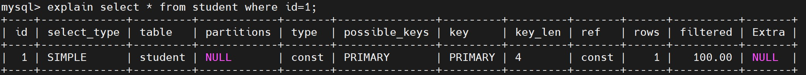
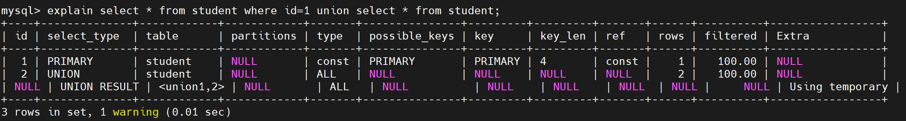
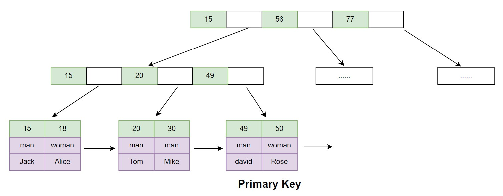
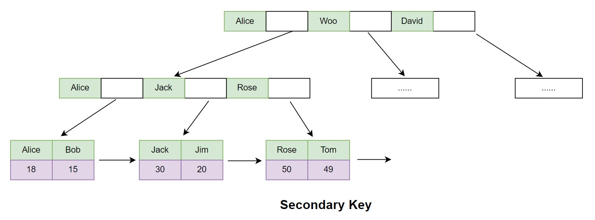
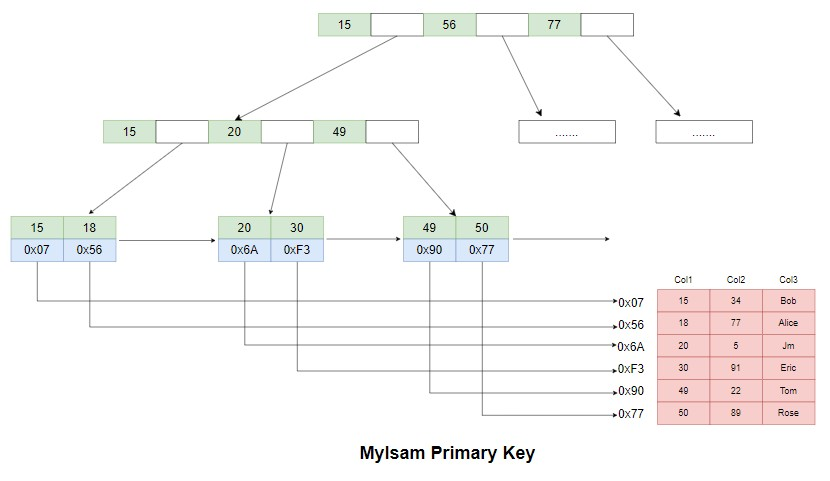
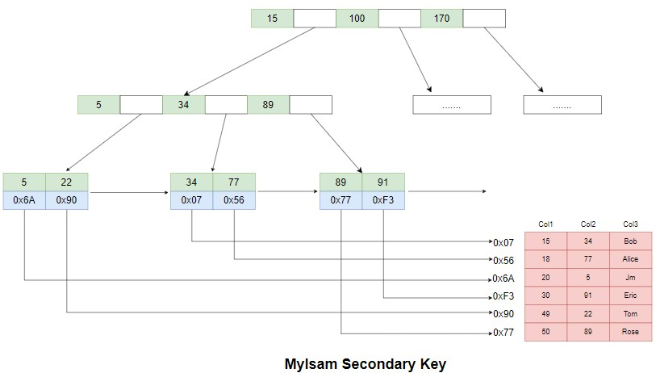

# MySQL Explain执行计划详解

所谓的执行计划就是MySQL如何执行一条SQL语句，包括查询的顺序、是否使用索引，以及使用的索引信息等内容。

MySQL、MongoDB、Oracle、Hive、Impala这些存储计算引擎都是有执行计划的。

执行计划的目的就是为了优化，MySQL把执行过程打印出来，对执行SQL进行定向优化。

执行计划如下图所示：



其中的查询表创建语句DDL为：
```sql
CREATE TABLE `student` (
  `id` int(11) NOT NULL AUTO_INCREMENT,
  `uid` int(11) NOT NULL,
  `name` varchar(40) COLLATE utf8_bin DEFAULT NULL,
  `sex` tinyint(4) DEFAULT NULL,
  `age` int(11) DEFAULT NULL,
  `email` varchar(40) COLLATE utf8_bin DEFAULT NULL,
  PRIMARY KEY (`id`),
  KEY `idx_name_sex` (`name`,`sex`),
  KEY `idx_age` (`age`)
) ENGINE=InnoDB AUTO_INCREMENT=4 DEFAULT CHARSET=utf8 COLLATE=utf8_bin;
```

基本语法：

> explain select ...

执行计划的基本形式。

> explain extended select ...

上述的语句是将表格形式的执行计划转换为select语句，在使用show warnings可以得到mysql优化器优化后的查询语句。

explain只是把MySQL的执行过程打印出来了，explain extended打印出来的信息数据更多，不光把执行过程打印出来，还能提供优化后的建议。

show warngins：如果是条慢SQL，它可以把优化后的SQL打印出来，如果返回空说明这条SQL还可以。

> explain partitions select ...

用于分区表的explain。

MySQL除了分库分表，还提供了分区表。

MySQL作为事务型数据库，操作条数一般较少，增删改查只是针对几条几十条的数据执行，MySQL也有做批量的任务。处理一个月或者一个季度的数据，如果要做报表，需要进行数据批处理，
这种应用场景，可以使用分区，比如一个月或者一个季度的流水数据，放在一个分区里读取或者计算就可以了。

分区使用的比较少是因为一般使用大数据来做批处理任务，订单导入到HBase、Hive等存储层，然后使用Spark、Hadoop来处理，不过批处理MySQL也是能胜任的。

## explain展示的列信息



* id：根据id确定执行顺序，先执行哪条，再执行哪条，SQL执行的顺序的标识
    * id相同的执行顺序由上至下
    * id不同，id值越大优先级越高，越先被执行
    * id为null表示一个结果集，不需要使用它查询，常出现在包括union等查询语句中
* select_type：每个select子句的类型，最常用的就是simple和subquery
    * SIMPLE：简单select，不使用union或子查询等
    * PRIMARY：查询中若包含任何复杂的子部分，最外层的select被标记为PRIMARY
    * UNION：出现在union后的查询语句中，union中的第二个或后面的select语句
    * SUBQUERY：子查询中的第一个select，在select或者where子句中包含的查询
    * DERIVED：派生表的select， from子句中包含的查询
    * DEPENDENT UNION：union中的第二个或后面的select语句，取决于外面的查询
    * UNION RESULT：union的结果
    * DEPENDENT SUBQUERY：子查询中的第一个select，取决于外面的查询
    * UNCACHEABLE SUBQUERY：一个子查询的结果不能被缓存，必须重新评估外链接的第一行
* table：查了哪张表。
* partitions：使用了哪个分区。
* type：使用的索引类型，常用的类型有：ALL、index、range、ref、eq_ref、const、system、NULL（性能从差到好），最重要的是唐渝鹏，影响查询效率的是索引，B+树究竟怎么查，select_type只是陈列一下MySQL怎么查询的，核心是type，命中的索引类型
    * ALL：全表遍历以便找到匹配的行，扫描全表数据
    * index：只遍历索引树，覆盖索引，索引做扫描，是基于索引在索引的叶子节点上找满足条件的数据（不需要访问数据文件）
    * range：只检索给定范围的行，使用一个索引来选择行。
    * ref：表示表的连接匹配条件，即哪些列或者常量被用于查找索引列上的值。
    * eq_ref：和ref类型类似，区别在于它使用的索引是唯一索引，多表连接中使用primary key或者unique key作为关联条件，对应每个索引键值，表中只有一条记录匹配。
    * const、system：当MySQL对查询某部分进行优化，并且转换为一个常量时，使用这些类型访问，比如将主键置于where列表中，MySQL就能将该查询转换为一个常量，system是const类型的特例，当查询的表只有一行的情况下，使用system
    * NULL：MySQL在优化过程中分解语句，执行时甚至不用访问表或者索引，例如从一个索引列中选取最小值可以通过单独索引查找完成。
    * fulltext：使用全文索引
    * index_subquery：在子查询中使用ref
    * unique_subquery：在子查询中使用eq_ref
    * ref_or_null：对NULL进行索引优化的ref
    * eq_ref：在join查询中使用PRIMARY KEY or UNIQUE NOT NULL索引关联
* passible_keys：指出MySQL能使用哪些索引在表中找到记录，候选的索引key，用了哪条索引，可能会用哪条索引，全给列出来，但不一定被查询使用
    * Tips：当该列为NULL时就要考虑当前的SQL是否需要优化了。
* key_length：查询中使用的索引的长度，不损失精确性的情况下，长度越短越好。
    * 索引char()、varchar()索引长度的计算公式：(Character Set: utf8mb4=4, utf8=3, latin1=1)*列长度+1(允许null)+2(变长列)  
    * 以name字段为例，`name` varchar(128) not null default '', name索引长度为：编码为uft8mb4，列长为128，不允许为NULL，字段长度为varchar(128)，key_length=128*4+0+2=514。
* key：真正命中的索引，MySQL实际决定使用的索引（MySQL内部会做评估），若没有使用索引，显示为NULL，要想强制MySQL使用possible_keys列中的索引，在查询中使用FORCE_INDEX、USE INDEX
    * Tips：查询中若使用了覆盖索引（覆盖索引：索引的数据覆盖了需要查询的所有数据），则该索引仅仅出现在key列表中。
* ref：引用，表示表的连接匹配条件，即哪些列或者常量被用于查找索引列上的值。
* rows：MySQL根据表统计信息及索引选用情况，估算找到所需的记录所需要读取的行数，即扫描了多少行。
* filtered：过滤了多少行
* Extra：包含MySQL解决查询的详细信息，用了什么where条件等额外内容
  * Using where:列数据是从仅仅使用了索引中的信息而没有读取实际的行动的表返回的，这发生在对表的全部的请求列都是同一个索引的部分的时候，表示mysql服务器将在存储引擎检索行后再进行过滤
  * Using temporary：表示MySQL需要使用临时表来存储结果集，常见于排序和分组查询
  * Using filesort：MySQL中无法利用索引完成的排序操作称为"文件排序"
  * Using join buffer：改值强调了在获取连接条件时没有使用索引，并且需要连接缓冲区来存储中间结果。如果出现了这个值，那应该注意，根据查询的具体情况可能需要添加索引来改进能。
  * Impossible where：这个值强调了where语句会导致没有符合条件的行。
  * Select tables optimized away：这个值意味着仅通过使用索引，优化器可能仅从聚合函数结果中返回一行

其中，id、type、key是比较重要的信息，其中最重要的是访问类型type。  

## 访问类型type比较

system、const、ref、range、index、full用的多，ref用的最多
访问类型type选用尽量往左靠


我们通过执行计划希望知道执行的顺序是什么，希望知道索引类型是什么，希望知道最终命中的是哪条索引，如果没有命中索引，
我们需要添加索引来修改我们的查询语句。

## InnoDB的索引实现

在InnoDB中，表数据文件本身就是按B+Tree组织的一个索引结构，这棵树的叶节点data域保存了完整的数据记录。这个索引的key是数据表的主键，因此InnoDB表数据文件本身就是主索引。
下图所示，可以看到叶节点包含了完整的数据记录。这种索引叫做聚集索引。因为InnoDB的数据文件本身要按主键聚集，所以InnoDB要求表必须要有主键。

特征：
* 创建表时指定一列作为主键列。
* MySQL系统会自动选择一个可以唯一标识数据记录的列作为主键。
* MySQL自动为InnoDB表生成一个隐含字段作为主键，这个字段长度为6个字节，类型为长整型。

> primary key

一级索引也称为主键索引、聚簇索引，索引就是这张表的主键，叶子节点的数据就是行里面的其他列，它是InnoDB表中最重要的索引，它的特点如下：

1. 存储方式：一级索引以B+Tree的形式存储在磁盘上，包含所有的列。InnoDB表的数据是按照聚簇索引的顺序存储的，也就是说，表的数据和聚簇索引是密切相关的。
2. 物理上的排序：一级索引是按照主键的值来排序的，因此数据行实际存储的物理位置是按照主键的值排序的。这种物理上的排序可以提高数据的查询速度。
3. 唯一性：一级索引的主键值必须是唯一的，如果定义的主键值不唯一，MySQL会自动创建一个隐藏的唯一主键。
4. 查询速度：因为一级索引是按照主键的值进行排序的，因此在查询主键时具有很高的效率，可以快速定位到目标行。
5. 支持范围查询：一级索引支持范围查询，可以通过范围查询来查找表中的数据，从而提高查询效率。

总之，InnoDB一级索引是InnoDB表中最重要的索引，它以B+Tree的形式存储在磁盘上，关系到表中的数据存储和查询效率，因此在设计数据库时需要合理地选择和使用一级索引。



> secondary key

有非主键列参与创建的索引叫做二级索引，其叶子节点的数据为主键索引，二级索引也被称为非聚簇索引、辅助索引或组合索引。比如使用name做索引，那么叶子节点的数据就是主键key。 

它的特点如下：
1. 存储方式：二级索引以B+Tree的形式存储在磁盘上，不包含表的所有列，只包含索引列和主键列。
2. 物理上的排序：二级索引是按照索引列的值来排序的，而不是按照主键的值来排序的。因此，二级索引的查询速度与主键索引的查询速度不同。
3. 唯一性：二级索引的值可以是重复的，但是主键的值必须是唯一的。
4. 查询速度：二级索引可以用于查询非主键列，可以提高查询效率，但是由于在查询时需要先查询二级索引，然后通过主键索引查找数据行，因此相比主键索引，二级索引的查询速度更慢。
5. 支持覆盖索引：如果查询的列在二级索引中已经包含，那么查询可以直接从二级索引中返回结果，而不需要到主键索引中查找数据行，这种索引称为覆盖索引，可以提高查询效率。  
覆盖索引举例：select id from student where name='Alice'，本应该从二级索引中找到id，再通过primary key把alice的数据查询出来，再获取到id，按道理需要查询两次B+Tree，但是MySQL发现查询的id正好是这张表的主键，直接第一次查出B+Tree结果后把18返回就可以了，这就是覆盖
    索引，查询正好是主键值的时候就不用再通过primary key二次查B+Tree了。
总之，InnoDB二级索引是InnoDB表中的一种索引类型，它可以提高查询效率，支持覆盖索引，但是相比主键索引，查询速度较慢。在设计数据库时需要根据具体情况选择和使用二级索引。 



Innodb的索引文件和数据文件放在一起的，都放在.ibd文件里面，二级索引的叶子节点的数据是primary key，主键索引的叶子节点的数据是所有的行数据。

## Mylsam的索引实现

Mylsam也是分一级索引和二级索引的，索引叶子节点的数据是个地址，获得地址才去寻找数据。  
Mylsam的一级索引是一个数据结构，用于存储和快速查找数据库中的主键。它包含一个主键列和一个指向实际数据行的指针。当用户请求数据时，Mylsam会首先查找一级索引，然后使用指针找到实际数据行并返回请求的数据。一级索引可以大大加快查询速度，特别是在大型数据库中。  
在Mylsam中，一级索引可以是唯一的或非唯一的。唯一的一级索引要求主键列的每个值都是唯一的，而非唯一的一级索引则允许主键列中包含重复值。在创建表时，可以选择是否要创建一级索引，并指定主键列和索引类型。Mylsam还支持创建多个一级索引，以便根据不同的查询条件和排序方式优化数据查询。



Mylsam的二级索引是一个用于加速数据查询的数据结构，它是在一级索引之上的另一个索引层。当表中的数据需要按照非主键列进行查询时，Mylsam可以使用二级索引来快速定位到数据行。  
在Mylsam中，创建二级索引需要指定要索引的列，以及索引类型。与一级索引不同的是，二级索引不需要是唯一的。当插入数据时，Mylsam会自动在对应的二级索引中插入相应的数据行。  
使用二级索引可以提高查询效率，但也会增加数据存储和维护的成本。因此，需要权衡查询效率和存储成本，选择适当的二级索引策略来优化数据库性能。  



Mylsam的数据文件是放在MYD（MYData）里面，索引文件是放在MYI（MYIndex）里面。  
通过索引找到了数据的地址，然后从数据文件里面把数据找到，这就是Mylsam索引的物理实现，它的一级索引和二级索引一样，叶子节点上的数据都是地址，通过索引文件找地址，再通过地址文件找数据。


