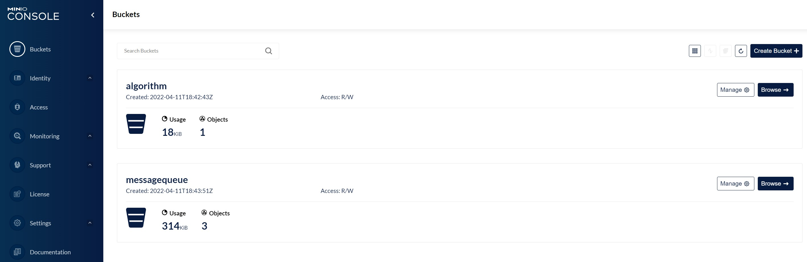
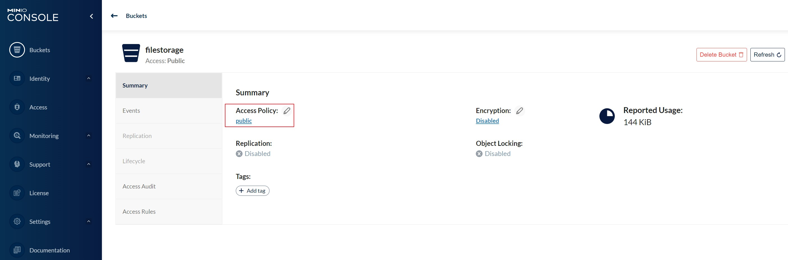

# 对象存储服务MinIO安装

## 部署MinIO对象存储服务（Linux环境）

使用MinIO搭建图片服务器，相比FastDFS，使用Minio搭建文件服务器更方便

> 首先需要有docker环境

> 拉取MinIO镜像

```asciidoc
docker pull minio/minio:RELEASE.2022-04-12T06-55-35Z
```

> 创建minio目录
```asciidoc
创建/data/minio/data和/data/minio/config目录
# 进入/目录
cd /
# 创建data目录
mkdir data
# 进入/data目录
cd data
# 创建/data/minio目录
mkdir minio
# 进入minio目录
cd minio
# 创建/data/minio/data目录
mkdir data
# 创建/data/minio/config目录
mkdir config
```

> 自定义用户和秘钥安装

```asciidoc
docker run --name minio -p 9000:9000 -p 9090:9090 -d --restart=always \
-e "MINIO_ROOT_USER=你设置的用户名" \
-e "MINIO_ROOT_PASSWORD=你设置的密码" \
-v /data/minio/data:/data \
-v /data/minio/config:/root/.minio minio/minio \
server /data \
--console-address '0.0.0.0:9090'
```

> 访问MinIO操作页面

我们在地址栏输入：http://服务器对外ip地址:9090/login 即可进入登录界面。
```asciidoc
访问MinIO操作页面：http://服务器对外ip地址:9090/login
用户名：你设置的用户名
密码：你设置的密码
```
进入系统后可以看到主界面

点击"Create Bucket+"，创建一个桶



Bucket如果创建成功，通过主页面每个Bucket的Manage功能，可以将Bucket的Access Policy设置为Public状态，Bucket里面的文件就可以对别人开放访问了



文件访问地址：http://服务器对外ip地址:9000/bucket名称/文件名称（包括文件类型后缀）

