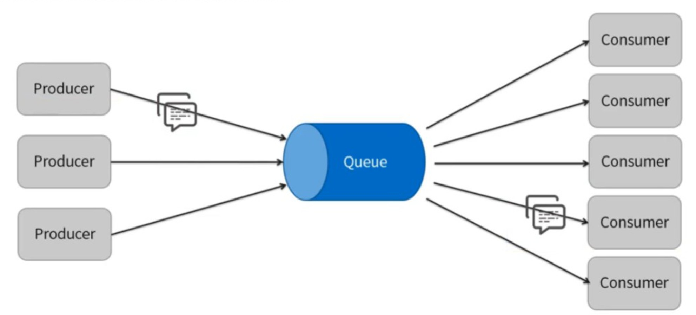
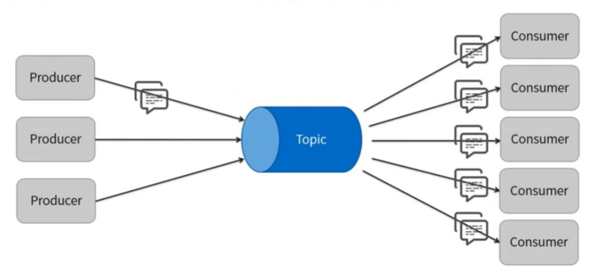
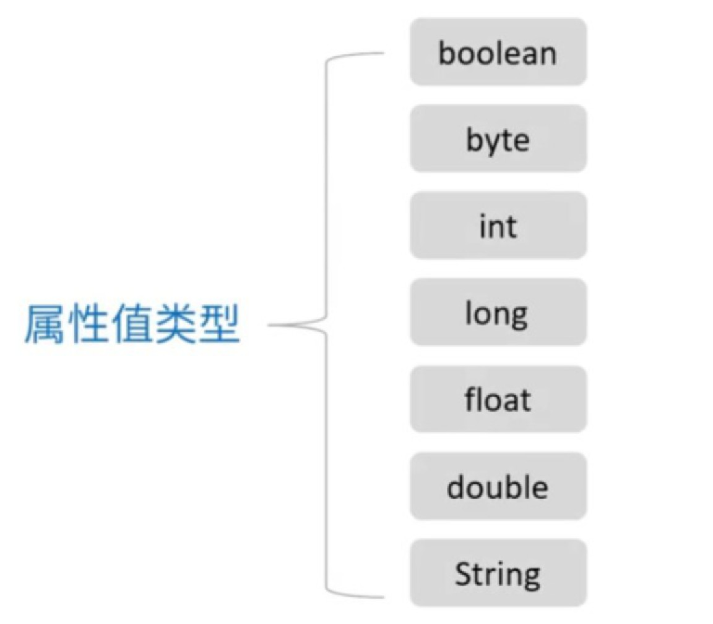

# JMS概述

## JMS规范

> JMS简介

即Java Message Service，Java消息服务，它只是一个Java平台中关于面向消息中间件的API，用于在两个应用程序之间或分布式系统中发送消息，用于异步通信，且与具体平台无关（Java、PHP、Python等语言都支持），
具体怎么发送消息，是由实现者来实现的，类似jdbc不同厂商有不同的驱动

> JMS的对象模型

|     模型属性      |             解释             |
| :---------------: | :--------------------------: |
| ConnectionFactory |           连接工厂           |
|    Connection     |             连接             |
|      Session      |             会话             |
|    Destination    |             目的             |
|  MessageProducer  |            生产者            |
|  MessageConsumer  |            消费者            |
|      Message      |             消息             |
|      Broker       | 消息中间件的实例（ActiveMQ） |

> JMS的消息模型

* 点对点（Point-to-Point）

消息指定消费者，你给朋友A发消息，其他人是看不到这个消息的

* 发布订阅（Publish/Subscribe）

有topic存在，这条消息会发送给全部订阅有这个topic的消费者，比如发帖子、发群公告等场景，只要别人能进入页面，就可以看到发的消息

> JMS的消息结构

JMS虽然只是一个API定义，JMS的实现厂商可以不遵循它去做，但是作为中间件的协议，最好有个规范，消息结构进行了这方面的约束

消息结构分为消息头、消息属性、消息体三部分，存放着消息的具体信息，就像发快递一样，告知我们发的快递里存放着什么物品

* 消息头（关于消息的描述信息）

|    消息头属性    |                             解释                             |
| :--------------: | :----------------------------------------------------------: |
|  JMSDestination  |                消息的目的地，Topic或者是Queue                |
| JMSDeliveryMode  |                        消息的发送模式                        |
|   JMSTimestamp   |        消息传递给Broker的时间戳，它不是实际发送的时间        |
|  JMSExpiration   |    消息的有效期，在有效期内，消息消费者才可以消费这个消息    |
|   JMSPriority    |        消息的优先级，0-4为正常的优先级，5-9为高优先级        |
|   JMSMessageID   |                一个字符串，用来唯一标识一条消息                |
|    JMSReplyTo    | 有时消息生产者希望消费者回复一个消息（告知是否收到），JMSReplyTo为一个Destination，标识需要回复的目的地 |
| JMSCorrelationID |                   通常用来关联多个Message                    |
|     JMSType      |              表示消息体的结构，和JMS提供者有关               |
|  JMSRedelivered  |              如果这个值为true，表示消息是被重新发送了              |

* 消息属性

可以理解为消息的附加消息头，属性名可以自定义，可以是业务值，Key-Value形式

属性值支持的类型

* 消息体

|  消息体属性   |        解释        |
| :-----------: | :----------------: |
| BytesMessage  |  用来传递字节消息  |
|  MapMessage   | 用来传递键值对消息 |
| ObjectMessage | 用来传递序列化对象 |
| StreamMessage |   用来传递文件等   |
|  TextMessage  |   用来传递字符串   |

