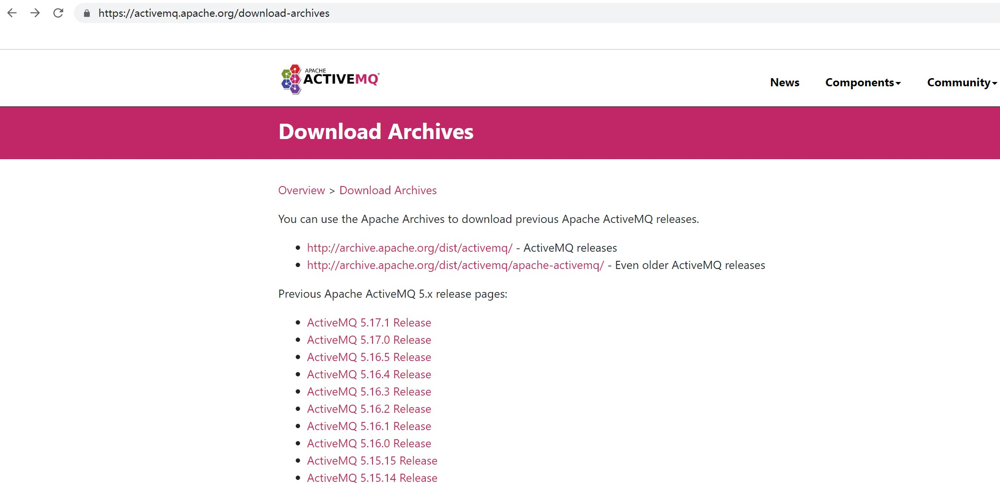
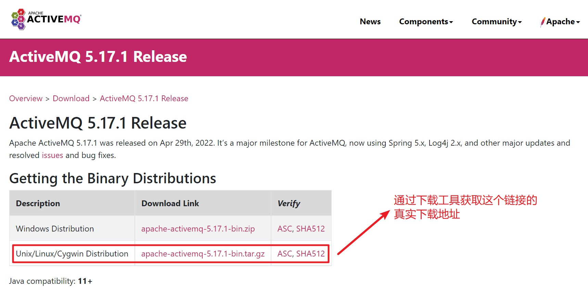

# ActiveMQ安装

## ActiveMQ简介

ActiveMQ是Apache出品，流行的，能力强劲的开源消息总线，是完全支持JMS1.1和J2EE1.4规范的JMS Provider实现（JMS在当今的J2EE应用中仍然扮演者重要的角色）

熟悉JMS的API的使用，就能操作ActiveMQ

## ActiveMQ特性

* 支持多种编程语言：不只是Java，C、Ruby、Php等都可以操作它

* 支持多种传输协议：JMS只是提供了API，具体发送数据的传输协议由ActiveMQ支持，ActiveMQ支持MQTT、AMQP、UDP、HTTP等协议

* 有多种持久化方式：可以文件，可以数据库

* 在传统业务中应用广泛

## 安装ActiveMQ（安装环境基于Centos7和Jdk1.8）

> 下载ActiveMQ

通过浏览器打开网页https://activemq.apache.org/download-archives，寻找合适的ActiveMQ版本



获取所需ActiveMQ版本的下载链接



获取到链接（比如https://dlcdn.apache.org//activemq/5.15.8/apache-activemq-5.15.8-bin.tar.gz）后

进入提取准备好的activemq安装目录，并且使用wget下载存档，如果Linux系统没有wget需要先通过"yum install wget"命令安装wget

如果Linux服务器下载资源较慢，可以本地先下载好ActiveMQ存档，再上传到Linux服务器上

```text
wget -c https://archive.apache.org/dist/activemq/5.15.8/apache-activemq-5.15.8-bin.tar.gz
```

> 安装ActiveMQ

下载完毕后，到activemq下载目录，提取存档

```text
tar -zxvf apache-activemq-5.15.8-bin.tar.gz
```

修改activemq的目录名
```text
mv /data/software/apache-activemq-5.15.8 /data/software/activemq
```

移除存档
```text
rm -rf apache-activemq-5.15.8-bin.tar.gz
```

## 启动ActivemQ服务

> 使用命令启动ActiveMQ服务

进入ActiveMQ目录，作为后台进程启动ActiveMQ
```text
# 进入ActiveMQ安装目录
cd /data/software/activemq

# 启动ActiveMQ
./bin/activemq start
```

如果后台进程启动成功，会有类似以下输出
```text
INFO: Loading '/data/software/activemq//bin/env'
INFO: Using java '/data/software/jdk/jdk1.8.0_221/bin/java'
INFO: Starting - inspect logfiles specified in logging.properties and log4j.properties to get details
INFO: pidfile created : '/data/software/activemq//data/activemq.pid' (pid '1293236')
```

> 使用命令停止ActiveMQ服务
```text
# 进入ActiveMQ安装目录
cd /data/software/activemq

# 停止ActiveMQ服务
./bin/activemq stop
```

如果后台进程停止成功，会有类似以下输出
```text
INFO: Loading '/data/software/activemq//bin/env'
INFO: Using java '/data/software/jdk/jdk1.8.0_221/bin/java'
ERROR: No or outdated process id in '/data/software/activemq//data/activemq.pid'
INFO: Removing /data/software/activemq//data/activemq.pid
```

> 使用System服务启动ActiveMQ服务

前面使用命令运行ActiveMQ，但有时候在工作环境中，不是使用这种方式启动服务（降低运维成本，因为不同的中间件有不同的启动命令，
如果是系统服务的话启动命令就比较统一了，不管是老的运维还是新来的运维，对他们来说，操作手册都是统一的），最好的方式是将ActiveMQ作为服务启动，
使用System服务将可以确保ActiveMQ能在系统启动时自行启动
统一：不用管ActiveMQ安装目录在哪里，也不用管命令是什么

* 使用vim创建一个systemd服务文件
```text
vi /usr/lib/systemd/system/activemq.service
```

* 填写类似以下内容
作用是记录启动、停止命令、日志输出
```text
[Unit]
Description=ActiveMQ service
After=network.target

[Service]
Type=forking
ExecStart=/data/software/activemq/bin/activemq start
ExecStop=/data/software/activemq/bin/activemq stop
User=root
Group=root
Restart=always
RestartSec=9
StandardOutput=syslog
StandardError=syslog
SyslogIdentifier=activemq

[install]
WantedBy=multi-user.target
```
系统日志一般都在/var/log/message里面

* 修改activemq配置，将JAVA_HOME的注释取消，填入jdk安装路径（填入自己机器的jdk安装路径），设JAVA_HOME，告知jdk目录在哪里
```text
vi /data/software/activemq/bin/env

找到
# Location of the java installation
# Specify the location of your java installation using JAVA_HOME, or specify the
# path to the "java" binary using JAVACMD
# (set JAVACMD to "auto" for automatic detection)
#JAVA_HOME=""
JAVACMD="auto"

将其改为
# Location of the java installation
# Specify the location of your java installation using JAVA_HOME, or specify the
# path to the "java" binary using JAVACMD
# (set JAVACMD to "auto" for automatic detection)
JAVA_HOME="/data/software/jdk/jdk1.8.0_221"
JAVACMD="auto"
```
经过一系列操作，ActiveMQ系统服务就创建好了（JAVA_HOME目录配置好才能正常启动）

* 启动ActiveMQ服务
```text
systemctl start activemq
```

* 查看服务状态
```text
systemctl status activemq
```

* 设置开机自动启动
```text

# 第一步
ln -s /usr/lib/systemd/system/activemq.service /etc/systemd/system/multi-user.target.wants/activemq.service

# 第二步
systemctl enable activemq

```

* 防火墙添加ActiveMQ的端口
如果ActiveMQ启动后，外部还无法访问，还需要在防火墙配置中添加ActiveMQ的Web管理端口和通讯端口

添加端口
```text
# Web管理端口默认为8161，通讯端口默认为61616
firewall-cmd --zone=public --add-port=8161/tcp --permanent
firewall-cmd --zone=public --add-port=61616/tcp --permanent
```

重启防火墙
```text
systemctl restart firewalld.service
```