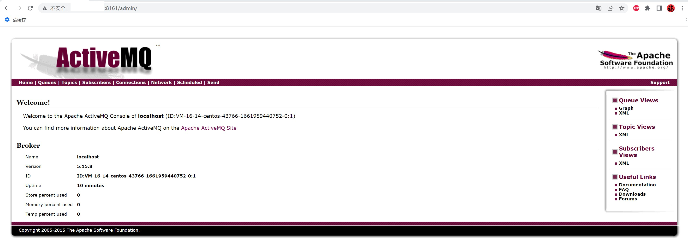
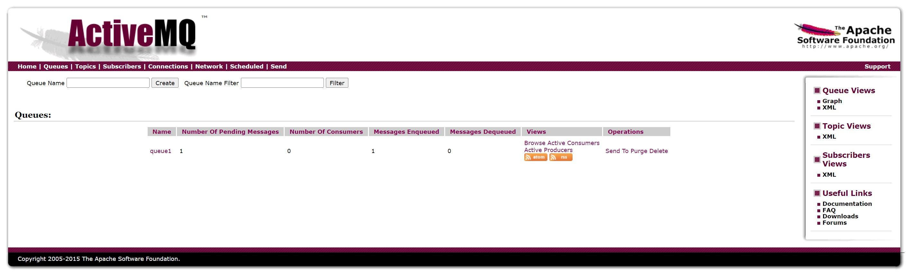
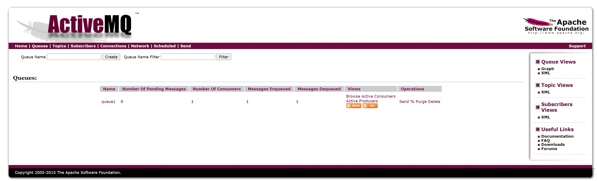

# ActiveMQ使用

## 使用ActiveMQ的Web管理平台

ActiveMQ本身自带管理平台，在浏览器访问http://服务器对外IP:8161/admin即可访问。  
ActiveMQ的管理页面默认开启了身份校验，用户名默认admin，密码默认admin。  
登录成功的访问页面如下：


## ActiveMQ的Web管理配置

ActiveMQ的Web管理平台是基于jetty运行。     
可以在ActiveMQ安装目录下的conf目录里看到jetty的配置文件：jetty.xml、jetty-realm.properties

* 管理Web平台端口号（jetty.xml）
```xml
<bean id="jettyPort" class="org.apache.activemq.web.WebConsolePort" init-method="start">
    <!-- the default port number for the web console -->
    <property name="host" value="0.0.0.0"/>
    <property name="port" value="8161"/>
</bean>
```

* 关闭/开启登录校验（jetty.xml）
```xml
<bean id="adminSecurityConstraint" class="org.eclipse.jetty.util.security.Constraint">
    <property name="name" value="BASIC" />
    <property name="roles" value="admin" />
     <!-- set authenticate=false to disable login -->
    <property name="authenticate" value="true" />
</bean>
```

* 配置用户名（角色）、密码（jetty-realm.properties）

通过jetty-realm.properties文件维护账号密码，格式为  
用户名:密码,角色  
如admin:888888,admin指的就是用户名是admin，密码是888888，角色是管理员admin。  
要修改的用户名和密码尽量不要出现','和':'特殊字符。
```properties
# Defines users that can access the web (console, demo, etc.)
# username: password [,rolename ...]
admin: admin, admin
user: 123, user
```

## 在Java中使用ActiveMQ

> 使用Jar包

在activemq的根目录有activemq-all-5.15.8.jar包，将其直接复制到工程即可。

> 使用Maven依赖

```xml
<dependency>
    <groupId>org.apache.activemq</groupId>
    <artifactId>activemq-all</artifactId>
    <version>5.15.8</version>
</dependency>
```

> ActiveMQ生产消息Demo

```java
import org.apache.activemq.ActiveMQConnectionFactory;
import javax.jms.*;
/**
 * 简单ActiveMQ生产者
 * @author yinaicheng
 */
public class Producer {
    public static void main(String[] args) {
        new ProducerThread("tcp://服务器对外IP:61616", "queue1").start();
    }

    static class ProducerThread extends Thread {
        String brokerUrl;
        String destinationUrl;

        public ProducerThread(String brokerUrl, String destinationUrl) {
            this.brokerUrl = brokerUrl;
            this.destinationUrl = destinationUrl;
        }

        @Override
        public void run() {
            ActiveMQConnectionFactory connectionFactory;
            Connection conn;
            Session session;

            try {
                // 1、创建连接工厂
                connectionFactory = new ActiveMQConnectionFactory(brokerUrl);
                // 2、创建连接对象
                conn = connectionFactory.createConnection("登录名","登录密码");
                conn.start();
                // 3、创建会话，ActiveMQ自动确认，AUTO_ACKNOWLENDGE是自动确认，代码收到就确认消息被消费，手动模式就是业务确认收到消息才认为被消费
                session = conn.createSession(false, Session.AUTO_ACKNOWLEDGE);
                // 4、创建点对点发送的目标，只有消费者拉取才可以看到，Queue是一对一的，Topic是只要订阅了该主题的，都可以看到，一个是广播的形式一个是单发的形式
                 Destination destination = session.createQueue(destinationUrl);
                // 5、创建生产者消息
                MessageProducer producer = session.createProducer(destination);
                // 设置生产者的模式，有两种可选 持久化 / 不持久化
                producer.setDeliveryMode(DeliveryMode.PERSISTENT);
                // 6、创建一条文本消息
                String text = "Hello world!";
                TextMessage message = session.createTextMessage(text);
                for (int i = 0; i < 1; i++) {
                    // 7、发送消息
                    producer.send(message);
                }
                // 8、 关闭连接
                session.close();
                conn.close();
            } catch (JMSException e) {
                e.printStackTrace();
            }
        }
    }
}
```

ActiveMQ的Web管理后台查看生产者发出的但未被消费者消费的消息：  


> ActiveMQ消费消息Demo

```java
import org.apache.activemq.ActiveMQConnectionFactory;
import javax.jms.*;
/**
 * 简单ActiveMQ消费者
 * 文档：http://activemq.apache.org/consumer-features.html
 * @author yinaicheng
 */
public class Consumer {
    public static void main(String[] args) {
        new ConsumerThread("tcp://服务器对外IP:61616", "queue1").start();
        new ConsumerThread("tcp://服务器对外IP:61616", "queue1").start();
    }
}

class ConsumerThread extends Thread {

    String brokerUrl;
    String destinationUrl;

    public ConsumerThread(String brokerUrl, String destinationUrl) {
        this.brokerUrl = brokerUrl;
        this.destinationUrl = destinationUrl;
    }

    @Override
    public void run() {
        ActiveMQConnectionFactory connectionFactory;
        Connection conn;
        Session session;
        MessageConsumer consumer;

        try {
            // brokerURL http://activemq.apache.org/connection-configuration-uri.html
            // 1、创建连接工厂
            connectionFactory = new ActiveMQConnectionFactory(this.brokerUrl);
            // 2、创建连接对象
            conn = connectionFactory.createConnection("登录名","登录密码");
            conn.start(); // 一定要启动
            // 3、创建会话（可以创建一个或者多个session）
            session = conn.createSession(false, Session.AUTO_ACKNOWLEDGE);
            // 4、创建点对点接收的目标，queue - 点对点
            Destination destination = session.createQueue(destinationUrl);
            // 5、创建消费者消息 http://activemq.apache.org/destination-options.html
            consumer = session.createConsumer(destination);
            // 6、接收消息(没有消息就持续等待)
            Message message = consumer.receive();
            if (message instanceof TextMessage) {
                System.out.println("收到文本消息：" + ((TextMessage) message).getText());
            } else {
                System.out.println(message);
            }

            consumer.close();
            session.close();
            conn.close();
        } catch (JMSException e) {
            e.printStackTrace();
        }
    }
}
```

ActiveMQ的Web管理后台查看生产者发出的且已被消费者消费的消息：



## 在Spring中使用ActiveMQ

Spring官方教程：http://spring.io/guides/gs/messaging-jms/

所需Maven依赖

```xml
<!--Spring支持ActiveMQ-->
<dependency>
    <groupId>org.springframework</groupId>
    <artifactId>spring-jms</artifactId>
    <version>5.1.3.RELEASE</version>
</dependency>
<dependency>
    <groupId>org.apache.activemq</groupId>
    <artifactId>activemq-broker</artifactId>
    <version>5.15.8</version>
    <exclusions>
        <exclusion>
            <artifactId>geronimo-jms_1.1_spec</artifactId>
            <groupId>org.apache.geronimo.specs</groupId>
        </exclusion>
    </exclusions>
</dependency>
<dependency>
    <groupId>javax.jms</groupId>
    <artifactId>javax.jms-api</artifactId>
    <version>2.0.1</version>
</dependency>
```

## 在SpringBoot中使用ActiveMQ

1.Maven下载SpringBoot相关依赖

```xml
<!--直接使用spring-boot-starter-activemq-->
<dependency>
    <groupId>org.springframework.boot</groupId>
    <artifactId>spring-boot-starter-activemq</artifactId>
</dependency>
```

2.配置文件配置ActiveMQ参数

```properties
spring.activemq.broker-url=tcp://服务器对外IP:61616
spring.activemq.user=用户名
spring.activemq.password=密码
```

3.编写配置类进行ActiveMQ属性的配置

```java
import org.apache.activemq.ActiveMQConnectionFactory;
import org.springframework.beans.factory.annotation.Value;
import org.springframework.context.annotation.Bean;
import org.springframework.context.annotation.Configuration;
import org.springframework.jms.annotation.EnableJms;
import org.springframework.jms.config.DefaultJmsListenerContainerFactory;
import org.springframework.jms.config.JmsListenerContainerFactory;
import org.springframework.jms.core.JmsTemplate;
import javax.jms.ConnectionFactory;
@Configuration
@EnableJms
public class JmsConfiguration {

    /**
     * 连接工厂
     *
     * @param brokerUrl
     * @param userName
     * @param password
     * @return
     */
    @Bean
    public ConnectionFactory connectionFactory(@Value("${spring.activemq.broker-url}") String brokerUrl, @Value("${spring.activemq.user}") String userName, @Value("${spring.activemq.password}") String password) {
        return new ActiveMQConnectionFactory(userName, password, brokerUrl);
    }

    /**
     * 队列模式的监听容器
     *
     * @param connectionFactory
     * @return
     */
    @Bean
    public JmsListenerContainerFactory<?> jmsListenerContainerFactoryQueue(ConnectionFactory connectionFactory) {
        DefaultJmsListenerContainerFactory bean = new DefaultJmsListenerContainerFactory();
        bean.setConnectionFactory(connectionFactory);
        return bean;
    }

    /**
     * topic 监听
     * @param connectionFactory
     * @return
     */
    @Bean
    public JmsListenerContainerFactory<?> jmsListenerContainerFactoryTopic(ConnectionFactory connectionFactory) {
        DefaultJmsListenerContainerFactory bean = new DefaultJmsListenerContainerFactory();
        bean.setConnectionFactory(connectionFactory);
        bean.setPubSubDomain(true);
        return bean;
    }

    /**
     * 队列模板
     *
     * @param connectionFactory
     * @return
     */
    @Bean
    public JmsTemplate jmsTemplateQueue(ConnectionFactory connectionFactory) {
        return new JmsTemplate(connectionFactory);
    }

    /**
     * 发布订阅模板
     *
     * @param connectionFactory
     * @return
     */
    @Bean
    public JmsTemplate jmsTemplatePublish(ConnectionFactory connectionFactory) {
        JmsTemplate jmsTemplate = new JmsTemplate(connectionFactory);
        jmsTemplate.setPubSubDomain(true);
        return jmsTemplate;
    }

}
```

4.生产者Demo

```java
import org.springframework.beans.factory.annotation.Autowired;
import org.springframework.boot.SpringApplication;
import org.springframework.boot.autoconfigure.SpringBootApplication;
import org.springframework.boot.autoconfigure.jdbc.DataSourceAutoConfiguration;
import org.springframework.boot.autoconfigure.jdbc.DataSourceTransactionManagerAutoConfiguration;
import org.springframework.jms.core.JmsTemplate;
import javax.annotation.PostConstruct;
import javax.jms.MapMessage;
@SpringBootApplication
public class Producer {

    @Autowired
    private JmsTemplate jmsTemplatePublish;

    @Autowired
    private JmsTemplate jmsTemplateQueue;

    @PostConstruct
    public void send() {
        // 队列模式发送
        jmsTemplatePublish.convertAndSend("topic1", "Hello Spring topic 1");

        // 发布订阅模式发送
        jmsTemplateQueue.send("queue1", session -> {
            MapMessage message = session.createMapMessage();
            message.setString("msg", "Hello Spring xxxx");
            return message;
        });
    }

    public static void main(String[] args) {
        SpringApplication.run(Producer.class, args);
    }
}
```

5.消费者Demo

```java
import org.apache.activemq.command.ActiveMQMapMessage;
import org.springframework.boot.SpringApplication;
import org.springframework.boot.autoconfigure.SpringBootApplication;
import org.springframework.jms.annotation.JmsListener;
import javax.jms.JMSException;
import javax.jms.Message;
import javax.jms.TextMessage;
@SpringBootApplication
public class Consumer {

    @JmsListener(destination = "queue1", containerFactory = "jmsListenerContainerFactoryQueue")
    public void receiveQueue(Message message) throws JMSException {
        if (message instanceof TextMessage) {
            System.out.println("收到文本消息：" + ((TextMessage) message).getText());
        } else if (message instanceof ActiveMQMapMessage) {
            System.out.println("收到Map消息：" + ((ActiveMQMapMessage) message).getContentMap());
        } else {
            System.out.println(message);
        }
    }

    @JmsListener(destination = "topic1", containerFactory = "jmsListenerContainerFactoryTopic")
    public void receiveTopic(String message) {
        System.out.println("收到订阅消息：" + message);
    }

    public static void main(String[] args) {
        SpringApplication.run(Consumer.class, args);
    }
}
```


