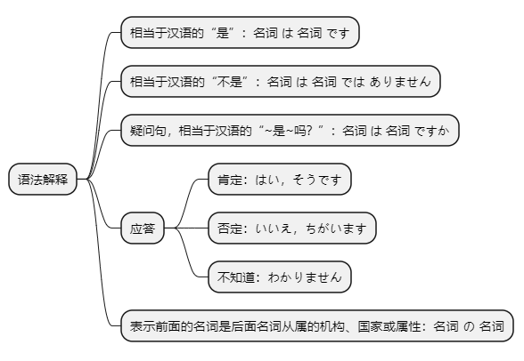
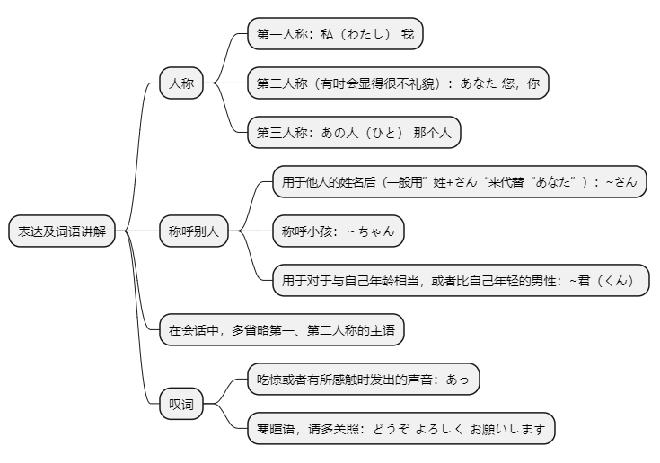

# 第一课

## 基本课文

```log
李さんは　中国人です。

森さんは　学生では　ありません。

林さんは　日本人ですか。

李さんは　JC企画の　社員です。

私は　李です。小野さんですか。
はい、そうです。小野です。

森さんは　学生ですか。
いいえ、学生では　ありません。会社員です。

吉田さんですか。
いいえ、ちがいます。森です。

李さんは　JC企画の　社員ですか。
はい、そうです。
```

## 语法解释



> 1. 名 は 名 です
```log
李さんは　中国人です。

わたしは　日本人です。

わたしは　王です。
```

> 2. 名 は 名 では ありません
```log
王さんは　学生では　　ありません。

わたしは　日本人では　ありません。

わたしは　田中じゃ　　ありません。
```

> 3. 名 は 名 ですか
```log
あなたは　小野さんですか。

はい、小野です。

キムさんは　中国人ですか。

いいえ、中国人では　ありません。
```

> 4. 应答
```log
森さんは　学生ですか。

はい、そうです。

いいえ、ちがいます。
```

> 5. 名 の 名
```log
李さんは　 JC企画の　社員です。

北京旅行社は　 中国の　 企業です。

デュボンさんは　大学の　 先生です。
```

## 表达及词语讲解



## 应用课文

出迎え
```log
JC企画の　小野さんですか。
はい，小野です。李秀麗さんですか。

はい，李秀麗です。はじめまして。どうぞ　よろしく　お願いします。
はじめまして，小野緑です。

李さん，こんにちは。
吉田さんですか。

いいえ，私は　吉田じゃ　ありません。森です。
あっ，森さんですか。どうも　すみません。

いいえ，どうぞ　よろしく。
李秀麗です。こちらこそ，よろしく　お願いします。
```

## 生词表

```log
ちゅうごくじん

にほんじん

かんこくじん

アメリカじん

フランスじん

がくせい

せんせい

りゅうがくせい

きょうじゅ

しゃいん

かいしゃいん

てんいん

けんしゅうせい

きぎょう

だいがく

ちち

かちょう

しゃちょう

でむかえ

あのひと

わたし

あなた

どうも

はい

いいえ

あっ

り

おう

ちょう

もり

はやし

おの

よしだ

たなか

なかむら

たろう

キム

デュポン

スミス

ジョンソン

ちゅうごく

とうきょうだいがく

ペキンだいがく

ジェーシーきかく

ペキンりょこうしゃ

にっちゅうしょうじ

こんにちは

すみません

どうぞ

よろしくおねがいします

はじめまして

こちらこそ

そうてす

ちがいます

わかりません

どうもすみません

さん

ちゅん

くん
```