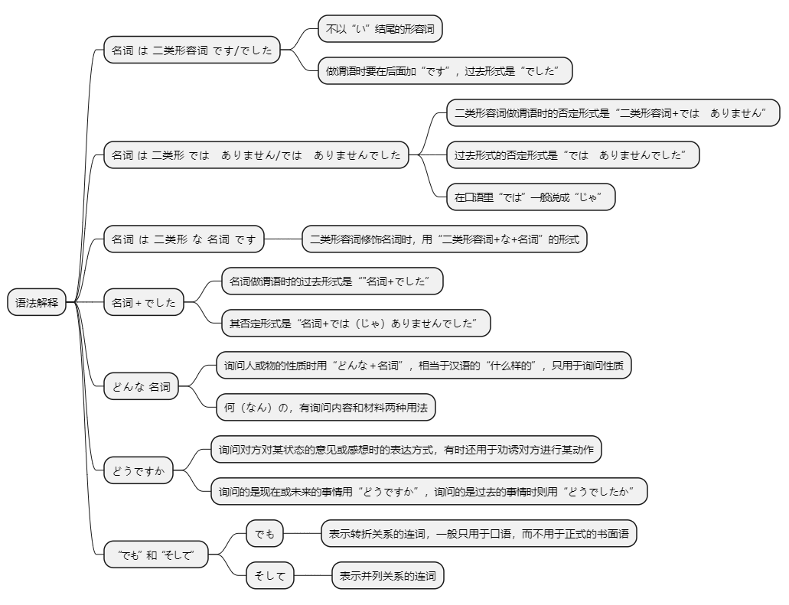
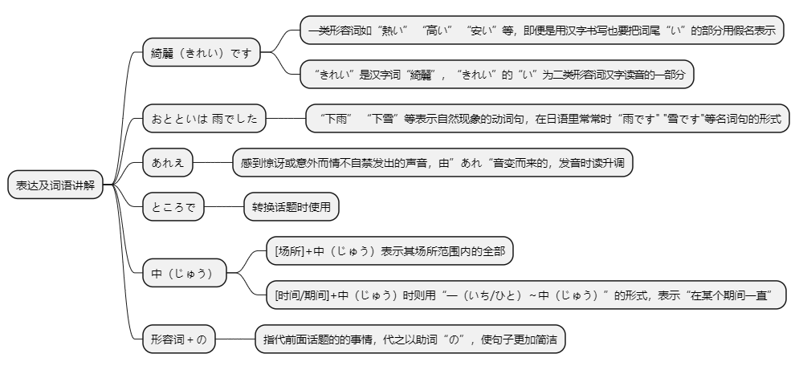

# 第十课

## 基本课文

```log
京都の紅葉　は　有名です。

この　通りは　にぎやかでは　ありません。

奈良は　静かな　町です。

昨日は　日曜日でした。

どんな　お土産を　買いましたか。
きれいな　人形を　買いました。

京都は　どうでしたか。
とても　きれいでした。でも、静かでは　ありませんでした。

横浜は　どんな　町ですか。
大きい　町です。そして、にぎやかな　町です。

東京の　天気は　どうでしたか。
昨日は　晴れでした。でも、おとといは　雨でした。
```

<audio id="audio" controls="" preload="none"><source src="./audio/10/article1.mp3"></audio>

## 语法解释



> 名は二类形です/でした

东京的红叶很有名。
```
京都の紅葉は有名です。
```

这条街很安静
```
この通りは静かです。
```

这个城市以前很热闹。
```
この町はにぎやかでした。
```

<audio id="audio" controls="" preload="none"><source src="./audio/10/1.mp3"></audio>

> 名は二类形ではありません/ではありませんでした

这条街不热闹。
```
この通りはにぎやかではありません。
```

昨天没空。
```
昨日は暇じゃありませんでした。
```

备注：
```
“です”是日语中常用的礼貌体助动词，用于表示断定。其否定形式是“ではありません”，这个表达的结构可以从几个角度来理解：

“では”部分：

“で”是“です”的变形，用于表示状态或存在。
“は”是主题助词，强调前面的内容，即“で”的部分。
“ありません”部分：

“ありません”是动词“ある”的否定形式的礼貌体，表示“没有”或“不存在”。
将“では”与“ありません”结合起来，可以表示“不是”或“没有”的意思。
通过这个结构，日语在礼貌地表达否定时，使用“ではありません”来取代“です”的否定形式。

总结起来，“ではありません”是“です”的礼貌体否定形式，分解为“では”和“ありません”两个部分，表示“不是”的意思。
```

<audio id="audio" controls="" preload="none"><source src="./audio/10/2.mp3"></audio>

> 名は二类形な名です

奈良是座很安静的城市。
```
奈良は静かな町です。
```

奈良不是个热闹的城市。
```
奈良はにぎやかな町ではありません。
```

<audio id="audio" controls="" preload="none"><source src="./audio/10/3.mp3"></audio>

> 名でした

```
昨日は日曜日でした。

おとといは休みでした。

昨日は雨ではありませんでした。

おとといは曇りじゃありませんでした。
```

<audio id="audio" controls="" preload="none"><source src="./audio/10/4.mp3"></audio>

> どんな　名

横滨是个怎么样的城市？
是个非常热闹的城市。
```
横浜はどんなまちですか。
とてもにぎやかな町です。
```


小张是什么样的人？
是个很热情的人。
```
張さんはどんなひとですか。
親切なひとです。
```

参考：”何の”和”どんな”

```
何の本ですか。
自動車の本です。

何の料理ですか。
魚の料理です。

どんな本ですか。
おもしろい本です。

どんな料理ですか。
ちょっとからい料理です。
```

<audio id="audio" controls="" preload="none"><source src="./audio/10/5.mp3"></audio>

> どうですか

这个菜怎么样？
```
この料理はどうですか。
```

京都怎么样？
```
京都はどうでしたか。
```

您喝杯茶吧。  
谢谢。
```
お茶、どうですか。
ありがとうございます。
```

<audio id="audio" controls="" preload="none"><source src="./audio/10/6.mp3"></audio>

> “でも”和“そして”

我的房间很小，但是很干净。
```
わたしの部屋は狭いです。でも、きれいです。
```

我的房间很小，而且很脏。
```
わたしの部屋は狭いです。そして、汚いです。
```

<audio id="audio" controls="" preload="none"><source src="./audio/10/7.mp3"></audio>

# 表达及词语讲解



## 应用课文

美術館
```log
昨日　京都へ　行きました。

京都ですか。京都の　紅葉は　どうでしたか。

とても　きれいでした。でも、町は　あまり　静かじゃ　ありませんでした。

えっ。

今　ちょうど　修学　旅行の　シーズンです。とても　にぎやかでした。

この　通りは　静かですね。

ああ、今日は　平日ですね。でも、休みの　日は　観光客が　多いです。とても　にぎやかですよ。

そうですか。

あれえ、だれも　いませんね。

そうですね。

ところで、この　美術館には　どんな　作品が　ありますか。

世界中の　有名な　作家の　彫刻です。

美術館の　庭にも　いろいろ　おもしろいのが　ありますよ。
```

<audio id="audio" controls="" preload="none"><source src="./audio/10/article2.mp3"></audio>

## 生词表

もみじ（紅葉） 〔名〕 红叶

こきょう（故郷） 〔名〕 故乡

とおり（通り） 〔名〕 大街

まち（町） 〔名〕 城市，街道

ところ（所） 〔名〕 场所

おみせ（お店） 〔名〕 餐馆；商店

にんぎょう（人形） 〔名〕 玩偶

さくひん（作品） 〔名〕 作品

ちょうこく（彫刻） 〔名〕 雕刻

じどうしゃ（自動車） 〔名〕 汽车

どうぐ（道具） 〔名〕 工具

さかな（魚） 〔名〕 鱼

おかし（お菓子） 〔名〕 点心

もの（物） 〔名〕 物品，东西

シーズン 〔名〕 季节

しゅうがくりょこう（修学旅行） 〔名〕 修学旅行

かんこうきゃく（観光客） 〔名〕 游客

さっか（作家） 〔名〕 作家

ぶちょう（部長） 〔名〕 部长

へいじつ（平日） 〔名〕 平日，非休息日

ひ（日） 〔名〕 日子

せいかつ（生活） 〔名〕 生活

せかい（世界） 〔名〕 世界

はれ（晴れ） 〔名〕 晴天

あめ（雨） 〔名〕 雨，下雨

くもり（曇り） 〔名〕 阴天

ゆき（雪） 〔名〕 雪

きたない（汚い） 〔形1〕 脏

きれい 〔形2〕 漂亮，干净

ゆうめい（有名） 〔形1〕 有名

にぎやか 〔形2〕 热闹，繁华

しずか（静か） 〔形2〕 安静

ひま（暇） 〔形2〕 空闲

しんせつ（親切） 〔形2〕 热情

すき（好き） 〔形2〕 喜欢

きらい（嫌い） 〔形2〕 讨厌

べんり（便利） 〔形2〕 方便

ふべん（不便） 〔形2〕 不方便

げんき（元気） 〔形2〕 健康，有精神

かんたん（簡単） 〔形2〕 简单

ハンサム 〔形2〕 英俊，帅气

どんな 〔疑〕 什么样的，怎样的

どう 〔副〕 怎样，如何

いかが 〔副〕 如何

いろいろ 〔副〕 各种各样

でも 〔连〕 可是，不过

そして 〔连〕 而且，于是

ところで 〔连〕 （转换话题） 哎

あれえ 〔叹〕 咦

なら（奈良） 〔专〕 奈良

ふじさん（富士山） 〔专〕 富士山

もうすこし（もう少し） 再～一点

～中じゅう

<audio id="audio" controls="" preload="none"><source src="./audio/10/word.mp3"></audio>