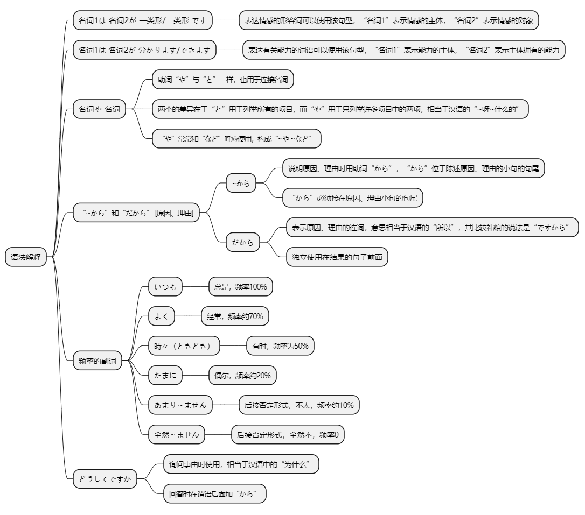
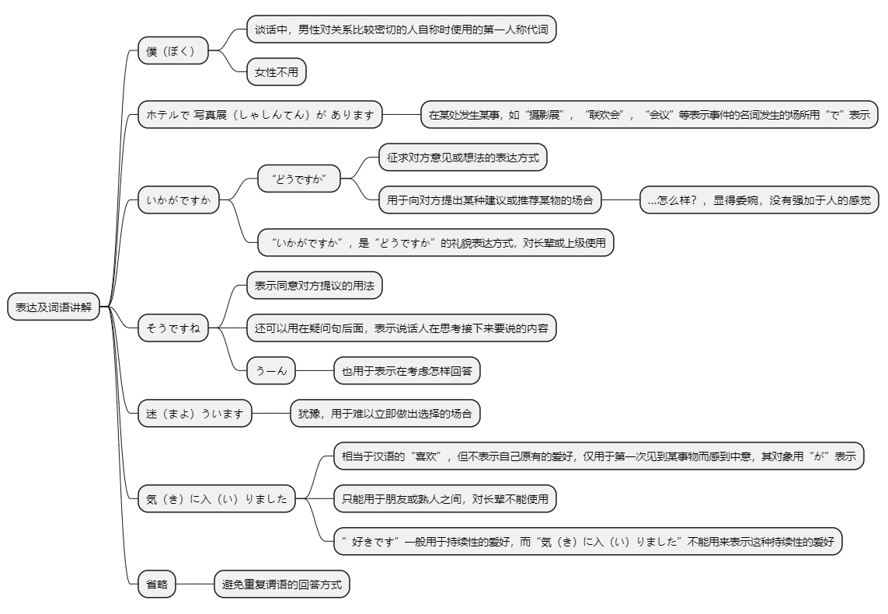

# 第十一课

## 基本课文

```log
小野さんは　歌が　好きです。

スミスさんは　韓国語が　わかります。

吉田さんは　時々　中国や　韓国へ　行きます。

森さんは　お酒が　好きですから、毎日　飲みます。

吉田さんは　料理が　できますか。
いいえ、ぜんぜん　できません。

どんな　音楽が　好きですか。
ロックや　ポップスなどが　好きです。

長島さん、スペイン語が　わかりますか。
ええ、大学で　習いましたから、少し　わかります。

小野さん、よく　音楽を　聞きますか。
ええ、家で　CDを　よく　聞きます。
そして、たまに　コンサートへ　行きます。
```

## 语法解释



> 名1は 名2が 一类形/二类形 です

"好きです"、"嫌いです"、"怖いです"等表达情感的形容词可以以"[名词1]は　[名词2]が　[一类形容词/二类形容词]　です"的句型使用。"名词1"表示情感的主体，"名词2"表示情感的对像。

```log
小野さんは　歌　が　好きです。

王さんは　肉　が　嫌いです。

林さんは　犬　が　怖いです。
```

> 名1は 名2 が 分かります/できます

"分かります"、"できます"、"上手です"、"下手です"、"苦手です"等有关能力的词语也可以以"[名词1]は　[名词2]　が　[动词]ます/ [一类形容词/二类形容词]　です"的句型使用。

```log
スミスさんは　韓国語　が　分かります。
  
わたしは　コンピュータ　が　できません。
  
小野さんは　料理　が　上手です。
```

> 名 や 名

第4课我们学习了相当于汉语"和"、"跟"意义的助词"と"。助词"や"与"と"一样，也且于连接名词，两者的差异在于"と"用于列举所有的项目，而"や"用于只列举许多项目中的两项，相当于汉语的"～呀～什么的"。并且"や"常常和"など"呼应使用，构成"や…など"。
```log
吉田さんは　時々　中国や　韓国へ　行きます。

森さんは　サッカーや　野球が　好きです。

わたしは　お店で　野菜や　果物などを　買いました。
```

> "～から"和"だから"[原因、理由]

说明原因、理由时用助词"から"。"から"位于陈述原因、理由的小句的句尾。通常是在说明原因、理由之后再陈述结论，但有时也可以先陈述结论再说明原因、理由，不过无论是哪一种情况，"から"都须接在表示原因、理由小句的句尾。构成复句的句子我们称之为小句。

"だから"是表示原因、理由的连词，意思相当于汉语的"所以"，其比较礼貌的说法是"ですから"。助词"から"构成表示原因、理由小句的一部分，而连词"だから"独立使用在结果的句子前面。

```log
森さんは　お酒が　好きですから、毎日　飲みます。

寒いですから、まどを　閉めます。

窓を　閉めます。寒いですから。

金さんは　やさいが　嫌いです。だから　あまり　野菜を　食べません。

あしたは　休みです。ですから、こどもと　動物園へ　行きます。

```

> 频率的副词

"いつも"、"よく"、"時々"、"たまに"、"あまり"、"全然"等是表示频率的副词。"あまり"、"全然"后面须接否定形式。

```log
わたしは　たまに　コンサートへ　行きます。

李さんは　時々　映画を　見ます。

田中さんは　あまり　横浜へは　行きません。
```

> どうしてですか

询问事由时使用"どうしてですか"，相当于汉语中"为什么"。回答时在谓语后面加"から"。

我下个月还来这里。  
为什么？  
因为朋友要在这里举行结婚典礼。  
```log
僕は　来月　また　ここへ　来ますよ。
どうしてですか。
ここで　友達の　結婚式が　ありますから。
```

## 表达及词语讲解



## 应用课文

```log
お土産

箱根は　ホテルや　旅館が　多いですね。

そうですね。会社の　別荘も　たくさん　あります。

長島さんや　小野さんも　よく　来ますか。

ええ、車で　時々　来ます。

わたしは　運転が　できませんから、いつも　電車です。

ぼくは　来月　また　きますよ。

どうしてですか。

この　近くの　ホテルで　友達の　写真展が　ありますから。

箱根の　お土産は　何が　いいですが。

うーん、そうですね…，迷いますね。

寄木細工は　いかがですか。とても　有名ですよ。

きれいな　模様ですね。

ええ。

気に　いりましたか。

はい、とても。
```

## 生词表

```log
うた

カラオケ

ロック

ポップス

クラシック

ピアノ

え

えいご

スペインご

スポーツ

すいえい

ゴルフ

うんてん

のみもの

おさけ

にく

やさい

くだもの

ヒマワリ

バラ

コンピュータ

まど

けっこんしき

しゃしんてん

りょかん

べっそう

よせぎざいく

もよう

がいこく

かいぎ

あし

ぼく

わかります

まよいます

できます

しめます

つかれます

さんぽします

こわい

あかい

いたい

じょうず

へた

にがて

ときどき

よく

たまに

また

どうして

だから

うーん

けっこうです

きにいります
```