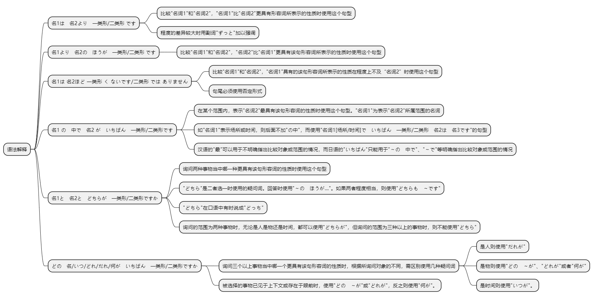
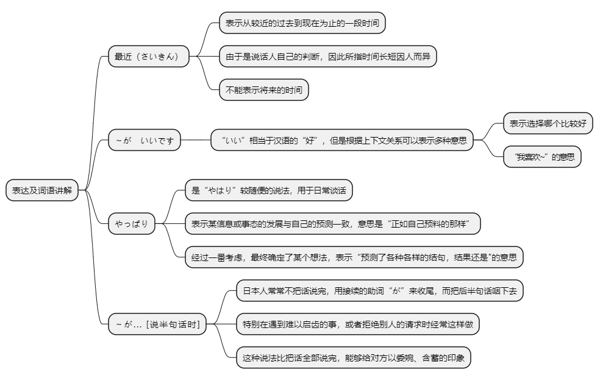

# 第十二课

## 基本课文

```log
李さんは　森さんより　若いです。

日本より　中国の　ほうが　広いです。

神戸は　大阪ほど　にぎやかでは　ありません。

スポーツの　中で　サッカーが　いちばん　おもしろいです。

北京は　東京より　寒いですか。
ええ、冬の　北京は　東京より　ずっと　さむいです。

日本語と　英語と　どちらが　難しいですか。
日本語の　ほうが　難しいです。

森さんは　テニスが　上手ですね。
いいえ、長島さんほど　上手では　ありません。

季節の　中で　いつが　いちばん　好きですか。
わたしは　春が　いちばん　好きです。
```

## 语法解释



> 名1は　名2より　一类形/二类形 です

比较"名词1"和"名词2"，"名词1"比"名词2"更具有形容词所表示的性质时使用这个句型。

程度的差异较大时用副词"ずっと"加以强调。

小李比森先生年轻。
```text
李さんは　森さん　より　若いです。
```

中国比日本辽阔
```text
中国は　日本　より　広いです。
```

上海比北京热闹吗？
```text
上海は　北京　より　にぎやかですか。
```

程度的差异较大时用副词"ずっと"加以强调。

中国比日本辽阔得多。
```log
中国は　日本より　ずっと　広いです。
```

> 名1より　名2の　ほうが　一类形/二类形 です

比较"名词1"和"名词2"，"名词2"比"名词1"更具有该句形容词所表示的性质时使用这个句型。

与日本相比，中国更辽阔。
```
日本より中国のほうが広いです。
```

与北京相比，东京更暖和。
```log
北京より東京のほうが暖かいです。
```

与大阪相比，东京更热闹吗？
```text
大阪より東京のほうがにぎやかですか。
```

> 名1は 名2ほど 一类形 く ないです/二类形 では ありません

比较"名词1"和"名词2"，"名词1"具有的该句形容词所表示的性质在程度上不及“名词2”时使用这个句型。  
句尾必须使用否定形式。

东京的冬天没有北京的冬天那么冷。
```
東京の冬は北京の冬ほど寒くないです。
```

神户没有大版那么繁华。
```
神戸は大阪ほどにぎやかではありません。
```

我的房间没有小王的房间那么整洁。
```
わたしの部屋は王さんの部屋ほどきれいではありません。
```

备注：
```
这个表达方式来源于日语中的比较结构和否定形式的结合，用来表示两者之间的比较，尤其是强调否定的比较。

名1 は：表示主语，强调比较的主体。
名2 ほど：表示比较的对象，表示“像……那样”。
一类形容词く：形容词的连用形，将形容词转化为副词形式，便于接否定形式。
ないです：否定助动词，表示“不……”。
```

> 名1 の　中で　名2 が　いちばん　一类形/二类形です

在某个范围内，表示"名词2"最具有该句形容词的性质时使用这个句型。"名词1"为表示"名词2"所属范围的名词。

如"名词1"表示场所或时间，则后面不加"の中"，而使用"名词1[场所/时间]で　いちばん　一类形/二类形　名2は　名3です"的句型。

注意：日语中的"いちばん"虽然相当于汉语"最"的意思，但两者用法不同。汉语的"最"可以用于不明确指出比较对象或范围的情况，日语的"いちばん"只能用于"～の　中で"、"～で"等明确指出比较对象或范围的情况。

在各种体育活动中，足球最有意思。
```
スポーツの中でサッカーがいちばんおもしろいです。
```

日式饭菜中，寿司最好吃。
```
日本料理の中で寿司がいちばんおいしいです。
```

日本最高的山是富士山。
```
日本でいちばん高い山は富士山です。
```

一年当中最冷的月份是2月份。
```
一年でいちばん寒い月は2月です。
```

> 名1と　名2と　どちらが　一类形/二类形ですか

询问两种事物当中哪一种更具有形容词的性质时使用这个句型。"どちら"是二者选一时使用的疑问词。回答时使用"～の　ほうが…"。如果两者程度相当，则使用"どちらも　～です"。"どちら"在口语中有时说成"どっち"。

询问的范围为两种事物时，无论是人是物还是时间，都可以使用"どちらが"。但询问的范围为三种以上的事物时，则不能使用"どちら"。

日语和英语，哪个难学？  
日语难学。
```
日本語と英語とどちらが難しいですか。
日本語のほうが　難しいです。
```

咖啡与红茶，更喜欢哪个？  
更喜欢红茶。  
哪个都喜欢。
```text
コーヒーと紅茶とどっちが好きですか。
紅茶のほうが好きです。
どちらも好きです。
```

> どの　名/いつ/どれ/だれ/何が　いちばん　一类形/二类形ですか

询问三个以上事物当中哪一个更具有形容词的性质时，根据所询问对象的不同，需区别使用几种疑问词;是人则使用"だれが"，是物则使用"どの　～が"、"どれが"或者"何が"，是时间则使用"いつが"。

在这些菜当中，哪个菜最好吃？  
这个菜最好吃。
```
この中でどの料理がいちばんおいしいですか。
この料理がいちばんおいしいです。
```

四个季节当中，你最喜欢哪个？  
我最喜欢春天。
```
季節の中でいつがいちばん好きですか。
わたしは春がいちばん好きです。
```

被选择的事物已见于上下文或存在于眼前时，使用"どの　～が"或"どれが"，反之则使用"何が"。

苹果、梨和香蕉当中你最喜欢什么？
```
リンゴとナシとバナナの中でどれがいちばんすきですか。
```

水果当中你最喜欢什么？
```log
果物の中で何がいちばん好きですか。
```

## 表达及词语讲解



## 应用课文

```log
お酒と　お茶

長島さんは　よく　お酒を　飲みますか。

ええ。お酒は　大好きですから、毎晩　飲みますよ。

ビールと　日本酒と、どちらが　好きですか。

どちらも　好きです。でも、焼酎が　いちばん　好きです。

焼酎は　最近　人気が　ありますね。

小野さんも　焼酎が　好きですか。

いいえ。私は　焼酎より　ワインの　ほうが　いいです。でも、ビールも　よく　飲みますよ。

中国は　お茶の　種類が　多いですね。

ええ。ウーロン茶、ジャスミン茶、緑茶など、たくさん　あります。

どの　お茶が　いちばん　人気が　ありますか。

やっぱり　ウーロン茶です。

李さんも　よく　飲みますか。

ええ。毎日　ウーロン茶か　ジャスミン茶を　飲みます。

どちらが　おいしいですか?

どちらも　おいしいですよ。私は　ジャスミン茶の　ほうが　好きですが…。
```

## 生词表

```log
きせつ

ふゆ

はる

にほんりょうり

すし

ナシ

バナナ

ミカン

しょうちゅう

にほんしゅ

こうちゃ

ウーロンちゃ

ジャスミンちゃ

りょくちゃ

ジュース

にんき

せき

クラス

しゅるい

せ

あに

さいきん

ふります

わかい

あたたかい

すずしい

はやい

だいすき

いちばん

ずっと

やはり

エベレスト

にんきがあります

ねんかん
```