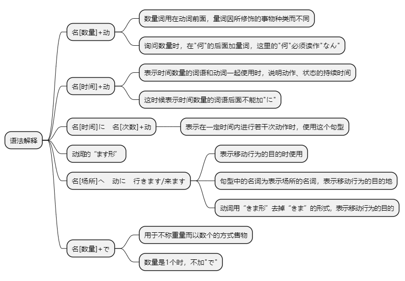
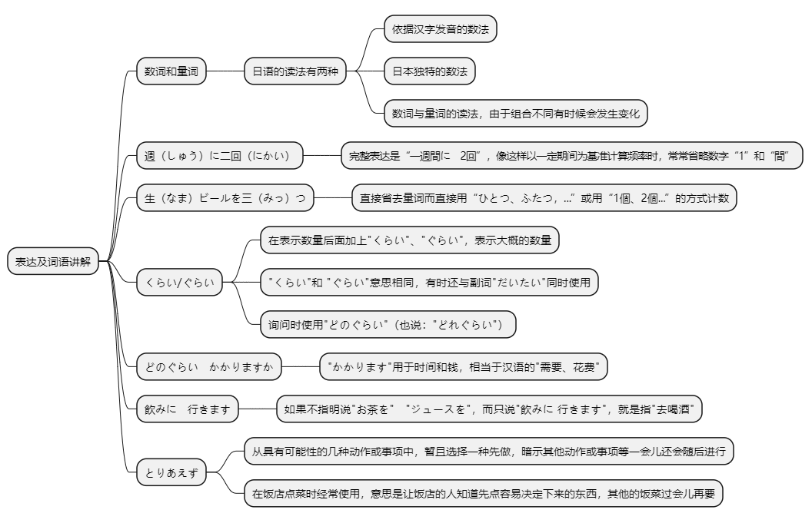

# 第十三课

## 基本课文

```log
机の　上に　本が　三冊　あります。

李さんは　毎日　七時間　働きます。

李さんは　一週間に　二回　プールへ　行きます。

午後　郵便局へ　荷物を　出しに　行きます。

すみません、はがきを　五枚　ください。
はい。五枚で　二百五十円です。

よく　映画を　見ますか。
ええ、一ヶ月に　二回ぐらい　見ます。

家から　会社まで　どのぐらい　かかりますか。
電車で　一時間ぐらい　かかります。

きのう　なにを　しましたか。
新宿へ　映画を　見に　行きました。
```

## 语法解释



> 名[数量]+动

询问数量时，在"何"的后面加量词，如"何個(多少个)"、"何本(多少根)"、"何冊(多少本)" 等。这里的"何"必须读作"なん"。

总体来看，日语的量词比汉语的量词搭配范围更广泛，因而其用法相对简单些。如指动物时，大动物用"頭"，小动物用"匹"，没有汉语中的"条"、"只"等。

```log
卵を　一個　食べます。

本を　二冊　買いました。

緑茶を　三杯　飲みました。

教室に　学生が　四人 います

ガレージに　車が　五台　あります。

引き出しに　鉛筆が　十本　あります。

切手を　何枚　買いましたか。

この　動物園には　象が　二頭　います。

友達に　猫を　一匹　もらいました。

```

> 名[时间]+动

表示时间数量的词语和动词一起使用时，说明动作、状态的持续时间。这时候表示时间数量的词语后面不能加"に"。


```log
李さんは　毎日　七時間　働きます。

昼　一時間　休みます。

森さんは　九時間　寝ます。
```

> 名[时间]に　名[次数]+动

表示在一定时间内进行若干次动作时，使用这个句型。

```log
李さんは　一週間に　二回　プールへ　行きます。

この　花は　二年に　一度　咲きます。
```

> 动词的"ます"形

```log
第5课 "语法解释2"中学习了动词。我们把"働きます"、"休みます"、"起きます"、"寝ます"等形式称做动词的"ます"形。这些动词的"ます"形去掉"ます"的形式，即"働き"、"休み"、"おき"、"ね"等形式在以后的各种句型讲解中会经常用到，请大家注意。
```

> 名[场所]へ　动に　行きます/来ます

表示移动行为的目的时使用

```log
午後　郵便局　へ　荷物を　出し　に　行きます。

小野さんは　プール　へ　泳ぎ　に　行きます。

李さんは　わたしの　家　へ　遊び　に　来ました。
```

> 名[数量]+で

用于不称重量而以数个的方式售物。

不过，数量是1个时，不加"で"。

【参考】　数词和量词

日语中，数的数法有两种：一种是依据汉字的发音的数法，即"いち、に、さん、し、ご…"另一种是日本独特的说法，即"ひ、ふ、よ、いつ、む、なな、や、ここ、とお"。数词与量词的读法，由于组合不同有时候会发生变化。

"～台"、"～枚"、"～番"等属于读法不会发生变化的类型。"～個"、"～回"、"～階"等与数字"1、6、8、10"结合，数字读音会发生促音变。"～本"、"～杯"、"～匹"与数字"1、3、6、8、10"结合，数字与量词的读音都会发生变化。

※："7人"也可以读作"しちにん"。

※：上表只是1~10和几个常用量词的搭配表。

```log
この　ケーキは　三個で　五百円です。

この　ケーキは　一個　二百円です。
```

## 表达及词语讲解



## 应用课文

居酒屋
```log
これから　森さんと　近くの　お店へ　飲みに　行きます。

李さんも　いっしょに　どうですか。

えっ、いいですか。お願いします。

森さんたちは　この　お店へ　よく　来ますか。

ええ、ぼくは　週に　二回ぐらい　来ます。

わたしも　よく　来ます。

あのう、すみません。

とりあえず　生ビールを　3つ　お願いします。

生ビールが　1杯　300円ですか。

ここは　お酒も　食べ物も　安いです。

焼き鳥は　5本で　400円　ですからね。

唐揚げや　肉じゃがは　1皿350円です。

ほかの　お店は　いくら　ぐらいですか。

生ビール　だいたい　一杯400円です。

焼き鳥は　1杯　150円ぐらい　ですよ

じゃあ、ここは　安いですね。
```

## 生词表

```log
にもつ

はがき

きって

ひきだし

アルバム
  
タバコ

まんが

ガレージ

しゅうり

いざかや

なまビール

やきとり

からあげ

にくじゃが

ボーリング

かみ

ぞう

ひる

ほか

かかります

さきます

およぎます

あそびます

すいます

きります

だいたい

とりあえず

どのぐらい

どれぐらい
```