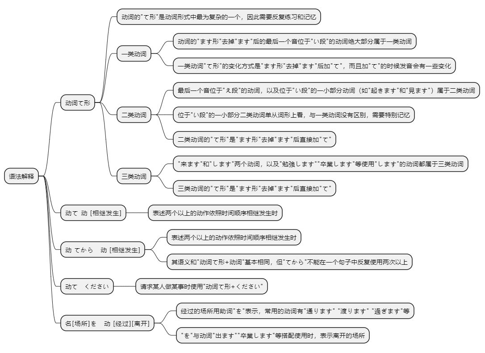
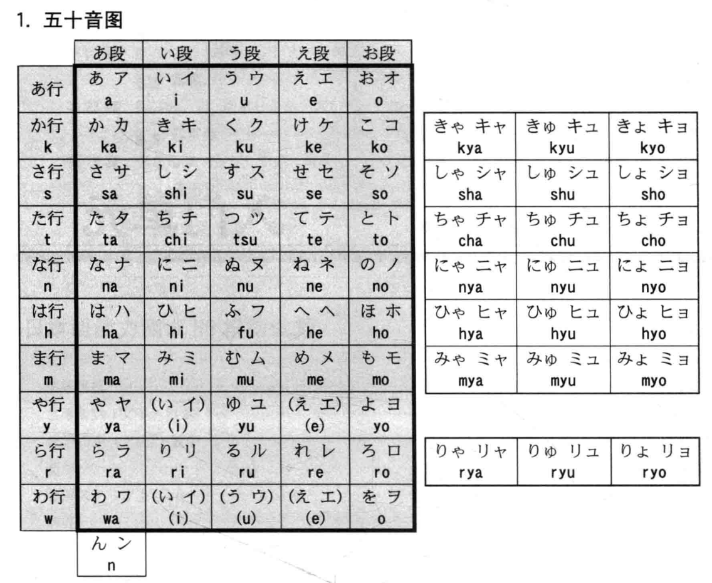
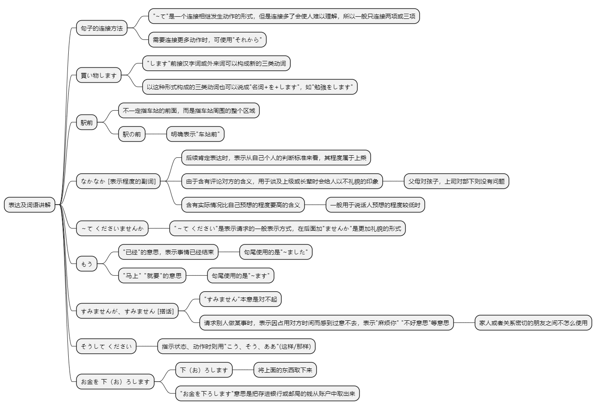

# 第十四课

## 基本课文

```log
昨日　デパートへ　行って、買い物しました。

李さんは　毎晩　ラジオを　聞いてから　寝ます。

ここに　住所と　名前を　書いて　ください。

李さんは　毎朝　7時に　家を　出ます。

今日の　午後は　何を　しますか。
図書館へ　行って、勉強を　します。それから　家へ帰って、手紙をかきます。

いつ　出かけますか。
昼ご飯を　食べてから　出かけます。

すみません、この　荷物を　中国へ　送って　ください。
船便ですか、航空便ですか。
船便で　お願いします。

この　バスは　駅前を　通りますか。
はい、通ります。
```

<audio id="audio" controls="" preload="none"><source src="./audio/14/article1.mp3"></audio>
## 语法解释



> 动词的“て形”

第13课学习了动词的“ます形”。本课学习动词的“て形”。“て形”可以用于各种各样的表达方式。动词的“て形”是动词形式中最为复杂的一个，因此需要反复练习和记忆。

动词因其形态变化方式不同，可以分为三类。

动词的“ます形”去掉“ます”后的最后一个音位于“い段”的动词绝大部分属于一类动词(如：“書きます”“読みます”);

最后一个音位于“え段”的动词(如：“食べます”“寝ます”)，以及位于“い段”的一小部分动词(如：“起きます”“見ます”)属于二类动词。

“来ます”和“します”两个动词，以及“勉強します”“卒業します”等使用“します”的动词都属于三类动词。

最后一个音位于“い段”的二类动词，单从词形上看，与一类动词没有区别。但这类动词数量很有限(属于初级的有15个左右)，出现时需要特别记忆。

一类动词“て形”的变换方式是“ます形”去掉“ます”后加“て”，加“て”的时候发音会有一些变化。即“き”-“いて”、“ぎ”-“いで”、“び、み、に”-“んで”、“ち、り、い”-“って”、“し”-“して”。

二类动词和三类动词的“て形”都是“ます形”去掉“ます”后直接加“て”。

“行きます”属于例外，其“て形”是“行って”。

备注：
* 动词结尾都是う段结尾
* 二类动词
    * 结尾一定是る
    * 倒数第二个字在い段或者え段上
* 三类动词
    * 来る
    * する



> 动て动[相继发生]

表述两个以上的动作依照时间顺序相继发生时，可以使用“动词て形+动词”的形式来表示。

昨天去商场买东西了。
```
昨日デパートへ行って、買い物しました。
```

回家，然后做作业。
```
家へ帰って、宿題をします。
```

去图书馆借书，然后回家。
```
図書館へ行って本を借りて、家へ帰ります。
```

<audio id="audio" controls="" preload="none"><source src="./audio/14/1.mp3"></audio>
> 动てから动[相继发生]

表述两个以上的动作依照时间顺序相继发生时，也可以使用“动词て形+から+动词”的表达形式。

其语义和“动词て形+动词”基本相同，但“てから”不能在一个句子中反复使用两次以上。

小李每晚听了收音机后睡觉。
```
李さんは毎晩ラジオを聞いてから寝ます。
```

吃了午饭后出门。
```
昼ご飯を食べてから、出かけます。
```

回家后，再学一遍日语。
```
家へ帰ってから、もう一度日本語の勉強をします。
```

<audio id="audio" controls="" preload="none"><source src="./audio/14/2.mp3"></audio>
> 动てください

请求某人做某事时使用“动词て形+ください”。

请在这里填写住址和姓名。
```
ここに住所と名前を書いてください。
```

请用航空方式寄这件包裹。
```
この荷物を航空便で送ってください。
```

<audio id="audio" controls="" preload="none"><source src="./audio/14/3.mp3"></audio>
> 名[场所]を　动[经过][离开]

经过的场所用助词“を”表示，常用的动词有“通ります”、“渡ります”、“過ぎます”等。此外，“を”与动词“出ます”、“卒業します”等搭配使用时，表示离开的场所。

这趟公共汽车经过车站一带。
```
このバスは駅前を通ります。
```

顺着这条路一直走，再过那座桥。
```
この道をまっすぐ行って、橋を渡ってください。
```

小李每天早晨7点离开家。
```
李さんは毎朝7時に家を出ます。
```

我明年大学毕业。
```
わたしは来年大学を卒業します。
```

<audio id="audio" controls="" preload="none"><source src="./audio/14/4.mp3"></audio>
## 表达及词语讲解



## 应用课文

原稿
```
吉田課長、原稿が　できました。

箱根の　記事ですね。ちょっと　見せて　ください。

なかなか　いいですね。いつ　書きましたか。

昨日　会社で　メモを　整理して、小野さんに　見せました。そして、アパートへ　帰ってから　書きました。

そうですか。大変でしたね。写真も　できましたか。

はい。これから　長島さんの　事務所へ　行って、写真を　選びます。

そうですか。

後で　写真も　見て　くださいませんか。

李さん、もう　会社を　出ますか。

はい。銀行で　お金を　下ろしてから　行きます。

じゃあ、郵便局の　近くを　通りますね。

すみませんが、この　手紙を　出して　ください。

はい。速達で　出しますか。

ええ、そうして　ください。
```

<audio id="audio" controls="" preload="none"><source src="./audio/14/article2.mp3"></audio>
## 生词表

ふなびん（船便） 〔名〕 海运

しょるい（書類） 〔名〕 文件，文稿

げんこう（原稿） 〔名〕 稿子，原稿

きじ（記事） 〔名〕 报道

メモ 〔名〕 记录

えきまえ（駅前） 〔名〕 车站一带

はし（橋） 〔名〕 桥，桥梁

かど（角） 〔名〕 拐角

おうだんほどう（横断歩道） 〔名〕 人行横道

みぎ（右） 〔名〕 右，右边

ひだり（左） 〔名〕 左，左边

こうさてん（交差点） 〔名〕 十字路口

みち（道） 〔名〕 路，道路

ドア 〔名〕 门

でんき（電気） 〔名〕 电，电力

たいきょくけん（太極拳） 〔名〕 太极拳

あさごはん（朝ご飯） 〔名〕 早饭

ばんごはん（晩ご飯） 〔名〕 晚饭

バーベキュー 〔名〕 户外烧烤

とおります（通ります） 〔动1〕 通过，经过

いそぎます（急ぎます） 〔动1〕 急，急忙

とびます（飛びます） 〔动1〕 飞，飞行

しにます（死にます） 〔动1〕 死，死亡

まちます（待ちます） 〔动1〕 等待，等候

うります（売ります） 〔动1〕 卖，销售

はなします（話します） 〔动1〕 说话，说

わたります（渡ります） 〔动1〕

过（桥，河），穿过（马路）

おろします（下ろします） 〔动1〕 取，卸货

えらびます（選びます） 〔动1〕 挑选，选择

けします（消します） 〔动1〕 关（灯），消除，去除

あるきます（歩きます） 〔动1〕 步行，行走

まがります（曲がります） 〔动1〕 拐弯，曲折

あらいます（洗います） 〔动1〕 洗，洗涤

でます（出ます） 〔动2〕 离开

でかけます（出かけます） 〔动2〕 外出，出门

あけます（開けます） 〔动2〕 开，打开，开启

すぎます（過ぎます） 〔动2〕 过

みせます（見せます） 〔动2〕 给～看；出示

つけます 〔动2〕 开（灯）

おります（降ります） 〔动2〕 下（车，山）

かいものします（買い物～） 〔动3〕 买东西

そつぎょうします（卒業～） 〔动3〕 毕业

しょくじします（食事～） 〔动3〕 吃饭，用餐

せいりします（整理～） 〔动3〕 整理

コピーします 〔动3〕 复印

くらい（暗い） 〔形1〕 黑暗，昏暗

たいへん（大変） 〔形2〕 够受的，不得了

なかなか 〔副〕 相当，很，非常

こう 〔副〕 这样，如此

そう∕ああ 〔副〕 那样

あとで（後で） 〔副〕 过会儿

それから 〔连〕 然后

すみませんが 对不起……，劳驾……

<audio id="audio" controls="" preload="none"><source src="./audio/14/word.mp3"></audio>