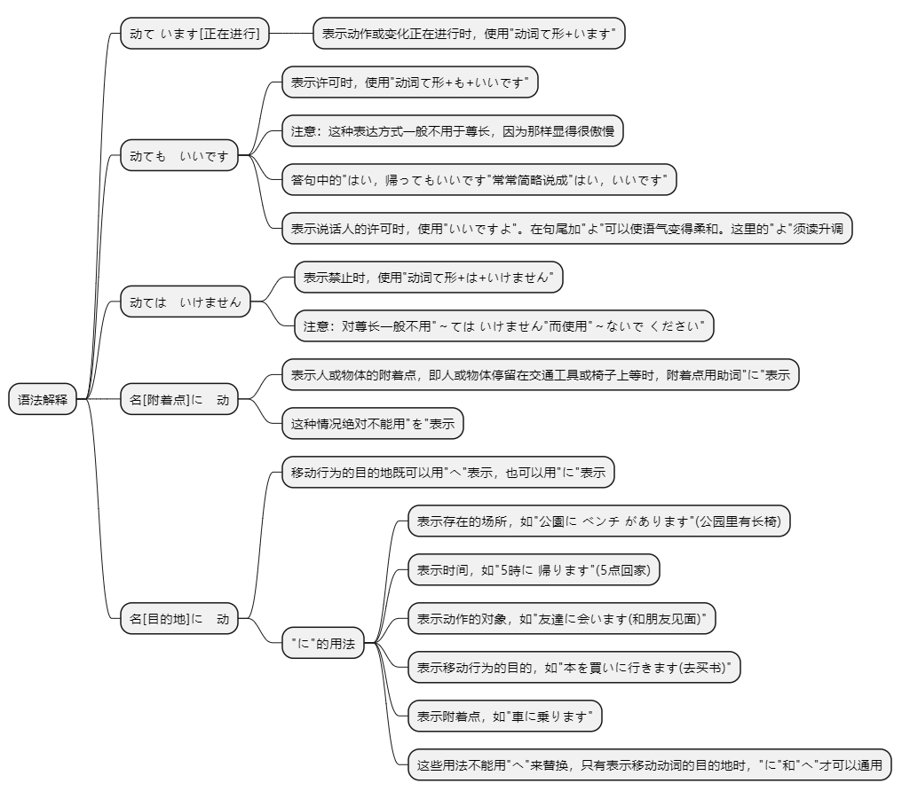
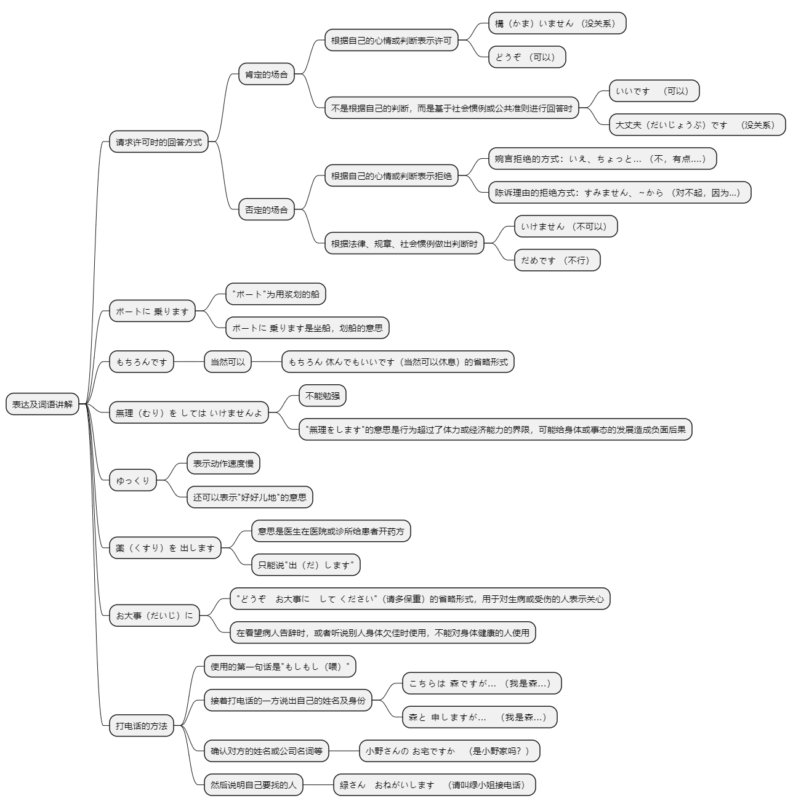

# 第十五课

## 基本课文

```log
小野さんは今新聞を読んでいます。

ここで写真を撮ってもいいですか。

飛行機の中でタバコをすってはいけません。

日曜日、小野さんは公園でボートに乗りました。

もしもし、森さん? 今どこですか。
今市役所の前を歩いています。

すみません、この辞書を借りてもいいですか。
いえ、ちょっと…。今使っています。

すみません、ここに座ってもいいですか。
ええ、どうぞ。

あっ、ここで携帯電話を使ってはいけませんよ。
すみません。これから気をつけます。
```

## 语法解释



> 动て います[正在进行]

表示动作或变化正在进行时，使用"动词て形+います"。

小野女士现在正在看报。
```
小野さんは今新聞を読んでいます。
```

森先生正在工作。
```
森さんは今仕事をしています。
```

太郎在喝咖啡。
```log
太郎さんはコーヒーを飲んでいます。
```

> 动ても　いいです

表示许可时，使用"动词て形+いいです"。

答句中的"はい、帰ってもいいです"常常简略说成"はい、いいです"。表示说话人的许可时，使用"いいですよ"。在句尾加"よ"可以使语气变得柔和。这里的"よ"须读升调。

注意：这种表达方式一般不用于尊长，因为那样显得很傲慢。

在家里工作也可以。
```
家で仕事をしてもいいです。
```

这儿可以拍照吗？  
可以。
```
ここで写真を撮ってもいいですか。
いいですよ。
```

可以回家吗？  
是的，可以回家。
```log
家に帰ってもいいですか。
はい、帰ってもいいです。
```

> 动ては　いけません

表示禁止时，使用"动词て形+は+いけません"。

注意：对尊长一般不用"～てはいけません"而使用"～ないでください"。

飞机上不能吸烟。
```text
飛行機の中でタバコを吸ってはいけません。
```

教室里不能吃东西。
```text
教室でものを食べてはいけません。
```

不能进这个屋子吗？  
是的，不能。  
不，可以进。
```text
この部屋に入ってはいけませんか。
はい、入ってはいけません。
いいえ、入ってもいいです。
```

备注：
```text
动词て形（动て）
动词的て形是动词的一种变形，用于连接句子或构成某些语法形式。
例：食べる (吃) → 食べて
例：行く (去) → 行って

助动词は
助词“は”在这里用作主题标记，强调动作。
例：行っては

いけません
“いけません”是一个固定表达，表示“不可以”或“不能”。它来自动词“行ける”的否定形式，表示“不行”或“不能”。

行ける
能去，可以去。
行，棒，可以，不错，不赖。
能喝酒。
```

> 名[附着点]に　动

表示人或物体的附着点，即人或物体停留在交通工具或椅子上等时，附着点用助词"に"表示。

小野女士在公园里划了船。
```text
小野さんは公園でボートに乗りました。
```

小李上了电车。
```text
李さんは電車に乗りました。
```

请坐在这把椅子上。
```text
この椅子に座ってください。
```

小李把文件放在包里了。
```log
李さんはかばんに書類を入れました。
```

注意：这种情况绝对不能用"を"表示。"≠電車を乗ります。""≠自転車を乗ります。"

> 名[目的地]に　动

第6课我们学习了表示移动行为的目的地的助词"へ"(第6课语法解释1)。移动行为的目的地既可以用"へ"表示，也可以用"に"表示。

参考："に"和"へ"

"に"的用法有：

表示存在的场所，如"公園にベンチがあります。(公园里有长椅。)"(第4课语法解释1)

表示时间，如"5時に帰ります。(5点回家。)"(第5课语法解释3)

表示动作的对象，如"友達に会います。(和朋友见面。)"(第8课语法解释4)

表示移动行为的目的，如"本を買いに行きます。(去买书。)"(第13课语法解释5)

表示附着点，如"車に乗ります。"(本课语法解释4)。

这些用法不能用"へ"来替换，只有表示"行きます""来ます""帰ります"等典型的移动动词的目的地时，"に"和"へ"才可以通用。

小李去医院。
```text
李さんは病院に行きます。
```

小李回家了
```log
李さんは家に帰りました。
```

## 表达及词语讲解



## 应用课文

風邪
```log
もしもし、小野です。どうしました?

ちょっと熱があります。今日会社を休んでもいいですか。

ええ、もちろんです。あまり無理をしてはいけませんよ。

はい、分かりました。あのう、吉田課長は?

今会議室で打ち合わせをしています。後で伝えます。

お願いします。

もう病院に行きましたか。

いいえ、まだです。

じゃあ、病院に行ってから、ゆっくり休んでください。

はい、ありがとうございます。

風邪ですね。温かい物を食べて、十分睡眠をとってください。それから今晩お風呂に入ってはいけませんよ。

分かりました。

では、薬を出します。薬局に行って、もらってください。

ありがとうございました。

お大事に。
```

## 生词表

```log
ボート

ベンチ

しやくしょ

けいたいでんわ

きんえん

かぜ

ねつ

すいみん

おふろ

やっきょく

クーラー

ひ

き

うちあわせ

むり

ちゅうしゃきんし

たちいりきんし

かきげんきん

さつえいきんし

のります

つかいます

すわります

はいります

もうします

とります

うたいます

つたえます

とめます

あたたかい

だいじょうぶ

だめ

じゅうぶん

もちろん

ゆっくり

もしもし

いえ

おだいじに

いけません

かまいません

まだです

きをつけます

むりをします

すいみんをとります

おふろにはいります
```