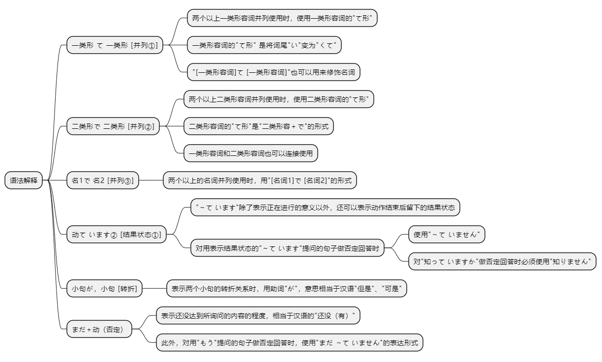
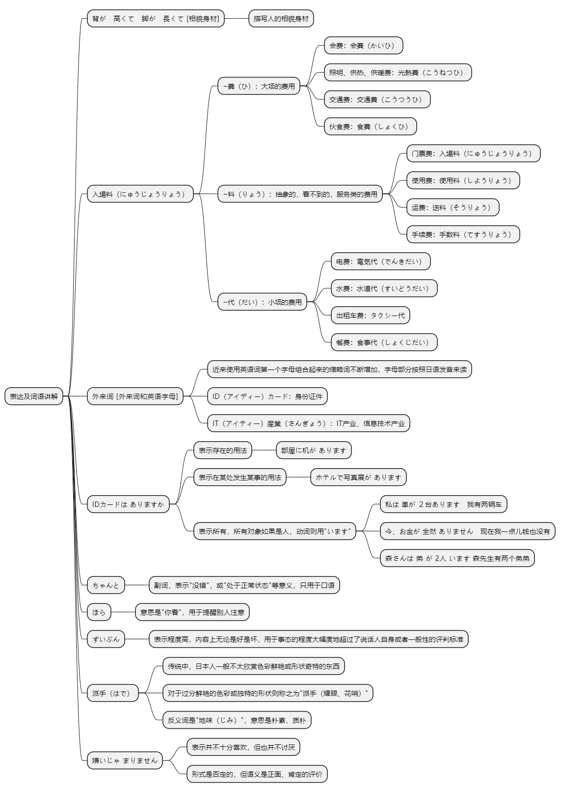

# 第十六课

> 基本课文

```log
テルの　部屋は　広くて　明るいです。

この　コンピュータの　操作は　簡単で　便利です。

森さんは　車を　もって　います。

3か月　パソコンを　練習しましたが、まで　あまり　できません。

森さんは　どんな　人ですか。
背が　高くて　脚が　長くて、ハンサムな　人です。

日本は　どうですか。
町が　きれいで　安全ですが、物が　高いですね。

スミスさんは　会社員ですか。
ええ。旅行会社の　社員で　営業部の　部長です。

長島さんは　どこに　すんで　いますか。
家族と　一緒に　渋谷に　住んで　います。
```

## 语法解释



> 一类形 て 一类形 [并列①]

两个以上一类形容词并列使用时，使用一类形容词的"て形"。一类形容词的"て形" 是将词尾"い"变为"くて"。

```log
ホテルの部屋は広くて明るいです。

この本は安くておもしろいです。

このリンゴは大きくて，甘くて，おいしいです。
```

"[一类形容词]て [一类形容词]"也可以用来修饰名词。

```log
軽くて暖かいコートを買いました。
```

> 二类形で二类形 [并列②]

两个以上二类形容词并列使用时，使用二类形容词的"て形"。二类形容词的"て形" 是"二类形容＋で"的形式。一类形容词和二类形容词也可以连接使用。

```log
このコンピュータ操作は簡単で便利です。

森さんは親切で優しいです。

この公園は静かで広いです。
```

> 名1で名2 [并列③]

两个以上的名词并列使用时，用"[名词1]で [名词2]"的形式。

```log
スミスさんは旅行会社の社員で，営業部の部長です。

この機械は日中電気の製品で，中国製です。
```

> 动て います② [结果状态①]

"～て います"除了表示正在进行的意义以外，还可以表示动作结束后留下的结果状态。

```log
森さんは車を持っています。

わたしは北京に住んでいます。

田中さんをしっていますか。
```

对用表示结果状态的"～て います"提问的句子做否定回答时，使用"～ていませ ん"。但是，对"知 し っていますか"做否定回答时必须使用"知 し りません"。
```log
車を持っていますか。
いいえ，もっていません。

田中さんをしっていますか。
いいえ，知りません。
```

> 小句が，小句 [转折]

表示两个小句的转折关系时，用助词"が"。意思相当于汉语"但是" "可是"。

```log
三か月パソコンを勉強しましたか，まだあまりできません。

このレストランはおいしいですがちょっと高いです。

```

> まだ＋动（否定）

表示还没达到所询问的内容的程度。相当于汉语的"还没（有）"

```log
何年ぐらい日本語を勉強しましたか。
2年勉強しました。でも，まだあまりできません。
```

此外，对用"もう" 提问的句子做否定回答使用"まだ～ていません"的表达形式。
```log
小野さんはもう結婚していますか。
いいえ，まだ結婚していません。
```

## 表达及词语讲解



## 应用课文

温泉
```log
大きくて　きれいな　建物ですね。

ええ。日本の　有名な　建築家の　設計で、最新の　展示場です。

デザインが　ユニークで、形が　おもしろいですね。

警備の　ひとが　いろいろな　所に　いますね。所に　いますね。

ここは　駅から　近くて、入場料も　安いです。たくさんの　人が　来ますから、警備が　厳重です。あっ、李さん、IDカードは　ありますか。

安心して　ください。ちゃんと　もって　います。

入り口は　狭いですが、中は　とても広いですね。

ええ。天井が　高くて、窓が　多くて、とても　明るいです。

クリスマスツリーの　横に　赤くて　大きい　看板が　ありますね。あれは　何ですか。

ああ、あれは　航空会社の　広告ですよ。ずいぶん　派手ですね。

派手ですが、わたしは　嫌いじゃ　ありませんよ。
```

## 生词表

```log
そうさ

きかい

りょこうがいしゃ

こうくうがいしゃ

えいぎょうぶ

アイティーさんぎょう

せいひん

けんちくか

せっけい

デザイン

かたち

さいしん

ネクタイ

さいふ

かわ

ぬの

すいとう

みどり

あし

ゆび

め

はな

かお

あたま

アイディーカード

まちがい

もんだい

こうこく

かんばん

てんじじょう

にゅうじょうりょう

サービス

てんじょう

けいび

クリスマスシリー

オーストラリアじん

みなさん

こ

よこ

もちます

すみます

しります

なおします

かたづけます

れんしゅうします

けっこんします

あんしんします

あかるい

ながい

みじかい

かるい

やさしい

ほそい

ふとい

くろい

ユニーク

あんぜん

はで

じみ

げんじゅう

まじめ

たいせつ

ふくざつ

ちゃんと

すぐ

ずいぶん

ほら

にっちゅうでんき

あたまがいい

せい

りょう

ひ

だい
```