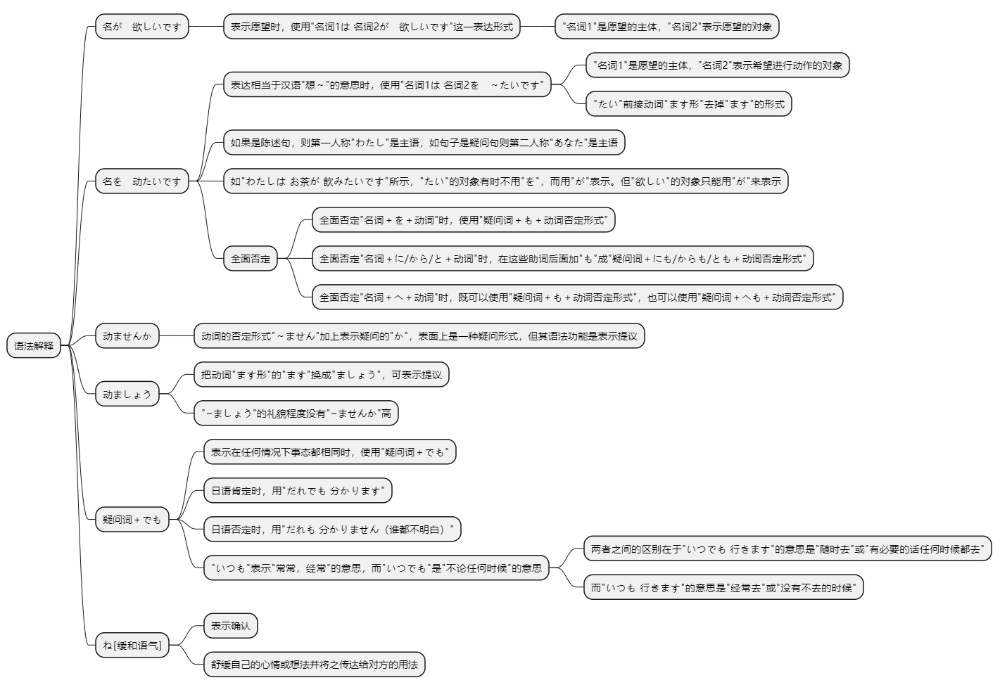
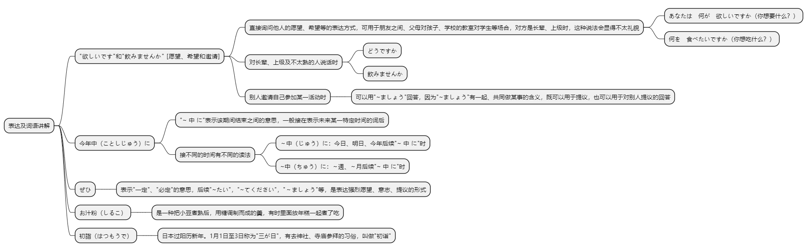

# 第十七课

## 基本课文

```log
わたしは　新しい　洋服が　ほしいです

わたしは　映画を　見たいです。

一緒に　お茶を　飲みませんか。

ちょっと　休みましょう。

今　何が　一番　ほしいですか。
安い　車が　ほしいです。

今日　デパートへ　買い物に　行きます。李さんも　いっしょに　どうですか。
はい、ぜひ　いきたいです。

李さん、何を　食べたいですか。
何でも　いいです。

土曜日の午後、コンサートへ　行きませんか。
いいですね。行きましょう。
```

## 语法解释



> 名が　欲しいです

表示愿望时，使用“名词1は名词2が　欲しいです”这一表达形式。“名词1”是愿望的主体，“名词2”表示愿望的对象。

我想有套新西服。
```
わたしは新しい洋服が欲しいです。
```

你想要什么？  
想要新的电脑。
```text
あなたは何が欲しいですか。
新しいパソコンが欲しいです。
```

> 名を　动たいです

表达相当于汉语“想～”的意思时，使用“名词1は 名词2を　～たいです”。“名词1”是愿望的主体，“名词2”表示希望进行动作的对象。 “たい”前接动词“ます形”去掉“ます”的形式。

使用“欲しいです”或“～たいです”的时候，如果是陈述句，则第一人称“わたし”是主语。如句子是疑问句则第二人称“あなた”是主语。这两种情况的主语都可以从句子的前后关系中判断出来，因此常常省略。

我想看电影。
```
わたしは映画を見たいです。
```

今天不想喝酒。
```
今日はお酒を飲みたくないです。
```

你想做什么？
```
あなたは何をしたいですか。
何もしたくありません。
```

注意：
如“わたしは お茶が 飲みたいです”所示，“たい”的对象有时不用“を”，而用“が”表示。但“欲しい”的对象只能用“が”来表示。

我想喝水。
```
水を飲みたいです。
```
我想喝水。
```
水が飲みたいです。
```
我想喝水。
```
水が欲しいです。
```

参考：
全面否定“名词＋を＋动词”时，使用“疑问词＋も＋动词否定形式”。

全面否定“名词＋に/から/と＋动词”时，在这些助词后面加“も”成“疑问词＋にも/からも/とも＋动词否定形式”。

全面否定“名词＋へ＋动词”时，既可以使用“疑问词＋も＋动词否定形式”，也可以使用“疑问词＋へも＋动词否定形式”。

你想见谁？  
谁也不想见。
```text
だれに会いたいですか。
だれにも会いたくないです。
```

你想去哪儿？  
哪儿也不想去。
```
どこへ行くたいですか。
どこへも行きたくないです。
```

> 动ませんか

动词的否定形式“～ません”加上表示疑问的“か”，表面上是一种疑问形式，但其语法功能是表示提议。

一起喝茶好吗？
```
いっしょにお茶を飲みませんか。
```
休息一下怎么样？
```
少し 休みませんか。
```
明天去故宫怎么样？
```
明日 故宮へ 行きませんか。
```

> 动ましょう

把动词“ます形”的“ます”换成“ましょう”，可表示提议。

休息一下吧。
```text
ちょっと 休みましょう。
```

咱们快走吧。
```
そろそろ 行きましょう。
```
一起喝茶吧。
```text
いっしょに お茶を 飲みましょう。
```

参考：“ましょう”的礼貌程度没有“ませんか”高。

> 疑问词＋でも

表示在任何情况下事态都相同时，使用“疑问词＋でも”。

小李，你想吃什么？
```
李さん、何を 食べたいですか。
何でも いいです。
```
请你随时打电话。
```
いつでも 電話を して ください。
```
谁都明白。
```
だれでも 分ります。
```
注意：
汉语的“疑问词＋都”肯定、否定时都可以使用，如“谁都明白” “谁都不明白”，但日语中用于肯定和否定的形式不同。

肯定时，用“だれでも 分かります”而不能说成“≠だれも 分かります”。反过来，表示否定时，用“だれも 分かりません（谁都不明白）”而不能说成“≠だれでも 分かりません”。

参考： “いつも”表示“常常，经常”的意思，而“いつでも”是“不论任何时候”的意思。

两者之间的区别在于“いつでも行きます”的意思是“随时去”或“有必要的话任何时候都去”，而“いつも 行きます”的意思是“经常去”或“没有不去的时候”。

> ね[缓和语气]

第4课我们学习了表示确认的“ね”（第4课“语法解释4”），“ね”也有舒缓自己的心情或想法并将之传达给对方的用法。

如本课应用课文的“まず 恋人が 欲しいですね（我想先找一个男朋友）”以及“まじめで 優しい 人が いいですね（办事认真，温柔体贴的人呗）”就属于这种用法。

你最喜欢吃什么日本菜？  
嗯...还是最喜欢寿司。
```
日本料理で 何が いちばん 好きですか。
そうですね。やっぱり お寿司ですね。
```

## 表达及词语讲解



## 应用课文

```log
小野さんは　何を　お願いしましたか。
健康と　恋愛です。
恋愛ですか？
ええ。今年中に　結婚したいです。
相手は　いますか。
いいえ。まず　恋人が　欲しいですね。
どんな　男性が　いいですか。
まじめで　やさしい　人が　いいですね。
じゃあ、森さんは　どうですか。
ええ？

ちょっと　寒いですね。温かい　物を　食べませんか。
そうですね。
何が　いいですか。
何でも　いいですよ。
じゃあ、お汁粉は　どうですか。いい　お店を　知って　います。そこに　行きましょう。
お汁粉？ぜひ　食べたいです。
```

## 生词表

```log
ようふく

セーター

ノートパソコン

バイク

おしるこ

てんぷら

はつもうで

けんこう

れんあい

ドラマ

あいて

こいびと

せんぱい

だんせい

がいこくじん

なつ

ことし

はじめます

れんらくしあす

ほしい

りっぱ

こんど

ぜひ

そろそろ

まず

ベートーベン

ショパン

こきゅう

ヨーロッパ

ホンコン

スイス

じゅう
```