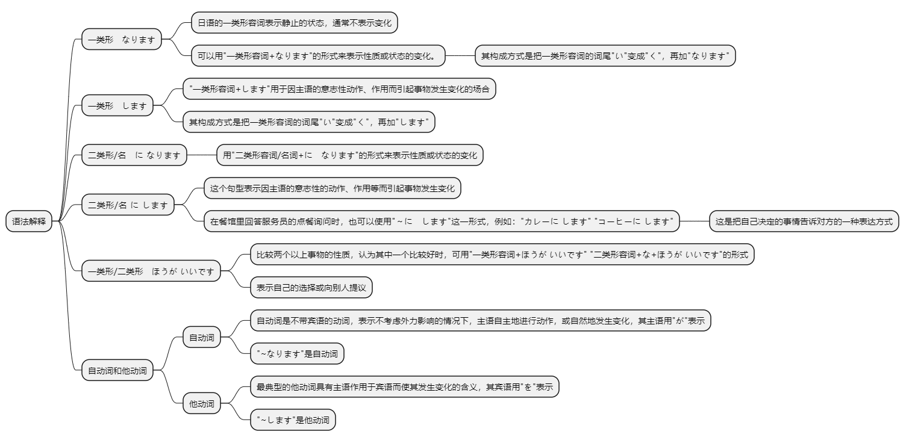
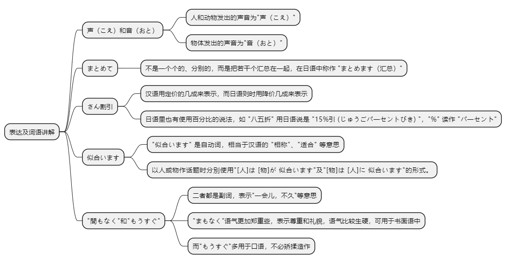

# 第十八课

## 基本课文

```log
携帯電話は とても 小さく なりました。

テレビの 音を 大きく します。

息子は 医者に なりました。

部屋を きれいに して ください。

風邪は どうですか。
ゆうべ 薬を 飲みましたが，まだ よく なりません。

旅行の 荷物は 軽い ほうが いいですよ。
はい。できるだけ 軽く します。

お嬢さんは おいくつですか。
今年 7歳に なりました。

あのう，ちょっと うるさいですよ。
あっ、すみません。静かにします。
```

## 语法解释



> 一类形　なります

日语的一类形容词表示静止的状态，通常不表示变化。但是，可以用“一类形容词+なります”的形式来表示性质或状态的变化。

其构成方式是把一类形容词的词尾“い”变成“く”，再加“なります”。
```log
だんだん 暖か く なります。
携帯電話は 小さ く なりました。
パソコンは 安 く なりました。
```

> 一类形　します

“一类形容词+します”用于因主语的意志性动作、作用而引起事物发生变化的场合。其构成方式是把一类形容词的词尾“い”变成“く”，再加“します”。
```log
テレビの 音を 大き く します。
ジュースを 冷た く します。
```

> 二类形/名　に なります

和本课“语法解释1”的情况相同，用“二类形容词/名词+に　なります”的形式来表示性质或状态的变化。
```text
もう 元気 に なりました。
息子は 医者 に なりました。
来年 社会人 に なります。
```

> 二类形/名 に します
和本课“语法解释2”的情况相同，这个句型表示因主语的意志性的动作、作用等而引起事物发生变化。

```text
部屋を きれい に して ください。
会議室を 禁煙 に します。
```

参考：
在餐馆里回答服务员的点餐询问时，可以使用“～に　します”这一形式。

例如：“カレーに します（我要咖喱饭）”“コーヒーに します（我要咖啡）”。这是把自己决定的事情告诉对方的一种表达方式。

> 一类形/二类形　ほうが いいです

比较两个以上事物的性质，认为其中一个比较好时，可用“一类形容词+ほうが いいです” “二类形容词+な+ほうが いいです”的形式，表示自己的选择或向别人提议。

```text
旅行の 荷物は 軽い ほうが いいです。

部屋は 広い ほうが いいです。

子供は 元気な ほうが いいです。

公園は 静かな ほうが いいです。
```

> 自动词和他动词

日语的动词可分为自动词和他动词。

最典型的他动词具有主语作用于宾语而使其发生变化的含义，其宾语用“を”表示。

自动词是不带宾语的动词，表示不考虑外力影响的情况下，主语自主地进行动作，或自然地发生变化，其主语用“が”表示。

另外，如下所示，日语的一部分自、他动词在词形上有对应关系。
```text
窓 が あきました。（窗子开了。）
（李さんが）窓 を 開けました。（小李打开窗户了。）
タイムサービス が 始まります。（时段廉价销售就要开始了。）
（デパートが）タイムサービス を 始めます。（百货公司开始时段廉价销售。）
```

## 表达及词语讲解



> 声（こえ）和音（おと）

在汉语里，人的声音、动物的鸣叫声以及物体、自然现象发出的声音都称为 "声音"，而日语则不同，人和动物发出的声音为"声"，物体发出的声音为"音"。

```text
子供の声がうるさいですね。

テレビの音を大きくします。
```

> まとめて

不是一个个的、分别的，而是把若干个汇总在一起，在日语中称作 "まとめます（汇总）"。

如 "まとめて 買います(一起买)"，表示所买的东西不是一个、一件，而是几样、几套东西一起买。

```text
お正月は 洋服が 安く なりますから，まとめて 買います。
```

> さん割引

相当于汉语 "七折" 的日语说法是 "3 割引 ( さんわりびき )"。 汉语用定价的几成来表示，而日语则时用降价几成来表示。

日语里也有使用百分比的说法，如 "八五折" 用日语说是 "15%引 ( じゅうごパ一セントびき) "，"%" 读作 "パ一セン卜"。

> 似合います

"似合います（にあう）" 是自动词，相当于汉语的 "相称"、"适合" 等意思。 

以人或物作话题时分別使用“[人]は [物]が 似合います"及“[物]は [人]に 似合います"的形式。

红的好吧，很适合你。
```text
赤い ほうが いいですね。よく 似合いますよ。
```

这个句子的意思是 "李さんは 赤いのが よく 似合います（对小李来说，红的相称）"。

小野女士穿浴衣很相称。
```
小野さんは 浴衣が 似合います。
```

这件衬衫不适合爸爸穿，太花哨。
```
この シャツは 父に 似合いません。派手ですよ。
```

> “間もなく”和“もうすぐ”

两者都是副词，表示“一会儿，不久”等意思，但“間もなく”语气更加郑重些，语气比较生硬，可用于书面语。而“もうすぐ”多用于口语。

应用课文中，店员有必要对顾客表示尊重和礼貌，从而使用了“間もなく”。

小野和小李是亲密的同事，不必矫揉造作，因而小野对小李使用了“もうすぐ”这个词。

时段廉价销售时间马上就要到了
```text
間もなく タイムサービスの 時間です。
```

马上就到6点了。
```text
もうすぐ6時になります。
```

## 应用课文

新春セール
```log
小野さん、今日は　たくさん　買いますか。

ええ。お正月は　洋服が　安く　なりますから、まとめて　買います。

どのぐらい　安く　なりますか。

だいたい　定価の　三割引か　半額に　なります。

半額ですか？わたしも　新しい　洋服が　ほしく　なりました。

赤と　青と、どちらが　いいですか。

赤い　ほうが　いいですね。よく　似合いますよ。

そうですか。じゃあ、これに　します。

間もなく　タイムサービスの　時間です。さらに　お安く　しますよ。

もうすぐ　六時に　なりますから、タイムサービスが　始まります。

タイムサービス？

ええ、今から　七時まで　もっと　安く　なります。さあ、行きましょう。
```

## 生词表

```log
おと

こえ

くうき

むすこ

いしゃ

おじょうさん

しゃかいじん

りょこうガイド

がくしゃ

パイロット

デザイナー

タイムサービス

しんしゅんセール

さんわりびき

ていか

はんがく

ねだん

シャツ

スカート

いろ

あか

あお

おしょうがつ

じかん

しょうらい

じゅんび

びょうき

なります

あきます

にあいます

うるさい

シンプル

まもなく

もうすぐ

さらに

さあ

できるだけ

まとめて

いまから
```