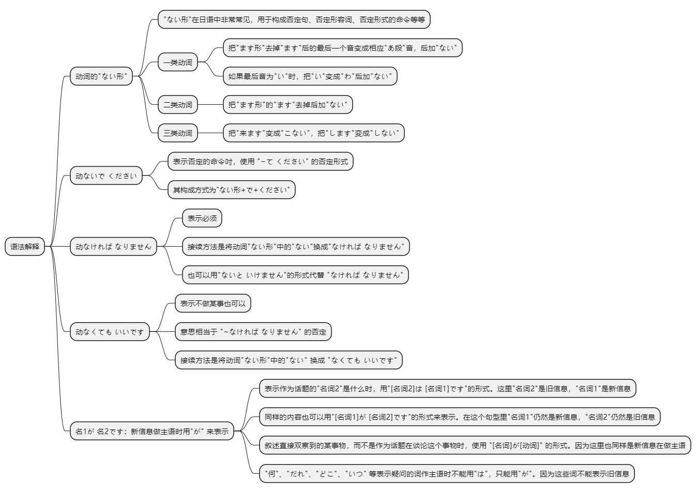
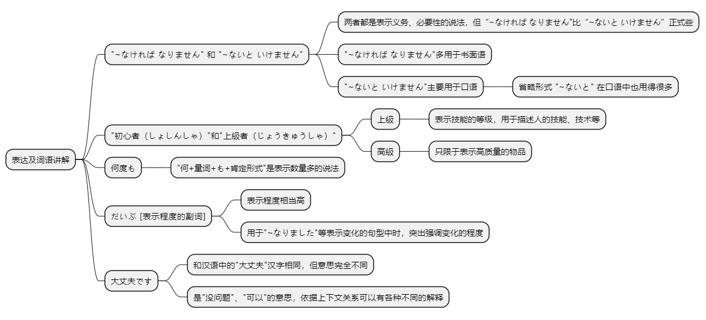

# 第十九课

## 基本课文

```log
部屋の　かぎを　忘れないで　ください。
李さんは　今日　早く　帰らなければ　なりません。
明日は　残業しなくても　いいですよ。
あの　人が　吉田課長ですよ。

その　品物に　触らないで　ください。
あっ、すみません。

李さん、いっしょに　食事に　行きませんか。
すみません。今日は　早く　帰って、レポートを　書かなければ　なりません。

先生、もう　薬を　飲まなくても　いいですか。
はい、いいですよ。

吉田課長は　いますか。
わたしが　吉田ですが…。
```

## 语法解释



> 动词的"ない形

动词的 "ない形" 的变换方式如下：

一类动词：把"ます形" 去掉 "ます" 后的最后一个音变成相应 "あ段" 音，后加 "ない"。如果最后音为 "い" 时，把 "い" 变成 "わ" 后加 "ない"。( 注意：此时不能将 "い" 变成 "あ"。)

二类动词：把 "ます形" 的 "ます" 去掉后加 "ない"，即直接将“る”变为“ない”。

三类动词：把 "来ます" 变成 "こない"，把 "します" 変成 "しない"。

> 动ないで ください

表示否定的命令吋，使用 "~て ください" 的否定形式。其构成方式为"ない形+で+ください"。

请别忘了房间钥匙。
```text
部屋のかぎを忘れないでください。
```

请不要进入这个房间。
```text
この 部屋には 入ら ないで ください。
```

请不要勉强。
```text
無理をしないで ください。
```

> 动 なければ なりません

表示必须。接续方法是将动词"ない形"中的"ない"换成"なければ なりません"。也可以用"ないと いけません"的形式代替 "なければ なりません"。

第18课中的“~ては　いけません”表示禁止。

小李今天必须早点回家。
```text
李さんは今日早く帰らなければなりません。
```

这个药必须每天吃。
```text
この薬は毎日飲まなければなりません。
```

得马上把文件寄出去。
```text
すぐに書類を送らないといけません。
```

备注：
* なければ なりません
```text
“动 なければ なりません”来源于日语中表示条件和必要性的结构，表示如果不做某事，那么某种结果将不成立，强调必须做某事的必要性。

动词的否定形 + ければ：表示条件，即“如果不……的话”。

なる：表示“成为”，在这里用否定形式“なりません”来强调必要性。
```

* ないといけません
```text
“ないといけません”是日语中表示必须做某事的表达方式之一。这个结构来源于几个部分的组合：动词的否定形“ない”、条件形式“と”和“いけません”，它们一起构成了“如果不做某事就不行”的意思。

ない：动词的否定形，表示“不做某事”。
例：食べる（吃） → 食べない（不吃）
例：行く（去） → 行かない（不去）

と：表示条件的助词，相当于“如果……的话”。
例：行かないと → 如果不去的话

いけません：来自动词“行く”的可能形式“行ける”的否定形式“行けない”（不能去），在这里用来表示“不行”。
```

> 动なくても いいです

表示不做某事也可以。意思相当于 "~なければ なりません" 的否定。接续方法是将动词"ない形"中的"ない" 换成 "なくても いいです"。

明天不加班也行。
```
明日は 残業し なくても いいです。
```

不要慌慌张张的！
```text
慌て なくても いいですよ。
```

不脱鞋也可以吗？
```text
靴を 脱が なくても いいですか。
```

> 名1が 名2です

表示作为话题的"名词2"是什么时，用"[名词2]は [名词1]です"的形式。这里"名词2”是旧信息，"名词1" 是新信息。

同样的内容也可以用"[名词1]が [名词2]です"的形式来表示。在这个句型里"名词1"仍然是新信息，"名词2"仍然是旧信息。新信息做主语时用"が" 来表示。

山田老师是哪位？  
山田老师是那位。  
那位是山田老师。  
```text
山田先生は どの方ですか。
山田先生は あの 方です。
あの 方が 山田先生です。
```

吉田科长在吗？  
我就是吉田......
```text
吉田課長は いますか。
わたしが 吉田ですが。
```

你的包是哪一个？  
这个是我的包。
```text
あなたの かばんは どれですか。
これが わたしの かばんです。
```

参考：叙述直接双察到的某事物，而不是作为话题在谈论这个事物时，使用 "[名词]が[动词]" 的形式。因为这里也同样是新信息在做主语。

孩子在公园里玩儿。
```text
子供が 公園で 遊んで います。
```

公共汽车来了。
```text
バスが 来ました。
```

注意："何"、"だれ"、"どこ"、"いつ"等表示疑问的词作主语时不能用"は"，只能用"が"。因为这些词不能表示旧信息。

有谁呀？
```text
だれがいますか。
```
xだれは いますか。

哪儿疼啊？
```text
どこが痛いですか。
```
xどこは 痛いですか。

喜欢什么？
```text
何が好きですか。
```
x何は 好きですか。

## 表达及词语讲解



> "~なければ なりません" 和 "~ないと いけません"

两者都是表示义务、必要性的说法，但“~なければ なりません"比“~ないと いけません”正式些。

"~なければ なりません"多用于书面语，"~ないと いけません"主要用于口语。

另外，后者的省略形式 "~ないと" 在口语中也用得很多。

从6岁起，孩子必须上学。
```text
子供は 6歳から 学校へ 行かなければ なりません。
```

啊，8点了，我得去车站了。
```text
あっ，8時ですね。もう 駅へ 行かないと。
```

> "初心者（しょしんしゃ）"、"上級者（じょうきゅうしゃ）"

汉语中，表示技能的等级时，说 "初级/中级/高级"，但日语中不说 "高級" 而说 "上級"。

尽管日语中有 "高級" 送个词，但它不用于描述人的技能、技术等，只限于表示高质量的物品。

森先生，英语会话学得怎么样了？  
上个月，好不容易进了高级班。
```text
森さん，英会話の 勉強は どうですか。
やっと 先月 上級クラスに 入りました。
```

> 何度も

"何+量词+も+肯定形式" 是表示数量多的说法。

我摔倒了好几次，不过挺有意思的。
```text
何度も 転びましたが，とても おもしろいです。
```

口渴了，喝了好几杯水。
```text
のどが 渇きましたから，水を 何杯も 飲みました。
```

> だいぶ [表示程度的副词]

表示程度相当高。用于 "~なりました" 等表示变化的句型中时，突出强调变化的程度。

昨天喝了不少酒。
```text
昨日は だいぶ お酒を 飲みました。
```

感冒好了吗？  
好多了。
```text
風邪は よく なりましたか。
だいぶ よく なりました。
```

> 大丈夫です

和汉语中的"大丈夫"汉字相同，但意思完全不同。是 "没问题"、"可以" 的意思。依据上下文关系可以有各种不同的解释，例如 "大丈夫です" 是 "我保证(不进去)" 的意思。

注意别滑进熟练者滑道里去。  
我保证不进去，请别担心。
```text
上級者の コースには 入らないで ください。
大丈夫です。心配しないで ください。
```

田中先生，病好了吗？  
嗯，已经不要紧了。
```text
田中さん，病気は もう 治りましたか。
はい，もう大丈夫です。
```

## 应用课文

スキー
```log
小野さん、初めてですから、ちょっと怖いです。

心配しなくてもいいですよ。ここは初心者コースですから。

森さん、小野さん、待ってください。先に行かないでください。

急がなくてもいいですよ。わたしたちもゆっくり滑りますから。

李さん、スキーはどうですか。

何度も転びましたが、とてもおもしろいです。

そうですか。だいぶ上手になりたいです。

本当ですか。でも、もっと上手になりたいです。

じゃあ、もっと練習しなければなりませんね。もう一度滑りますか。

はい。今度は先に滑ってもいいですか。

いいですよ。でも、上級者のコースには入らないでください。

大丈夫です。心配しないでください。
```

## 生词表

```log
しなもの

おさら

ごみ

しょしんしゃ

じょうきゅうしゃ

こうきゅう

じょうきゅうクラス

えいかいわ

コース

スキー

レポート

パスポート

のど

さわります

ぬぎます

ころびます

かわきます

なおります

すべります

よびます

かえします

てつだいます

はこびます

なくします

おとします

おきます

はらいます

たちます

わすれます

あわてます

すてます

ざんぎょうします

しんぱいします

ほんとう

はやく

やっと

だいぶ

はじめて

さきに

やまだ
```