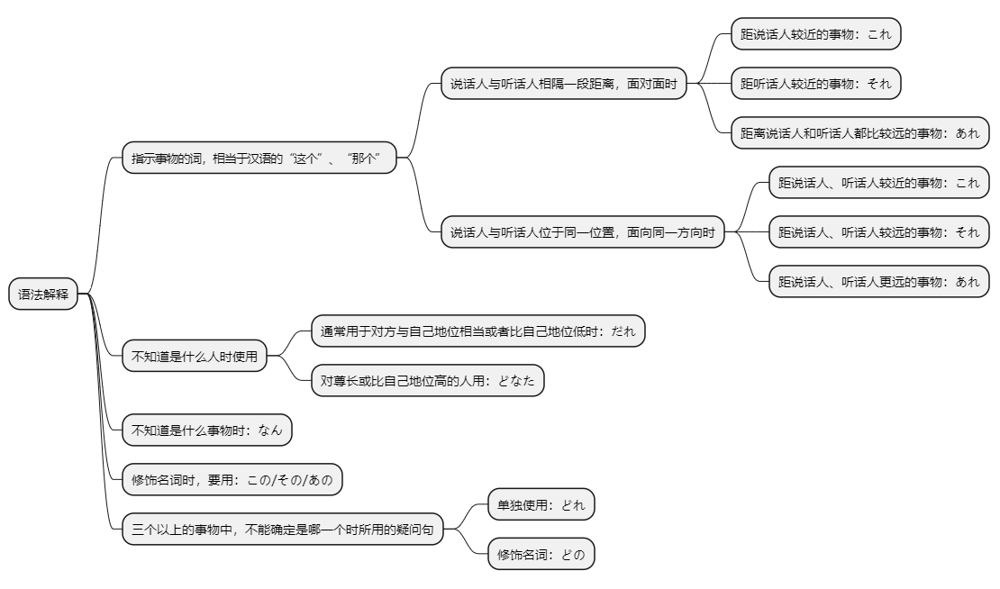
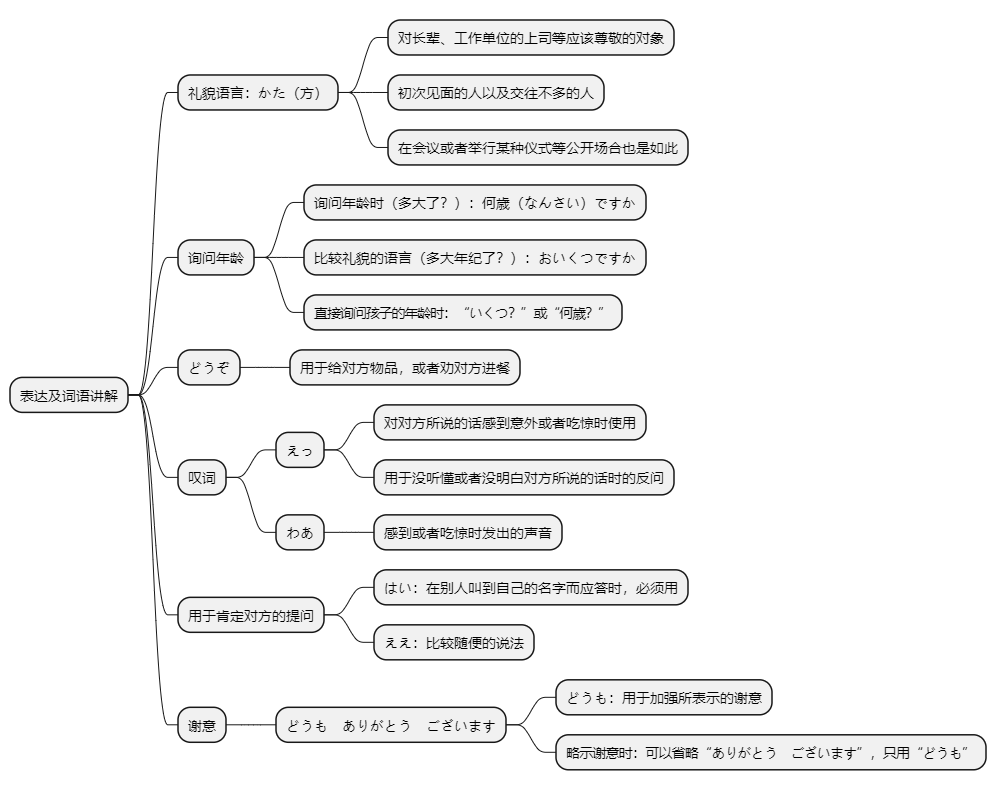

# 第二课

## 基本课文

```log
これは　本です。

それは　何ですか。

あれは　だれの　 傘ですか。

この　 カメラは　スミスさんのです。

これは　テレビですか。
いいえ，それは　テレビでは　ありません。パソコンです。

それは　何ですか。
これは　日本語の　本です。

森さんの　かばんは　どれですか。
あの　かばんです。

その　ノートは　だれのですか。
わたしのです。
```

## 语法解释



> これ/それ/あれ は　名 です
```log
これは　本　 です。

それは　かばん　です。

あれは　テレビ　です。
```

> だれですか / 何（なん）ですか
```log
それは　なんですか。

あの人は　だれ ですか。

スミスさんは　どなたですか
```

> 名 の 名
```log
わたし　の　かぎ。

田中さん　の　車（くるま）。
```

> この/その/あの　名は　名 です
```log
この　カメラは　スミスさんのです。

その　自転車は　森さんのです。

あの　ノートは　誰のですか。
```

> どれ/どの　名
```log
森さんの　かばんは　どれ　ですか。

長島さんの　傘は　どれ　ですか。

小野さんの　机は　どの　机　ですか。
```

## 表达及词语讲解



## 应用课文

家族の写真
```log
李さん，それは　何ですか。

これですか。家族の　写真です。

この　方は　どなたですか。

私の　母です。

お母さんは　おいくつですか。

52歳です。

小野さん，これ，どうぞ。

えっ，何ですか。

お土産です。

わあ，シルクの　ハンカチですか。

ええ。スワトウの　ハンカチです。中国の　名産品です。

どうも　ありがとう　ございます。
```

## 生词表

```log
ほん

かばん

ノート

えんぴつ

かさ

くつ

しんぶん

ざっし

じしょ

カメラ

テレビ

パソコン

ラジオ

でんわ

つくえ

いす

かぎ

とけい

てちょう

しゃしん

くるま

じてんしゃ

おみやげ

めいさんひん

シルク

ハンカチ

かいしゃ

かた

ひと

かぞく

はは

おかあさん

にほんご

ちゅうごくご

これ

それ

あれ

どれ

なん

だれ

どなた

この

その

あの

どの

えっ

わあ

ええ

ながしま

にほん

スワトウ

ロンドン

ありがとうございます

おいくつ

なん

さい
```