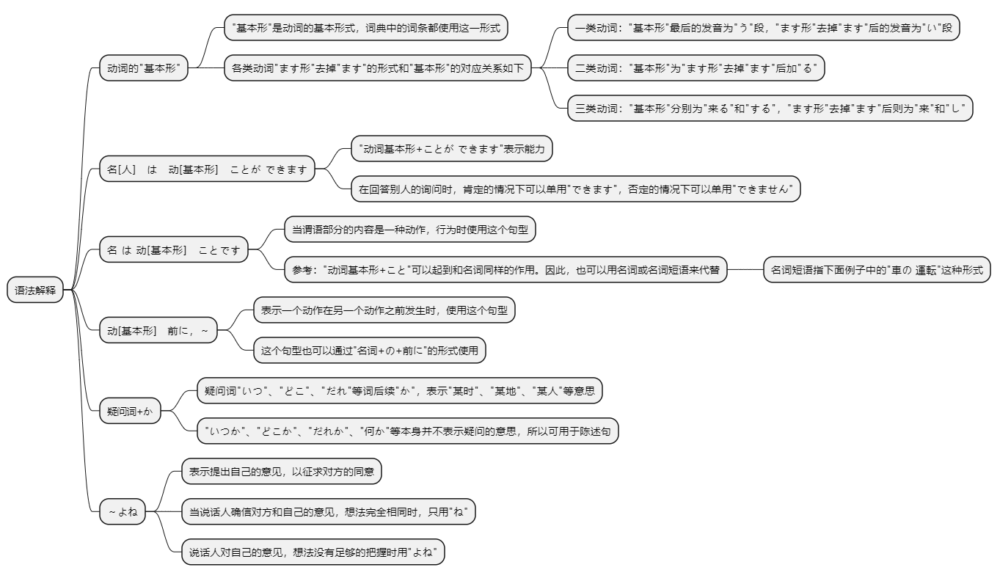
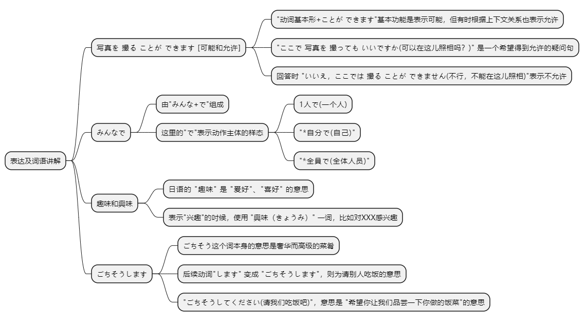

# 第二十课

## 基本课文

```log
スミスさんは　ピアノを　弾く　ことが　できます。
わたしの　趣味は　切手を　集める　ことです。
こちらへ　来る　前に、電話を　かけて　ください。
冬休み、　どこかへ　行きたいです。

李さんは　車を　運転する　ことが　できますか。
はい、できます。

ここで　写真を　撮っても　いいですか。
いいえ、ここでは　とる　ことが　できません。

何か　趣味が　ありますか。
ええ。音楽を　聞く　ことです。

森さんは　いつ　ギターを　練習しますか。
毎晩、寝る　前に　練習します。
```

## 语法解释



> 动词的 "基本形"

"基本形"是动词的基本形式。一般情况下动词“基本形”与动词“ます形”（初级第13课）是对应记忆的。

一类动词（变形规则：う段 → い段＋ます）

1. 结尾是う段非る的动词，肯定是一类动词（如書く、探す、勝つ、遊ぶ、読む等）

2. あ段＋る、う段＋る、お段＋る（如困る、怒る、やる等）

3. 特例（如切る、帰る、走る）

二类动词（上一段动词、下一段动词）

1. い段＋る、え段＋る（如起きる、食べる、見える、教える、着る、受ける等）

三类动词

1. 来る（くる）、する
2. 名词+する（如勉強する、努力する、運動する等）

> 名[人]　は　动[基本形]　ことが できます

“动词基本形+ことが できます”表示能力。在回答别人的询问时，肯定的情况下可以单用“できます”，否定的情况下可以单用“できません”。

史密斯先生会弹钢琴。
```
スミスさんは ピアノを 弾く ことが できます。
```

森先生会做中国菜吗？  
是的，会做。
```
森さんは　中華料理を　作る　ことが　できますか。
はい、できます。
```

> 名 は 动[基本形]　ことです

当谓语部分的内容是一种动作，行为时使用这个句型。

我的爱好是集邮。
```
私の 趣味は 切手を 集める こと です。
```

小王的特长是拉胡琴。
```
王さんの特技は 胡弓を 弾く こと です。
```

森先生的理想是在外国工作。
```text
森さんの 夢は 外国で 働く こと です。
```

参考：“动词基本形+こと”可以起到和名词同样的作用。因此，也可以用名词或名词短语来代替。

名词短语指下面例子中的“車の 運転”这种形式。

小野不会开车。
```
小野さんは 車を 運転する こと が できません。
```

小野不会开车。
```
小野さんは 車の 運転 が できません。
```

> 动[基本形]　前に，～

表示一个动作在另一个动作之前发生时，使用这个句型。

来之前请打个电话。
```
こちらへ 来る 前に 電話を かけて ください。
```

每天睡觉前淋浴。
```
毎日 寝る 前に シャワーを 浴びます。
```

这个句型也可以以“名词+の+前に”的形式使用。

开会之前复印材料
```
会議の前に，資料を コピーします。
```

> 疑问词+か

疑问词“いつ” “どこ” “だれ”等词后续“か”，表示“某时” “某地” "某人"等意思。

房间里有人吗？
```
部屋に だれか いますか。
```

房间里有谁？
```
部屋に だれが いますか。
```

“いつか” “どこか” “だれか” “何か”等本身并不表示疑问的意思，所以可用于陈述句。

寒假想去个什么地方。
```
冬休み、どこかへ 行きたいです。
```

肚子饿了吧。吃点东西吧。
```
おなかが すきましたね。何か 食べましょう。
```

> ～よね　

第4课和第8课分别学习了助词“ね”和“よ”。这两个助词组成“よね”，表示提出自己的意见，以征求对方的同意。

当说话人确信对方和自己的意见，想法完全相同时，只用“ね”，而说话人对自己的意见，想法没有足够的把握时用“よね”。

自己擀的饺子皮可好吃了。
```
手作りの ギョーザの 皮は おいしいですよね。
```

这把伞是森先生的吧？
```
この 傘は 森さんのですよね。
```

小野女士也一起去吧？
```
小野さんも いっしょに 行きます よね。
```

## 表达及词语讲解



> 写真を 撮る ことが できます [可能和允许]

"动词基本形+ことが できます"基本功能是表示可能，但有时根据上下文关系也表示允许。

"ここで 写真を 撮っても いいですか(可以在这儿照相吗？)" 是一个希望得到允许的疑问句，回答时 "いいえ，ここでは 撮る ことが できません(不行，不能在这儿照相)"表示不允许。
允许的内容，从国家的规章制度到入住公司宿舍的条件等，有许多种类。

在日本，多大年龄可以结婚？  
女的16岁，男的18岁。
```
日本では 何歳から 結婚する ことが できますか。
女の 人は 16歳から，男の 人は 18歳から できます。
```

宿舍的洗衣机可以用到几点？  
用到8点，那以后就不能用了。
```
寮の 洗濯機は 何時まで 使う ことが できますか。
8時までです。それからは 使う ことが できません。
```

> みんなで

由"みんな+で"组成。这里的"で"表示动作主体的样态，如 "1人で(一个人)"、"*自分で(自己)"、"*全員で(全体人员)"。

大家在一起包饺子。
```
みんなで餃子を作ります。
```

上个月我们班全体同学一起去野营了。
```
先月 クラス 全員で キャンプへ 行きました。
```

> 趣味和興味

因为汉语中也有"趣味"这个词，所以致使不少人对日语的"趣味（しゅみ）"屡屡用错。

日语的 "趣味" 是 "爰好"、"喜好" 的意思，与 "兴趣" 无缘。

表示 "兴趣" 的吋候，使用 "興味（きょうみ）" 一词。

我的爱好是集邮。
```
わたしの 趣味は 切手を 集める ことです
```

我对日本的书法感兴趣。
```
わたしは 日本の 書道に 興味が あります。
```

> ごちそうします

”（ご馳走）ごちそう“ 这个词本身的意思是奢华而高级的菜肴，后续动词 ”します“ 变成 ”ごちそうします“，则为请别人吃饭的意思。

例如，森对小野说，"ごちそうしてください(请我们吃饭吧)"，意思是 "希望你让我们品尝一下你做的饭菜" 的意思。

我时不时在家请小李吃日本料理。
```text
わたしは 時々 家で 李さんに 日本料理を ごちそうします。
```

那个老师上完课后常常请学生吃饭
```text
あの 先生は 授業が 終わってから，よく 学生に ごちそうします
```

## 应用课文

春節
```log 
李さん、春節は　中国へ　帰りますか。
いいえ、今　日本の　仕事が　忙しいですから、帰りません。
じゃあ、いっしょに　どこかへ　行きませんか。
横浜の　中華街へ　行きましょうよ。中国の　獅子舞を　見ることが　できますよ。

料理は　どうでしたか。
とても　おいしかったですよ。特に　ギョーザは。
李さんは　ギョーザを　作る　ことが　できますか。
ええ。北京では　春節の　前に、家族みんなで　ギョーザを　作ります。
手作りの　ギョーザは　皮が　おいしいですよね。
小野さんも　作る　ことが　できますか。
ええ、もちろん。わたしの　趣味は　おいしいものを　作る　ことですから。
本当ですか？じゃあ、いつか　ごちそうして　ください。
いいですよ。李さんが　帰国する　前に、ぜひ　いっしょに　うちに　来て　ください。
```

## 生词表

```log
しゅみ

とくぎ

きょうみ

ゆめ

ギター

こきゅう

しょどう

つり

ドライブ

あみもの

てづくり

ちゅうかがい

ちゅうかりょうり

ギョーザ

かわ

しゅんせつ

ししまい

りょう

せんたくき

シャワー

おなか

じゅぎょう

しりょう

フランスご

しょうせつ

かいがん

ふゆやすみ

キャンプ

みんな

じぶん

ぜんいん

ひきます

すきます

のぼります

あつめます

あびます

ごちそうします

きこくします

とくに

おなかがすきます
```