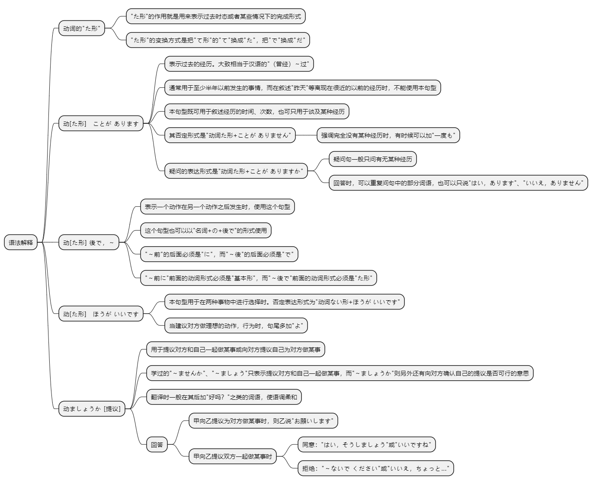
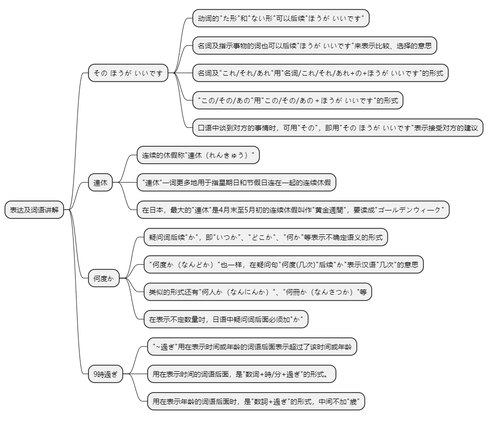

# 第二十一课

## 基本课文

```log
私はすき焼きを食べたことがあります。

李さんは会社が終わった後で、飲みに行きます。

もっと野菜を食べたほうがいいですよ。

窓を閉めましょうか。

お寿司を食べたことがありますか。
いいえ、一度もありません。天ぷらは食べたことがあります。

この資料を見てもいいですか。
はい。読んだ後で、森さんに渡してください。

ホテルを予約したほうがいいですか。
そうですね。連休ですから、そのほうがいいですね。

何か食べましょうか。
いいえ。寝る前に食べないほうがいいですよ。
```

## 语法解释



> 动词的“た形”

“た形”的作用就是用来表示过去时态或者某些情况下的完成形式

在本课，我们学习用动词“た形”构成的句型。“た形”的变换方式是把“て形”的“て”换成“た”，把“で”换成“だ”。
注意：行きます→いって→いった

> 动[た形]　ことがあります

表示过去的经历。大致相当于汉语的“曾经～过”。

通常用于至少半年以前发生的事情，而在叙述“昨天”等离现在很近的以前的经历时，不能使用本句型。

本句型既可用于叙述经历的时间、次数，也可只用于谈及某种经历。其否定形式是“动词た形+ことがありません”。

强调完全没有某种经历时，有时候可以加“一度も”。疑问的表达形式是“动词た形+ことが ありますか”。

疑问句一般只问有无某种经历。回答时，可以重复问句中的部分词语，也可以只说“はい、あります” “いいえ、ありません”。而不能说“ はい、ことがあります” “ ことがありません”。

我吃过日式牛肉火锅。
```text
私は すき焼きを 食べた ことが あります。
```

你去过北京吗？  
没有，一次也没有去过。  
不，没有。  
```text
北京へ 行った ことが ありますか。
いいえ，一度も 行った ことが ありません。
いいえ，ありません。
```

> 动[た形] 後で，～

表示一个动作在另一个动作之后发生时，使用这个句型

公司下班后去喝酒。
```text
会社が 終わった 後で，飲みに 行きます。
```

看完电影后吃了饭。
```text
映画を 見た 後で，食事を しました。
```

这个句型也可以以“名词+の+後で”的形式使用。

工作之后看电影。
```text
仕事 の 後で，映画を見ます。
```

注意：第20课我们学过了“～前に”（第20课语法解释4），“～前”的后面必须是“に”，而“～後”的后面必须是“で”。

“～前に”前面的动词形式必须是“基本形”，而“～後で”前面的动词形式必须是“た形”。

> 动[た形]　ほうがいいです

本句型用于在两种事物中进行选择时。否定表达形式为“动词ない形+ほうが いいです”。当建议对方做理想的动作，行为时，句尾多加“よ”。

还是多吃点蔬菜好啊。
```text
もっと 野菜を 食べた ほうが いいですよ。
```
别那么慌张啊。
```text
そんなに 慌てない ほうが いいですよ。
```
饭店还是先预约为好吗？
```text
ホテルを 予約した ほうが いいですか。
```

> 动ましょうか [提议]

用于提议对方和自己一起做某事或向对方提议自己为对方做某事。

第17课学过的“～ませんか” “～ましょう”只表示提议对方和自己一起做某事（第17课语法解释4）

而“～ましょうか”则另外还有向对方确认自己的提议是否可行的意思。因此，翻译时一般在其后加“好吗？”之类的词语，使语调柔和。

吃点什么吗？
```text
何か 食べましょうか。
```

参考：回答时，如本句型的意思为甲向乙提议为对方做某事时，则乙说“お願いします”。
如本句型的意思为甲向乙提议双方一起做某事时，则乙说“はい、そうしましょう”或“いいですね”。反对或拒绝提议时则说“～ないで ください”或“いいえ、ちょっと～”。

我来帮你拿行李吧？  
好的，拜托你了。
```text
荷物を 持ちましょうか。
はい、お願いします。
```

关上窗子好吗？  
不，请别关。
```text
窓を閉めましょうか。
いいえ、閉めないでください。
```

## 表达及词语讲解



> その ほうが いいです

动词的 "た形" 和 "ない形"可以后续 "ほうが いいです"（21课语法4），名词及指示事物的词也可以后续 "ほうが いいです" 来表示比较、选择的意思。

名词及 "これ/それ/あれ" 用 "名词/これ/それ/あれ+の+ほうがいいです" 的形式，"この/その/あの" 用 "この/その/あの＋ほうがいいです" 的形式。

苹果、橘子你喜欢哪个？  
我喜欢吃苹果。
```text
リンゴと ミカンと どちらが いいですか。
わたしは リンゴの ほうが いいです。
```

因为速度快，还是坐飞机去比较好。
```text
速いですから，飛行機の ほうが いいです。
```

啤酒杯，这个和那个，哪个好？  
（拿起手边的杯子）这个好。
```text
ビ一ルの グラスは，これと あれと どちらが いいですか。
これの ほうが いいです。
```

这个车和那个车，哪个车型好看？  
（指向停在远处的车）那个好看。
```text
デザインは，この車と あの 車と どちらが いいですか。
あの ほうがいいです。
```

另外，口语中谈到对方的事情时，可用 "その"，即用 "その ほうが いいです" 表示接受对方的建议。

饭店还是先预约为好吗？  
是啊。因为是连休，先预约的好啊。
```text
ホテルを 予約した ほうが いいですか。
そうですね。連休ですから，その ほうが いいですね。
```

马上和吉田先生联系比较好吗？
是的，那样比较好，马上打电话。
```text
すぐに 吉田さんに 連絡した ほうが いいですか。
ええ，その ほうが いいですね。すぐに 電話して ください。
```

> 連休

连续的休假称 "連休（れんきゅう）"。

"連休" 一词更多地用于指星期日和节假日连在一起的连续休假。

在日本，最大的 "連休" 是4月末至5月初的连续休假叫作 " * ゴ一ルデンウィ一ク"。"ゴ一ルデンウィ一ク" 有时也写作 "黄金週間"，但要读成 "ゴ一ルデンウィ一ク"，而不能读 "おうごんしゅうかん"。

> 何度か

第20课学习了疑问词后续 "か"， 即 "いつか"、"どこか"、"何か" 等表示不确定语义的形式

"何度か（なんどか）" 也一样，在疑问句 "何度(几次)" 后续 "か" 表示汉语 "几次" 的意思。

类似的形式还有 "何人か（なんにんか）"、"何冊か（なんさつか）" 等。在表示不定数量吋，日语中疑问词后面必须加 "か"。

```text
仕事の後で，何度か 見に 行った ことが あります。
```

> 9時過ぎ

"~過ぎ" 用在表示时间或年龄的词语后面表示超过了该时间或年龄。

用在表示时间的词语后面，是"数词+時/分+過ぎ"的形式。

用在表示年龄的词语后面时，是 "数詞+過ぎ" 的形式，中间不加 "歳"。

昨晚10点刚过发生了地震。
```
ゆうべ 10時過ぎに 地震が ありました。
```

那个小偷大概多大年龄？  
嗯...30岁出头。
```
その 泥棒はいくつぐらいでしたか。
そうですね......, 30過ぎでした"。
```

## 应用课文

歌舞伎
```log
少し急ぎましょうか。遅れないほうがいいですから。

そうしましょう。ところで、小野さんはよく歌舞伎を見ますか。

仕事の後で、何度か見に行ったことがあります。

終わりは９時過ぎですね。食事はどうしますか。

歌舞伎を見た後で、食べますか。それとも、見る前に何か食べますか。

そうですね…、休憩時間に食事をしましょうか。

ええ、いいですよ。

じゃあ、早く行ってお弁当を買ったほうがいいですね。

言葉は分りませんでしたが、とてもよかったです。

そうですね。課長に感謝しましょう。

ええ。京劇もいいですか、歌舞伎もすばらしいですね。小野さんは京劇を見たことがありますか。

いいえ、一度もありません。いつか見たいですね。

じゃあ、ぜひ北京へ京劇を見に来てください。
```

## 生词表

```log
ことば

メールアドレス

れんきゅう

ゴールデンウィーク

おわり

きゅうけいじかん

きょうげき

きっぷ

からだ

じしん

どろぼう

ちゅうしゃじょう

わたします

おくれます

かんがえます

しらべます

きます

よやくします

かんしゃします

うんどうします

せんたくします

ほうこくします

あぶない

それとも

とうきょうタワー

そんなに
```