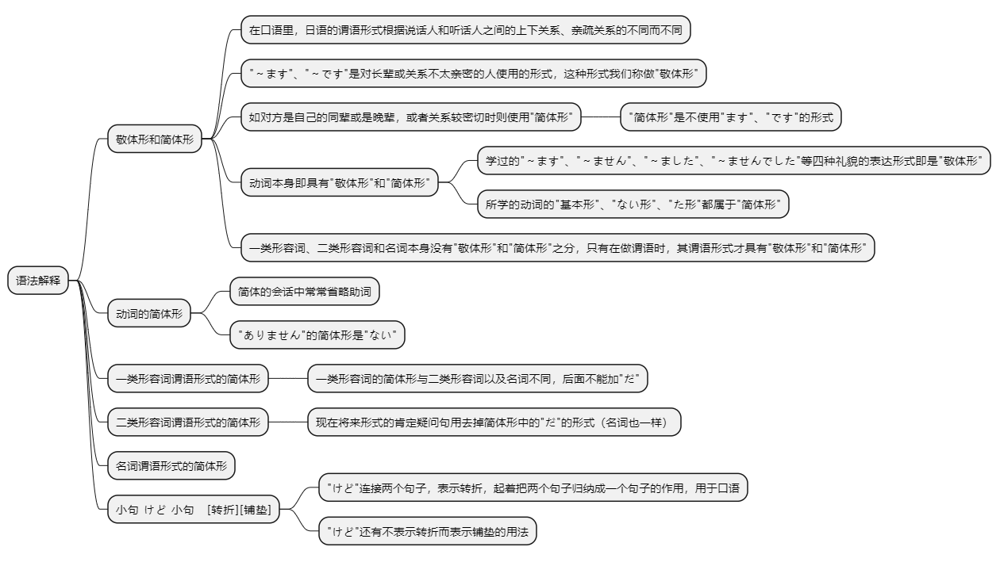
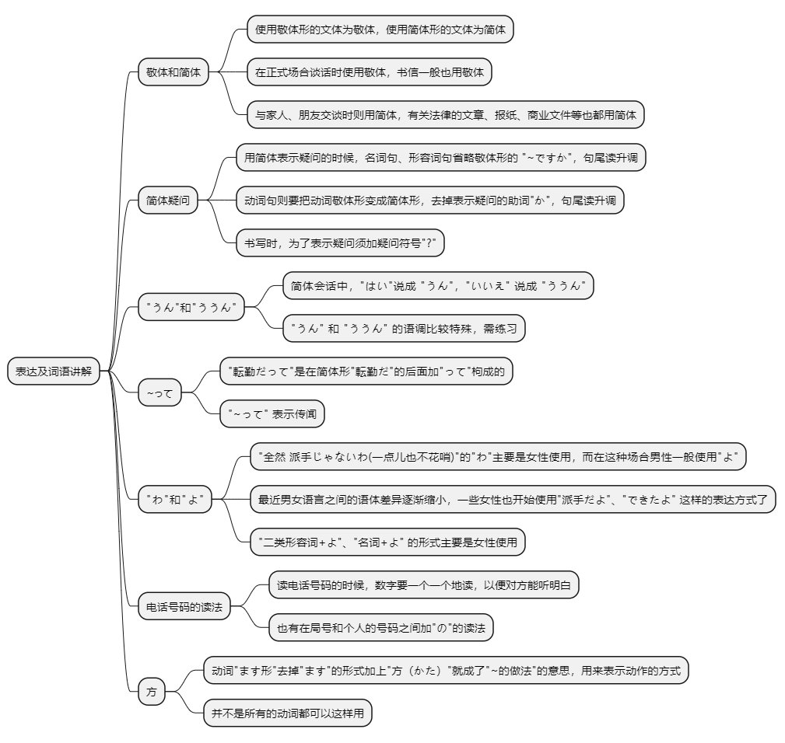

# 第二十二课

## 基本课文

```log
森さんは　毎晩　テレビを　見る。

昨日は　とても　忙しかった。

コンピュータは　簡単では　ない。

今日は　曇りだ。

明日　ボーリングに　行かない？
ごめん。明日は　仕事が　あるから…。

昨日の　試験、どうだった？
ちょっと　難しかったけど、まあまあ　できたよ。

この　ネクタイ　派手？
ううん、全然　派手じゃないわ。

森さんの　電話番号、知ってる？
うん、知ってる。3493-3945だよ。
```

## 语法解释



> 敬体形和简体形

在口语里，日语的谓语形式根据说话人和听话人之间的上下关系、亲疏关系的不同而不同。

迄今为止学习的“～ます”、“～です”是对长辈或关系不太亲密的人使用的形式。这种形式我们称做“敬体形”。

与此相反，如对方是自己的同辈或是晚辈，或者关系较密切时则使用“简体形”。“简体形”是不使用“ます”、“です”的形式。

动词本身即具有“敬体形”和“简体形”，如以前学过的“～ます”、“～ません”、“～ました”、“～ませんでした”等四种礼貌的表达形式即是“敬体形”

而以前所学的动词的“基本形”、“ない形”、“た形”都属于“简体形”。

但一类形容词、二类形容词和名词本身没有“敬体形”和“简体形”之分，只有在做谓语时，其谓语形式才具有“敬体形”和“简体形”。

> 动词的简体形

森先生每天晚上看电视
```text
森さんは　毎晩　テレビを　見る。
```

喝咖啡吗？  
不，不喝
```text
コーヒー，飲む？
ううん，飲まない。
```

昨天看电视了吗？
```text
昨日　テレビ、見た？
ううん、見なかった。
```

注意： 简体的会话中常常省略助词。另外，“ありません”的简体形是“ない”。

> 一类形容词谓语形式的简体形

那个咖喱饭好吃吗？  
不怎么样，味道不太好啊。
```text
そのカレー、おいしい？
ううん、あんまり　おいしく　ないよ。
```

昨天的考试怎么样啊？  
稍微有点难。
```text
昨日の　試験　どうだった？
ちょっと　難しかった。
```

注意： 一类形容词的简体形与二类形容词以及名词不同，后面不能加“だ”。

> 二类形容词谓语形式的简体形

现在将来形式的肯定疑问句用去掉简体形中的“だ”的形式（名词也一样）。

这条领带花哨吗？  
不，一点都不花哨。
```text
この　ネクタイ、派手？ 
ううん、全然　派手じゃ ないわ。
```

森先生居住的公寓安静吗？  
嗯，很安静。
```text
森さんの　アパート，静か？
うん、静かだよ。
```

> 名词谓语形式的简体形

今天是阴天
```text
今日は　曇りだ。
```

明天是星期三吧。  
不是星期三，是星期四。
```text
明日は　水曜日だね？
水曜日じゃ　ないよ，木曜日だよ。
```

昨天滑雪场下雪了吗？  
没有下雪啊，天气挺好的。
```text
昨日，スキー場は　雪だった？
ううん，雪じゃ　なかったよ。いい　天気だった。
```

> 小句 けど 小句　[转折][铺垫]

“けど”连接两个句子，表示转折，起着把两个句子归纳成一个句子的作用，用于口语。

昨天的考试怎么样啊？
有点难，不过都做出来了。
```text
昨日の試験、どうだった？
ちょっと　難しかったけど、まあまあ　できたよ。
```

另外，“けど”还有不表示转折而表示铺垫的用法。

下星期要开一个欢送会，你时间方便吗？
```text
来週，送別会を　するけど、都合は　どうかな？
```

## 表达及词语讲解



> 简体会话

>> 敬体和简体

使用敬体形的文体为敬体，使用简体形的文体为简体。

在正式场合谈话时使用敬体，书信一般也用敬体。

但是，与家人、朋友交谈时则用简体，有关法律的文章、报纸、商业文件等也都用简体。

以下分别是简体会话及简体文章中的句子。

妈妈，我想要那个玩具。[ 孩子和母亲的对话 ]
```text
お母さん，あの おもちゃが 欲しい。
```

昨天车站附近发生了很大的火灾，[ 日记的文章 ]
```text
昨日 駅前で 大きい 火事が あった。
```

>> 简体疑问 

用简体表示疑问的时候，名词句、形容词句省略敬体形的 "~ですか"，句尾读升调。

动词句则要把动词敬体形变成简体形，去掉表示疑问的助词"か"，句尾读升调。号外，书写时，为了表示疑问须加疑问符号"?"。

这个，是日本货？
```text
これ，日本製? iuy
```

>> "うん" 和 "ううん"

简体会话中，"はい" 说成 "うん"，"いいえ" 说成 "ううん"。"うん" 和 "ううん" 的语调比较特殊，请听录音练习。

>> 简体助词 

”かな“ 和 ”の“ 这两个助词只能接在简体形后面。

* かな

助词 "かな" 本来只用于自言自语的场合。如有听话人在场时则表示通过让对方听到自己的自问自答而向对方提供一种不太确实的信息。

小李今天会来吗？
```text
今日 李さんは来るかな。
```

时间好像是4年或5年。
```text
期間は 4年か 5年かな。
```

备注
```text
“かな”由终助词“か”和表示感叹的“な”构成。

か：疑问助词，表示疑问或不确定。
例：彼は来るか。（他会来吗？）
な：表示感叹或加强语气。
例：すごいな！（真厉害啊！）
```

* の助词 "の" 用于要求说明或确认某事。

清水，你好。有什么事吗？  
冷吗？  
```text
ああ， 清水君，どうしたの? 
寒いの?
```

>> ~って

"太田，今度 中国へ 転勤だって(听说太田要调到中国去工作)" 中的 "転勤だって" 是在简体形 "転勤だ" 的后面加 "って" 枸成的，"~って" 表示传闻。

听说太田要调到中国去工作
```text
太田，今度 中国へ 転勤だって
```

> "わ"和"よ"

"全然 派手じゃないわ(一点也不花哨)"的"わ"主要是女性使用，而在这种场合男性一般使用"よ"。

但是，最近男女语言之间的语体差异逐渐缩小，一些女性也开始使用 "派手だよ"、"できたよ" 这样的表达方式了。

另外，"二类形容词+よ"、"名词+よ" 的形式主要是女性使用。

```text
この携帯，とても便利よ。

あそこがわたしのうちよ。
```

和 "よ" 一样 "わ" 既可以用在简体句后面，也可以用在敬体句后面。

```text
あのう，すみません。この靴，ちょっと大きいですわ。
```

> 方

动词"ます形"去掉"ます"的形式加上"方（かた）"就成了"~的做法"的意思，用来表示动作的方式

像 "話します→話し方(说→说法)"、"読みます→読み方(读→读法)" 等，但并不是所有的动词都可以这样用。

## 应用课文

友達
```log
もしもし　小野です。

小野さん？清水だけど。

ああ、清水君、どうしたの？

最近　大田から　連絡　あった？

太田君から？ううん、ないわよ、どうして？

大田、今度　中国へ転勤だって。

本当に？いつ　行くの？

たしか　来月だよ。

急ね、中国の　どこ？期間は　どのぐらい？

北京だって、期間は　四年か　五年かな。

ずいぶん　長いわね。太田君　一人で　行くの？

いや、奥さんも　一緒だよ。
来週　送別会をするけど、都合はどうかな？

ええと、火曜日は　予定が　あるけど、それ以外は　大丈夫よ。

分かった。じゃあ、また　連絡するよ。

お友達からですか、小野さん？

あっ、分かりました？

ええ。いつもの　話し方じゃ　ありませんでしたから。
```

## 生词表

```log
スキーじょう

そうべつかい

つごう

よてい

おもちゃ

かじ

きかん

てんきん

けいたい

バドミントン

ラケット

おくさん

かしゅ

だいとうりょう

やります

うれしい

ねむい

おもい

きゅう

まあまあ

ごめん

ううん

うん

しみず

おおた

モーツァルト

ディズニーランド

いがい

かた
```