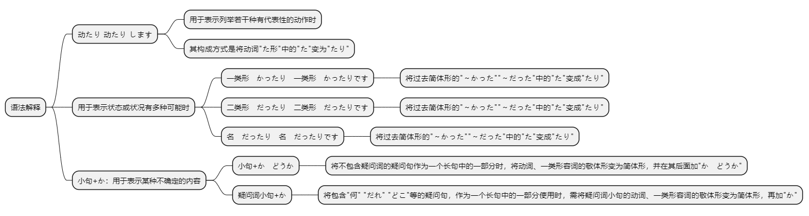
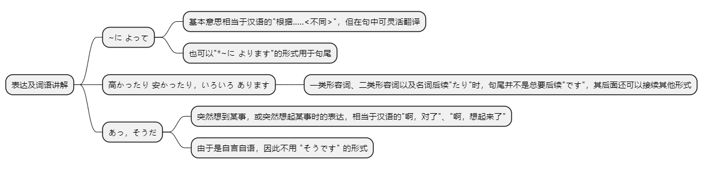

# 第二十三课

## 基本课文

```log
小野さんは　休みの日、散歩したり　買い物に　行ったり　します。

日本語の　先生は　中国人だったり　日本人だったりです。

わたしは　今年の　夏、北京へ　行くか　どうか　分かりません。

鍵が　どこに　あるか　教えて　ください。

週末に　何を　しましたか。

スケートを　したり、ボーリングを　したり　しました。

北京まで、飛行機の　チケットは　いくらぐらいですか。

季節に　よって　高かったり　安かったりです。

李さん、仕事は　忙しいですか。

ええ、日に　よって　暇だったり　忙しかったりです。

森さんが　何時ごろ　来るか　知っていますか。

いいえ、今日は　来るか　どうか　分かりません。
```

## 语法解释



> 动たり 动たり します

用于表示列举若干种有代表性的动作时。其构成方式是将动词“た形”中的“た”变为“たり”。

周末或节假日，小野女士有时去散步，有时去买东西。
```text
小野さんは　休みの 日、散歩したり　買い物に　行ったり　します。
```

吉田先生，你星期天都做什么？  
打扫打扫房间，洗洗衣服。
```text
吉田さんは　日曜日には　何を　しますか。
家の　掃除を　したり　洗濯を　したり　します。
```

> 一类形　かったり　一类形　かったりです / 二类形　だったり　二类形　だったりです / 名　だったり　名　だったりです

用于表示状态或状况有多种可能时，其构成方式是将一类形容词、二类形容词和名词的过去简体形的“～かった”“～だった”中的“た”变成“たり”。
一类形容词、二类形容词出现的状态一般是反义。如“暑い―寒い” “高い―低い” “静か―にぎやか”。
```text
飛行機の チケットは　高かったり　安かったりです。

マンションの　部屋は　広かったり　狭かったりです。

この　公園は　時間に よって　静かだったり　にぎやかだったりです。

日本語の　先生は　中国人だったり　日本人だったりです。
```

> 小句+か

用于表示某种不确定的内容。
一、小句+か　どうか
将不包含疑问词的疑问句作为一个长句中的一部分时，将动词、一类形容词的敬体形变为简体形，并在其后面加“か　どうか”。
（私は）　今年の夏、北京へ　行きますか。＋私は　分かりません。
→私は　今年の夏、北京へ　行くか　どうか　分かりません。（我今年夏天去不去北京，还不知道。）
（２）この　料理は　辛いですか。　＋　私は　知りません。
→私は　この　料理が　辛いか　どうか　知りません。（我不知道这道菜辣不辣。）
（３）小野さんに　仕事が　終わったか　どうか　聞いてください。（问一下小野女士，工作完了没有。）

另外，也可以重复使用动词的“基本形”和“ない形”，表达的含义与上面的句子相同。
（１）私は　今年の　夏、北京へ　行くか　行かないか　分かりません。（我今年夏天去不去北京，还不知道。）
（２）私は　この　料理が　辛いか　辛くないか　知りません。（我不知道这道菜辣不辣。）

如果“か　どうか”的前面为名词或二类形容词时，“～か　どうか”直接接在名词或二类形容词后面，其间不加“だ”。另外，“～か　どうか”小句中的主语后面必须用“が”，而不能用“は”。
（１）金さんは　中国人ですか。＋私は　知りません。
→私は　金さんが　中国人か　どうか　知りません。（我不知道金女士是不是中国人。）
→私は　金さんが　中国人か　中国人ではないか　知りません。（我不知道金女士是不是中国人。）
×私は　金さんが　中国人だ　か　どうか　知りません。

二、疑问词小句+か
将包含“何”“だれ”“どこ”等的疑问句，作为一个长句中的一部分使用时，需将疑问词小句的动词、一类形容词的敬体形变为简体形，再加“か”。
（１）鍵が　どこに　あるか　教えてください。（请告诉我钥匙在哪儿。）
（２）昨日　何を　食べたか　忘れました。（忘记昨天吃什么了。）
（３）どの　料理が　辛いか　知りません。（不知道哪道菜辣。）
与上面的“～か　どうか”相同，“か”前面出现名词或二类形容词时，“～か　どうか”直接接在名词或二类形容词后面，其间不加“だ”。
この　歌が　誰の　歌か　知っていますか。（你知道这是谁的歌吗？）

## 表达及词语讲解



> ~に よって

基本意思相当于汉语的 "根据.....<不同>"，但在句中可灵活翻译，也可以"*~に よります"的形式用于句尾。

飞机票根据季节，有时贵，有时便宜。
```text
飛行機の チケットは 季節に よって 高かったり 安かったりです。
```

结婚典礼的形式因国别而异。
```text
結婚式の やり方は 国に よって 違います。
```

这电车总是很挤吗？
不，分时间。
```text
この 電車は いつも 込みますか。
いえ，時間に よります。
```

> 高かったり 安かったり，いろいろ あります

一类形容词、二类形容词以及名词后续"たり"时，句尾并不是总要后续"です"

其后面还可以接续其他形式。

浴衣有贵的，有便宜的，种类很多。
```text
浴衣は 高かったり，安かったり，いろいろ あります。
```

这个店的菜，口味时轻时重，每次都不一样。
```text
この 店の 料理は 味が 濃かったり 薄かったり，毎回 違います。
```

有时坐电车上班，有时开车上班，不一定。
```text
通勤は 電車だったり 車だったり，日に よって 違います。
```

> あっ，そうだ

突然想到某事，或突然想起某事时的表达，相当
于汉语的"啊，对了"、"啊，想起来了"。

由于是自言自语，因此不用 "そうです" 的形式。

啊，对了，买块儿布料我自己做。
```text
あっ，そうだ。生地を 買って，わたしが 作りますよ。
```

那个人的名字，嗯.....对了，想起来了，叫田中。
```text
あの 人の 名前は...。ええと，あっ，そうだ，田中さんですよ。
```

## 应用课文

```text
小野さん、何を買うか　決まりましたか。

浴衣は　どうですか。

いいですね。でも、高く　ないですか。

高かったり　安かったり、いろいろ　あります。

あっ、そうだ。生地を　買って。私が　作りますよ。

日本の　生活は　どうでしたか。

温泉に　入ったり　歌舞伎を　見たり　して、とても　楽しかったです。

ご両親に　いつ　帰るか　知らせましたか。

はい、昨日　母に　メールで　知らせました。

ご両親は　メールが　できますか。

母は　できますが、父は　電話か　手紙ですね。

北京へ　帰った　あと、どうしますか。

一週間ぐらい　休みたいですね。　

春節に　休みが　なかったですから。

休みに　何を　しますか。　旅行に　行きますか。

旅行に　行くか　どうか　分かりません。

多分　友達に　会ったり、食事に　行ったり　します。
```

## 生词表

```log
しゅうまつ

スケート

あじ

まいかい

つうきん

ふね

きじ

へいてんじこく

そつぎょうしき

ちがいます

こみます

きまります

しらせます

たしかめます

こい

うすい

はやい

おそい

たぶん

とうきょうえき

によって

によります
```