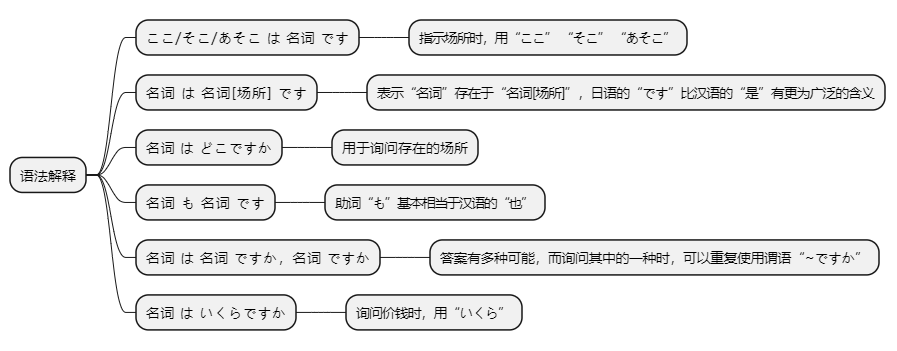
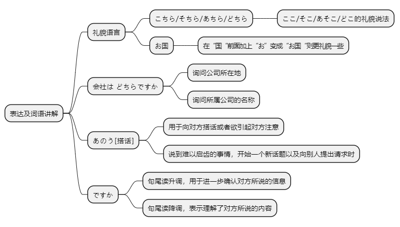

# 第三课

## 基本课文

```log
ここ はデパートです。

食堂 は デパート の7階です。

あそこ も JC企画の ビルです。

かばん 売り場 は 1階ですか、2階ですか。

トイレは どこですか。
あちら です。

ここ は郵便局ですか、銀行ですか。
銀行 です。

これはいくらですか。
それは5，800円です。

あれは?
あれも5，800円です。
```

## 语法解释



> ここ/そこ/あそこ は 名 です
```log
ここ は　デパートです。

そこ は　図書館です。

あそこ は　入り口です。
```

> 名 は 名[场所] です
```log
食堂 は デパートの7階 です。

トイレ は ここです。

小野さん は 事務所 です。
```

> 名 は どこ ですか
```log
トイレは　どこですか。
あちら　です。

あなたの　かばん　は　どこですか。
私の かばん　は　ここです。
```

> 名 も 名 です
```log
ここは　JC企画の　ビルです。
あそこ も　JC企画の　ビルです。

李さん は 中国人です。
張さん も　中国人です。

あなた も　中国人ですか。
```

> 名 は 名 ですか，名 ですか
```log
かばん売り場 は1階ですか，2階ですか。
今日は 水曜日ですか，木曜日ですか。

林さんは　韓国人ですか，日本人ですか，中国人ですか。
日本人 です。
```

> 名 は いくら ですか
```log
これは いくらですか。

その服は いくらですか。
```

## 表达及词语讲解



## 应用课文

ホテルの周辺
```log
ここは　コンビニです。隣は　喫茶店です。

あの　建物は　ホテルですか、マンションですか。

あそこは　マンションです。

あの　建物 は　何ですか。

あそこも　マンションです。

マンションの　隣は?

マンションの　隣は　病院です。

本屋は　どこですか。

そこです。その　ビルの　二階です。

あのう，東京の地図は　どこですか。

地図ですか。そちらです。

いくら ですか。

五百円です。
```

## 生词表

```log
デパート

しょくどう

ゆうびんきょく

ぎんこう

としょかん

マンション

ホテル

コンビニ

きっさてん

びょういん

ほんや

レストラン

ビル

たてもの

うりば

トイレ

いりぐち

じむしょ

うけつけ

バーゲンかいじょう

エスカレーター

ふく

コート

デジカメ

くに

ちず

となり

しゅうへん

きょう

すいようび

もくようび

ここ

そこ

あそこ

こちら

そちら

あちら

どこ

どちら

あのう

シャンハイ

とうきょう

いくら

お

かい

えん

ようび
```