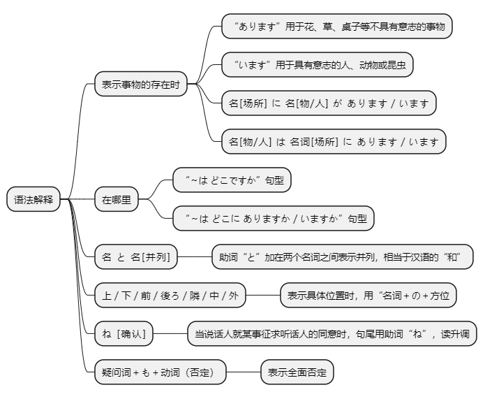
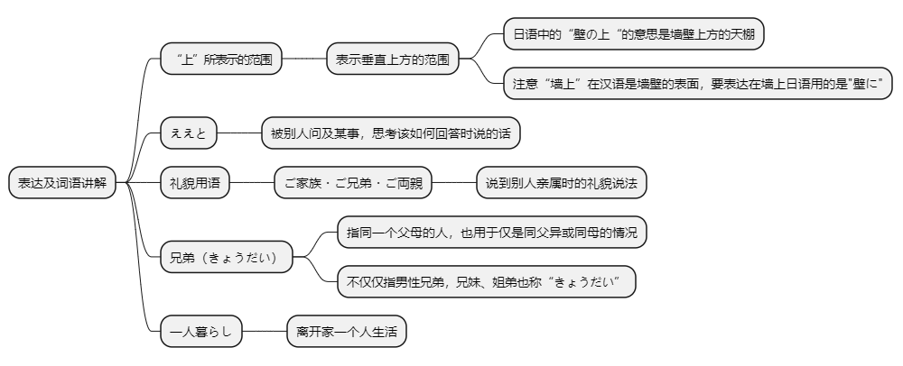

# 第四课

## 基本课文

```log
部屋に　机と　いすが　あります。

机の　上に　猫が　います。

売店は　駅の　外に　あります。

吉田さんは　庭に　います。

その　箱の　中に　何が　ありますか。
時計と　眼鏡が　あります。

部屋に　誰が　いますか。
誰も　いません。

小野さんの家は　どこに　ありますか。
横浜に　あります。

あそこに　犬が　いますね。
ええ、わたしの　犬です。
```

## 语法解释



> 名[场所]に　名[物/人]が　あります/ います。
```log
部屋に　机が　 あります。

ここに　本が 　あります。

庭に　何が　 ありますか。

部屋に　猫が 　います。

公園に　子供が 　います。

あそこに　だれが 　いますか。
```

> 名【物/人】は　名【场所】に　あります/ います。
```log
いすは　部屋に　あります。

本は　ここに　あります。

図書館は　どこに　ありますか。

吉田さんは　庭に　います。

子供は　公園に　います。

犬は　どこに　いますか。

小野さんの家は　どこですか。
小野さんの家は　どこに　ありますか。

林さんは　どこ　ですか。
林さんは　どこに　いますか。

```

> 名　と　名 [并列]
```log
時計　と　眼鏡

ビール　と　ウイスキー

居間に　テレビ　と　ビデオが　あります。
```

> 上 / した / 前 / 後ろ / 隣 / 中 / 外
```log
机の　上 に　猫が　います。

会社の　隣に　花屋が　あります。

猫は　箱の　中に　います。

売店は　駅の　外に　あります。
```

> ね[确认]
```log
あそこに　犬が　いますね。

この　新聞は　林さんのですね。

駅の　前に　銀行が　ありますね。
```

> 疑问词+も+动(否定)
```log
教室に　だれも　いません。

冷蔵庫に　なにも　ありません。
```

## 表达及词语讲解



## 应用课文

会社の場所
```log
小野さん、会社は　どこに　ありますか。
ええと、ここです。

近くに　駅が　ありますか。
ええ。JRと　地下鉄の　駅が　あります。JRの　駅は　ここです。

地下鉄の　駅は　ここですね。
ええ、そうです。JRの　駅の　隣に　地下鉄の　駅が　あります。

小野さんの　家は　どちらですか。

私の　家は　横浜です。

ご家族も　横浜ですか。
いいえ、私は　一人暮らしです。

ご両親は　どちらですか。
両親は　名古屋に　います。

ご兄弟は?
大阪に　妹が　います。

```

## 生词表

```log
へや

にわ

いえ

いま

れいぞうこ

かべ

スイッチ

ほんだな

ベッド

ねこ

いぬ

はこ

めがね

ビデオ

サッカーボール

ビール

ウイスキー

こども

きょうだい

りょうしん

いもうと

おとこ

おんな

せいと

うえ

そと

なか

した

まえ

うしろ

ちかく

ばしょ

きょうしつ

かいぎしつ

としょしつ

こうえん

はなや

ばいてん

えき

ちかてつ

き

ひとりぐらし

あります

います

ええと

よこはま

なごや

おおさか

ジェーアール

ご
```

