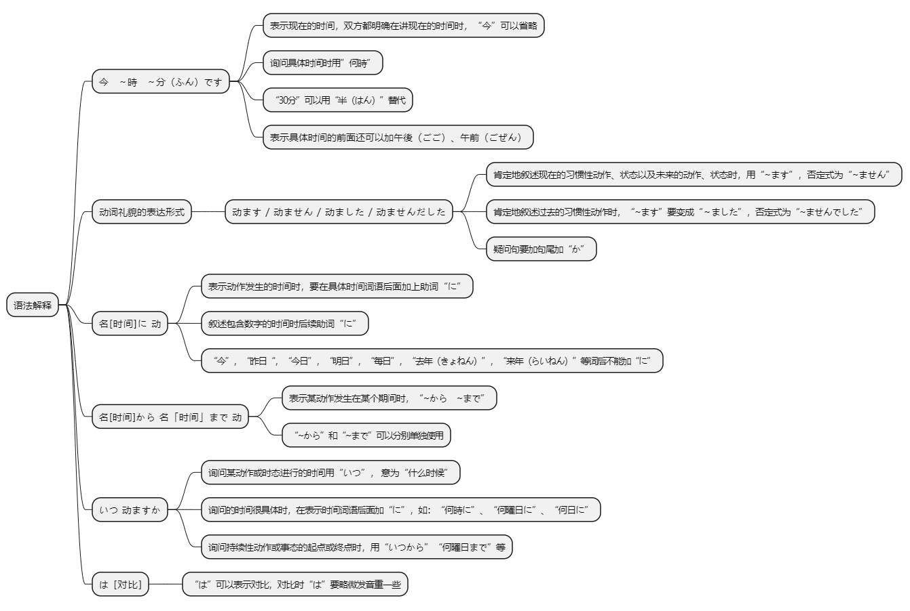
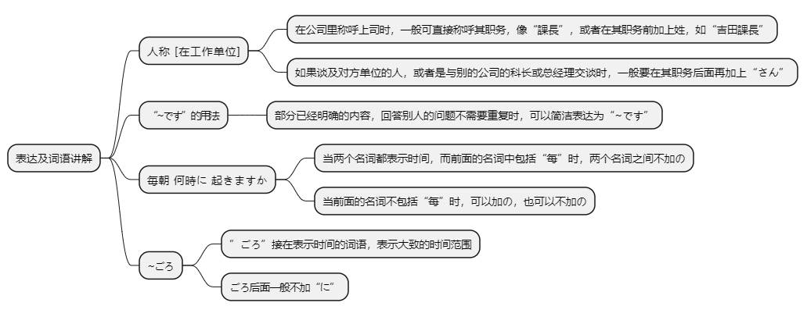

# 第五课

## 基本课文

```log
今　4時です。

森さんは　七時に　起きます。

森さんは　先週　休みました。

わたしは　昨日　働きませんでした。

毎日　何時に　寝ますか。
十一時三十分に　寝ます。

昨日、何時から　何時まで　働きましたか。
九時から　六時まで　働きました。

先週　休みましたか。
いいえ、　休みませんでした。

試験は　いつ　始まりますか。
来週の　木曜日です。
```

## 语法解释



> 今　～時　～分です。
```log
今　何時　ですか。

八時　三十分です。
```

> 动词ます/动词ません/动词ました/动词ませんでした

```log
森さんは　七時に　起きます。

森さんは　先週　休みました。

森さんは毎日働きます。

田中さんはあした休みます。

田中さんは今日働きません。

森さんは明日やすみません。

森さんは先週休みました。

私は昨日働きませんでした。

森さんは先週休みましたか。
```

> 名词[时间]に 动词
```log
学校は　八時半　に　始まります。
```

> 名词[时间]から 名词[时间]まで　动词
```log
森さんは　月曜日から　水曜日まで　休みました。

わたしは　九時から　五時まで　働きます。

わたしは　九時から　働きます。

森さんは　二時まで　勉強します。
```

> いつ 动词 ますか
```log
試験は　いつ　始まりますか。

仕事は　何時に　終わりますか。

展覧会は　いつから　はじまりますか。

張さんは　何曜日まで　休みますか。
火曜日までです。
```

> は [对比]

小野女士今天休息
```
小野さんは今日は休みます。
```

森先生，你每天早晨几点起床？  
我一般是7点左右起床。
```log
森さんは毎朝何時に起きますか。
いつもは七時ごろです。
```

## 表达及词语讲解



## 应用课文

遅刻
```log
小野さん、李さんの　歓迎会は　いつですか。

あさって　の　夜です。

何時からですか。

六時からです。

森君、お早う。今　何時ですか。

十時十五分です。

遅刻ですね。

すみません、課長。今朝　九時に　起きました。

森さんは　毎朝　何時に　起きますか。

いつもは　七時ごろです。李さんは?

私は　6時ごろです。

北京支社は　何時に　始まりますか。

八時です。午前　八時から　午後　五時まで　働きます。

土曜日は?

土曜日は　働きません。土曜日と　日曜日は　休みです。
```

## 生词表

```log
いま

せんしゅう

らいしゅう

さらいしゅう

こんしゅう

きのう

あした

あさって

おととい

まいにち

まいあさ

まいばん

まいしゅう

ごぜん

ごご

にちようび

げつようび

かようび

きんようび

どようび

けさ

こんばん

らいねん

きょねん

よる

ばん

あさ

がっこう

しけん

しごと

ちこく

やすみ

しゅっちょう

けんしゅう

りょこう

てんらんかい

かんげいかい

パーティー

おたく

いつ

やすみます

はたらきます

はじまります

おわります

おきます

ねます

べんきょうします

いつも

ペキンししゃ

こうべ

おはよう

じ

ふん

はん

がつ

にち

ねん

ごろ
```