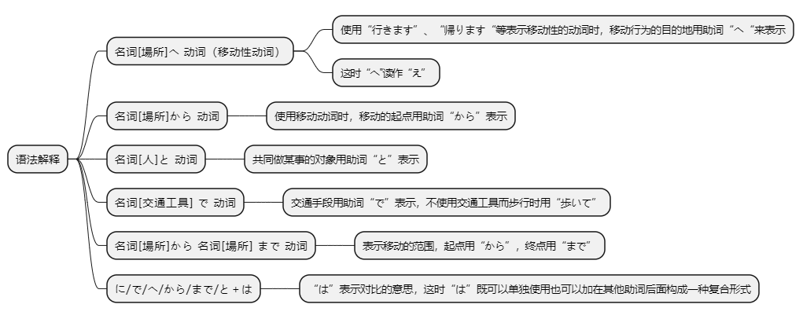
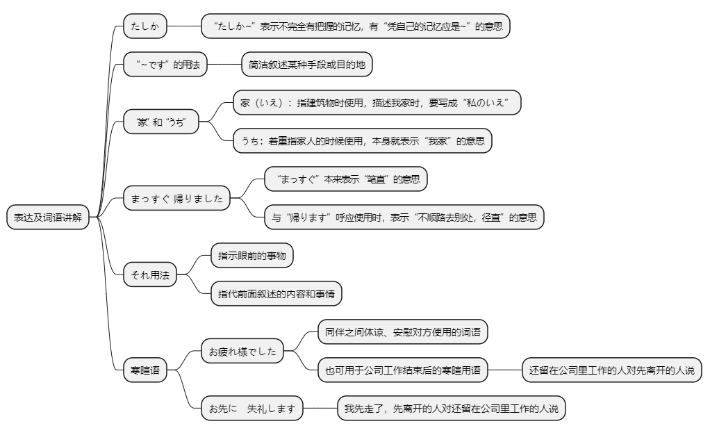

# 第六课

## 基本课文

```log
吉田さんは　来月　中国へ　行きます。

李さんは　先月　北京から　来ました。

小野さんは　友達と　帰りました。

森さんは　東京から　広島まで　新幹線で　行きます。

いつ　アメリカへ　行きますか。
十月に　行きます。

駅へ　何で　行きますか。
自転車で　行きます。

だれと　美術館へ　行きますか。
友達と　行きます。

大阪から　上海まで　飛行機で　行きますか。
いいえ、フェリーで　行きます。
```

## 语法解释



> 名[场所]へ　动

```log
吉田さんは　中国　へ　行きます。

森さんは　日本　へ　帰ります。

李さんは　どこ　へ　行きましたか。
```

> 名[场所]から　动
```log
李さんは　先月　北京　から　来ました。

あの方は　どこ　から　来ましたか。
```

> 名[人]と　动
```log
小野さんは　友達と　帰りました。

李さんは　だれと　日本へ　来ましたか。(
```

> 名[交通工具]で　动

```log
上海まで　飛行機で　行きます。

私は　バスで　家へ　帰ります。

李さんは　歩いて　アパートへ　帰りました。

京都へ　何で　来ましたか。
```

> 名[场所]から　名[场所]　まで　动
```log

森さんは　東京から　広島まで　新幹線で　行きます。

李さんは　駅から　アパートまで　歩いて　帰りました。

```

> “に/で/へ/から/まで/と”+は
```log
わたしの　部屋には　電話が　ありません。

韓国へは　行きました。中国へは　行きませんでした。
```

## 表达及词语讲解



## 应用课文

交通機関
```log
李さん、昨日は　何時に　アパートへ　帰りましたか。

ええと、たしか　11時半ごろです。

何で　帰りましたか。タクシーですか。

電車です。渋谷まで　電車で　行きました。駅から　アパートまで　歩いて　帰り　ました。

小野さんは?

私も　電車です。駅からは　タクシーで　うちへ　帰りました。

何時に　帰りましたか。

12時ごろです。

森さん、ゆうべは　まっすぐ　帰りましたか。

いいえ、課長と　一緒に　銀座へ　行きました。

えっ、銀座ですか?

何時に　うちへ　帰りましたか。

夜中の　2時です。

2時ですか。それは　お疲れ様でした。
```

## 生词表

```log
らいげつ

せんげつ

よなか

ゆうべ

コンサート

クリスマス

たんじょうび

こどものひ

なつやすみ

こうつうきかん

しんかんせん

ひこうき

フェリー

でんしゃ

バス

タクシー

びじゅつかん

アパート

うち

プール

ともだち

おとうと

いきます

かえります

きます

たしか

まっすぐ

いっしょに

さとう

ペキン

アメリカ

かんこく

フランス

ひろしま

きょうと

ほっかいどう

はこね

ぎんざ

しぶや

しんじゅく

おつかれさまでした

おさきにしつれいします

あるいて

たいへんですね
```