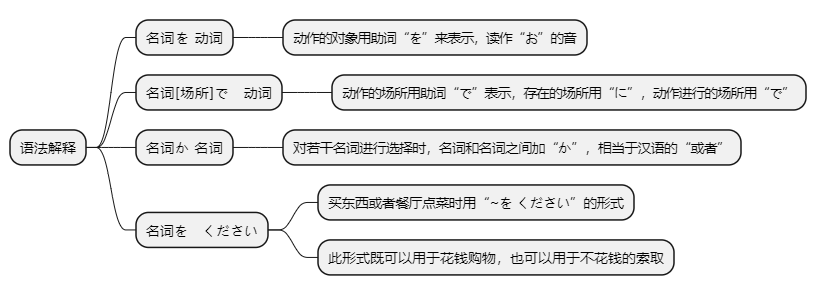
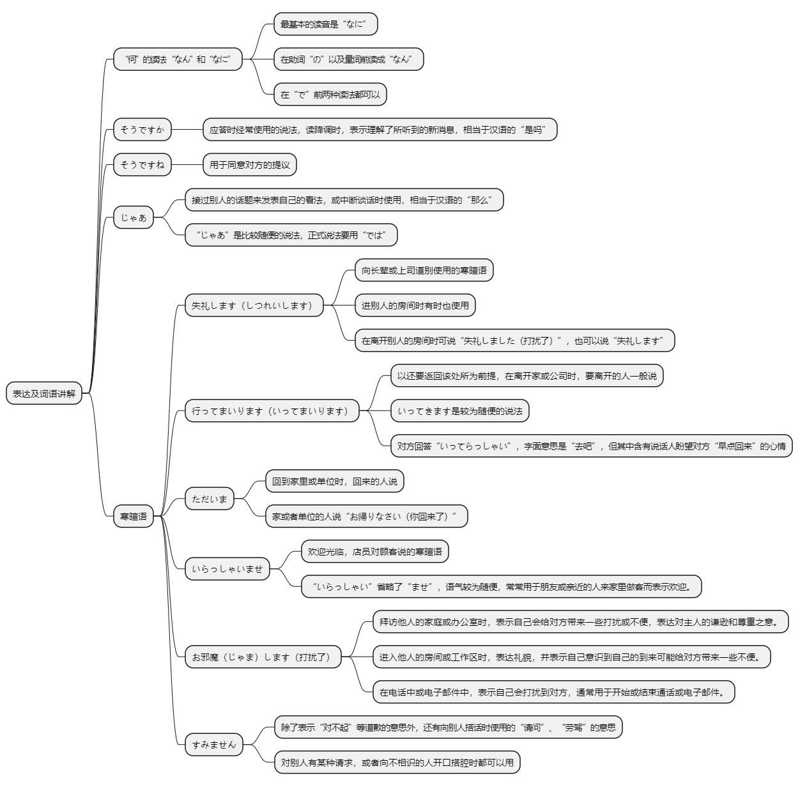

# 第七课

## 基本课文

```log
李さんは　毎日　コーヒーを　飲みます。

李さんは　図書館で　勉強します。

わたしは　毎朝　パンか　お粥を　食べます。

コーラと　ケーキを　ください。

李さんは　今朝　うちで　新聞を　読みましたか。
いいえ　読みませんでした。

今朝　何を　食べましたか。
何も　食べませんでした。

吉田さん、日曜日　何をしますか
テニスか　ジョギングをします。

いらっしゃいませ。
この　ノートと　鉛筆を　ください。
```

## 语法解释



> 名を　动

```log
李さんは　毎日　コーヒー　を　飲みます。

わたしは　毎日　ジョギングを　します。

わたしは　新聞を　読みません。

李さんは　毎朝　なにを　食べますか。
```

> “何”的读法

```log
“何”相当于汉语的“什么”。根据后续音节的不同，读音发生相应的变化。其最基本的读音是“なに”，但在助词“の”以及量词前读成“なん”。在“で”前两种读法都可以。
```

> 名[场所]で　动

```log
李さんは　図書館　で　勉強します。

わたしは　コンビニで　お弁当　を　かいます。

今日　どこ　で　新聞を　読みます。
```

> 名　か　名

```log
わたしは　毎朝　パンか　お粥を　食べます。

休みは　何曜日ですか。

休みは　月曜日か　火曜日です。
```

> 名を　ください

```log
コーラと　ケーキを　ください。

申込書を　ください。

この本を　ください。
```

## 表达及词语讲解



## 应用课文

昼ご飯
```log
李さん、これから　昼ご飯ですか。

はい、小野さんと　一緒に　行きます。

課長は?

コンビニで　お弁当と　お茶を　買いました。

いつも　コンビニですか。

いいえ。いつもは　そば屋で　そばか　うどんを　食べます。

そうですか。

李さん、今日は　そば屋へ　行きますか。

そうですね。

じゃあ、課長、失礼します。

いってらっしゃい。

いらっしゃいませ。

すみません、親子丼を　ください。李さんは?

私も　それを　ください。

かしこまりました。
```

## 生词表

```log
コーヒー

コーラ

おちゃ

ワイン

パン

ケーキ

おかゆ

ひるごはん

おべんとう

そば

うどん

おやこどん

カレー

たまご

チーズ

リンゴ

イチゴ

そばや

テニス

ジョギング

サッカー

やきゅう

もうしこみしょ

てがみ

シーディー

おんがく

えいが

どうぶつえん

パンダ

のみます

かいます

とります

かきます

よみます

ききます

たべます

みます

します

そうじします

これから

じゃあ

いらっしゃいませ

しつれいします

しつれいしました

いってまいります

いってきます

いってらっしゃい

ただいま

おかえりなさい

かしこまりました

おじゃまします

ください

ごぜんちゅう
```