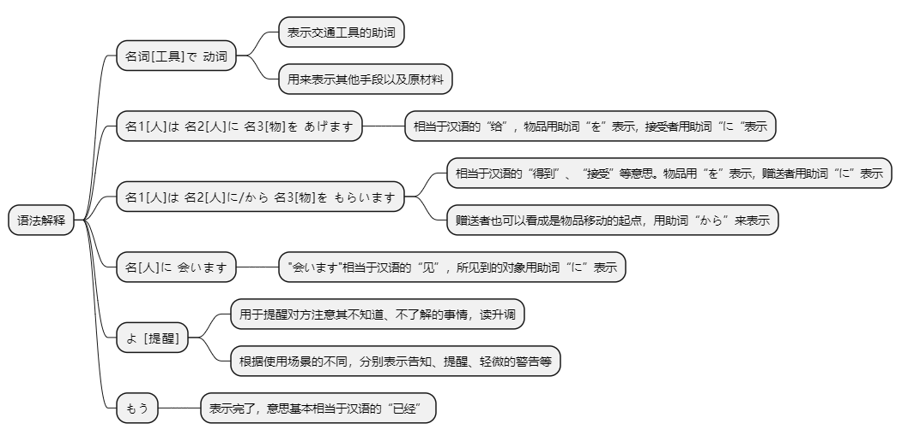
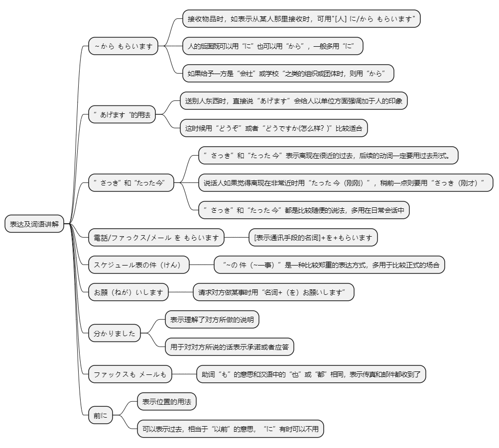

# 第八课

## 基本课文

```
李さんは　日本語で　手紙を　書きます。

わたしは　小野さんに　お土産を　あげます。

わたしは　小野さんに　辞書を　もらいました。

李さんは　明日　長島さんに　会います。

昨日、母に　誕生日の　プレゼントを　送りました。
何で　送りましたか。
航空便で　送りました。

その　映画の　チケットを　誰に　あげますか。
李さんに　あげます。

だれに　その　パンフレットを　もらいましたか。
長島さんに　もらいました。

すみません、李さんは　いますか。
もう　帰りましたよ。
```

## 语法解释



> 名[工具]　で　动

```
李さんは日本語で手紙を書きます。

手紙を速達で送りました。

新聞紙で紙飛行機を作りました。

何でうどんを作りますか。
```

<audio id="audio" controls="" preload="none"><source src="./audio/8/1.mp3"></audio>

> 名1[人]　は　名2[人]　に　名3[物]　を　あげます。

“あげます" 相当于汉语的 "给"，通常在物品以 "第一人称 → 第二人称 → 第三人称" 或 " 第三人称 → 第三人称" 的形式移动时使用。

物品用助词 "を" 表示，接受者用助词 "に" 表示。

我送给小野女士一件礼物。
```
わたしは小野さんにお土産をあげます。
```

小野女士给了森先生巧克力。
```
小野さんは森さんにチョコレートをあげました。
```

弟弟送花给小野女士。
```
弟は小野さんに花をあげました。
```

母亲送葡萄酒给长岛先生。
```
母は長島さんにワインをあげました。
```

当第三人称的其中之一是说话人的亲戚时，按说话人的立场处理（即当做第一人称“我”来处理）。

<audio id="audio" controls="" preload="none"><source src="./audio/8/2.mp3"></audio>

> 名1[人]　は　名2[人]　に　名3[物]　を　もらいます。

```
わたしは小野さんに辞書をもらいました。

わたしは長島さんから写真をもらいました。

森さんは長島さんにパンフレットをもらいました。

母は小野さんにハンカチをもらいました。

弟は長島さんから本をもらいました。
```

<audio id="audio" controls="" preload="none"><source src="./audio/8/3.mp3"></audio>

> 名[人]　に　会います。

```
李さんは明日長島さんに会います。

わたしは駅で森さんに会いました。
```

<audio id="audio" controls="" preload="none"><source src="./audio/8/4.mp3"></audio>

> よ　[提醒]

```
すみません、李さんはいますか。
もう帰りましたよ。

わたしは毎日アイスクリームを食べます。
太りますよ。
```

<audio id="audio" controls="" preload="none"><source src="./audio/8/5.mp3"></audio>

> もう

```
昼ごはんを食べましたか。

ええ、もう食べました。
```

<audio id="audio" controls="" preload="none"><source src="./audio/8/6.mp3"></audio>

## 表达及词语讲解



## 应用课文

スケジュール表
```log
さっき　長島さんに　電話を　もらいました。

スケジュール表の　件ですか。

はい。

もう　ファックスで　送りましたよ。

いつですか。

昨日の　夕方です。もう　一度　送りますか。

ええ、お願いします。わたしは　メールで　送ります。

わかりました。

李さん、たった　今　長島さんに　メールを　もらいました。

ファックスは　届きましたか。

ええ、ファックスも　メールも　とどきましたよ。

そうですか。よかったです。

李さん、これ、どうぞ。箱根の　写真集です。前に　長島さんに　もらいました。

ありがとう　ございます。
```

## 生词表

ブレゼント 〔名〕 礼物

チケット 〔名〕 票

パンフレット 〔名〕 小册子

きねんひん（記念品） 〔名〕 纪念品

スケジュールひょう（～表） 〔名〕 日程表

しゃしんしゅう（写真集） 〔名〕 影集

はな（花） 〔名〕 花

おかね（お金） 〔名〕 钱，金钱

ボールペン 〔名〕 圆珠笔

しゅくだい（宿題） 〔名〕 作业

こうくうびん（航空便） 〔名〕 航空邮件

そくたつ（速達） 〔名〕 速递，快件

ファックス 〔名〕 传真

メール 〔名〕 邮件

でんわばんごう（電話番号） 〔名〕 电话号码

じゅうしょ（住所） 〔名〕 住址

なまえ（名前） 〔名〕 姓名

けん（件） 〔名〕 事件，事情

しんぶんし（新聞紙） 〔名〕 报纸

かみひこうき（紙飛行機） 〔名〕 纸折的飞机

チョコレート 〔名〕 巧克力

アイスクリーム 〔名〕 冰激凌

こむぎこ（小麦粉） 〔名〕 面粉

はし 〔名〕 筷子

スプーン 〔名〕 勺子

おにいさん（お兄さん） 〔名〕 哥哥

かんこくご（韓国語） 〔名〕 韩语

ゆうがた（夕方） 〔名〕 傍晚

ひるやすみ（昼休み） 〔名〕 午休

もらいます 〔动1〕 拿到，得到

あいます（会います） 〔动1〕 见

おくります（送ります） 〔动1〕 寄

つくります（作ります） 〔动1〕 做，制造

ふとります（太ります） 〔动1〕 胖

だします（出します） 〔动1〕 寄（信）

とどきます（届きます） 〔动1〕 收到，送到，寄到

かきます 〔动1〕 画

かします（貸します） 〔动1〕 借出，借给

ならいます（習います） 〔动1〕 学习

あげます 〔动2〕 给

かけます 〔动2〕 打（电话）

かります（借ります） 〔动2〕 （向别人）借

おしえます（教えます） 〔动2〕 教

もう 〔副〕 已经

さっき 〔副〕 刚才

たったいま（たった今） 〔副〕 刚刚

もういちど（もう一度） 〔副〕 再一次

まえに（前に） 〔副〕 以前

ちん（陳） 〔专〕 陈

どうですか 怎样，如何

おねがいします（お願いします） 拜托了

わかりました（分かりました） 明白了

よかったです 太好了

～様さま

<audio id="audio" controls="" preload="none"><source src="./audio/8/word.mp3"></audio>