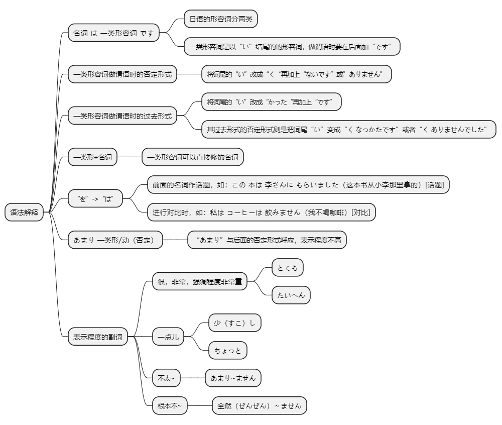
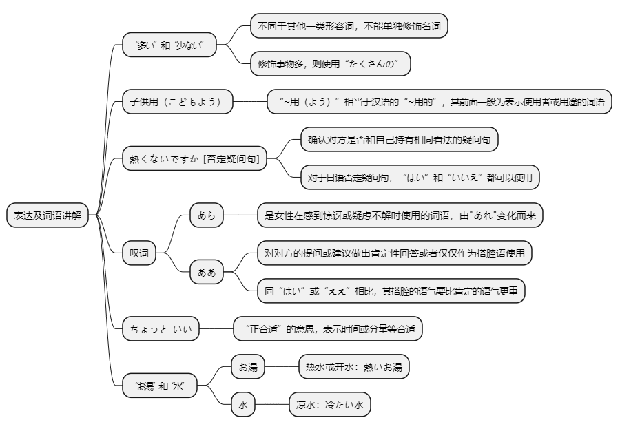

# 第九课

## 基本课文

```log
四川料理は　辛いです。

この　スープは　あまり　熱くないです

旅行は　とても　楽しかったです。

中国は　広い国です。

天気は　よかったですか。
いいえ、あまり　よく　なかったです。

天安門へ　行きましたか。
はい。とても　大きい　建物ですね。

万里の　長城は　北京から　遠いですか。
いいえ、あまり　とおく　ないです。

北京ダックは　食べましたか。
はい、食べました。とても　おいしかったですよ。
```

## 语法解释



> 名は　一类形　です

```log
四川料理は　辛い　です。

あの　スープは　冷たい　です。

この　お茶は　熱い　です。
```

> 一类形做谓语时的否定形式

```log
このスープは　熱く　ないです。

今日は　寒く　ないです。

この本は　高く　ありません。
```

> 一类形做谓语时的过去形式

```log
旅行は　楽し　かったです。

昨日は　寒く　なかったです。

昨日は　寒く　ありませんでした。

おいしいです。

おいしかったです。

```

> 一类形 + 名

```log
広い　国

青い　海

おいしい　料理

白い　紙
```

> “を”和“は”

```log
この　本は　李さんに　もらいました。

わたしは　コーヒーは　飲みません。
```

> あまり　ー类形/动(否定)

```log
この　スープは　あまり　あつく　ないです。

試験は　あまり　難しく　ありませんでした。
```

> 表示程度的副词：とても、たいへん、少し、ちょっと、あまり、全然。

```log
この　料理は　とても　おいしいです。

この　スープは　すこし　からいです。

試験は　全然　難しく　ありませんでした。
```

## 表达及词语讲解



## 应用课文

```log
温泉

小野さん、この　浴衣は　ちょっと　小さいです。

あら、それは　子供用ですよ。これを　どうぞ。

それは　ちょうど　いいです。

李さん、熱く　ないですか。

いいえ、ちょうど　いいです。とても　気持ちが　いいですね。

小野さん、すばらしい　眺めですね。

ええ、本当に。

小野さん、それは　何ですか。

ああ、これは　温泉の　お湯です。李さんも　飲みますか。

ええ。あまり　おいしくないですね。
```

## 生词表

```log
りょうり

しせんりょうり

スープ

ぺキンダック

たべもの

すきやき

おんせん

おゆ

みず

ゆかた

ながめ

くすり

てんき

うみ

やま

かみ

ニュース

じょせい

おきゃくさま

グラス

かぶき

きもち

たくさん

からい

あまい

しおからい

すっぱい

にがい

おいしい

まずい

あつい

つめたい

たのしい

おもしろい

つまらない

ひろい

せまい

おおきい

ちいさい

いそがしい

いい

わるい

すばらしい

とおい

ちかい

たかい

ひくい

やすい

さむい

あつい

あおい

しろい

あたらしい

ふるい

むずかしい

やさしい

おおい

すくない

かわいい

ほんとうに

あまり

とても

すこし

ぜんぜん

ちょうど

あら

ああ

てんあんもん

ばんりのちょうじょう

きもちがいい

よう
```