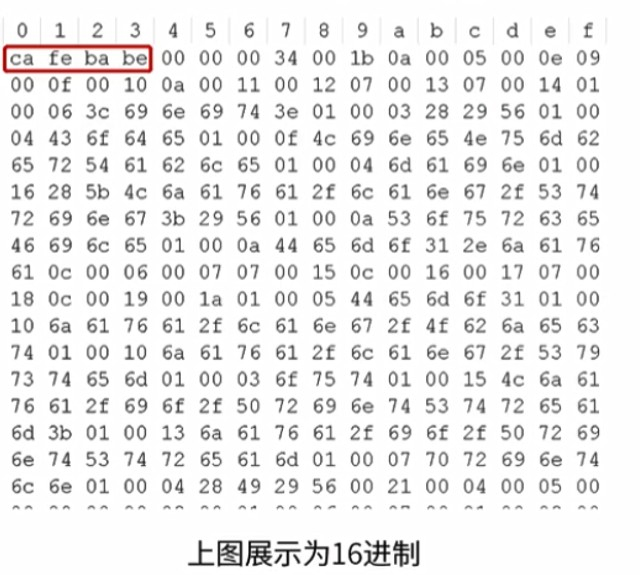
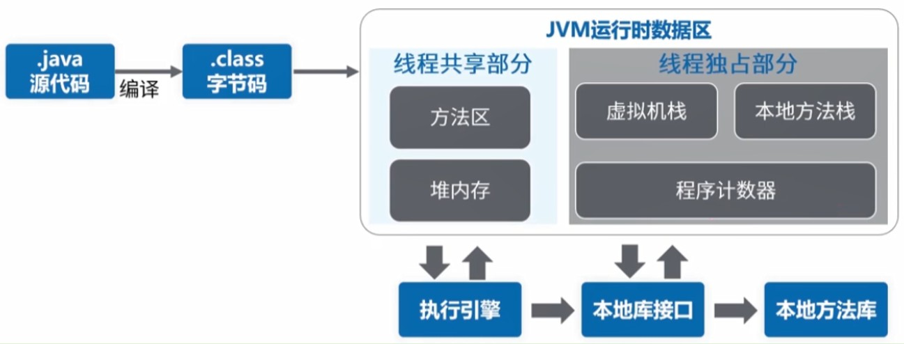
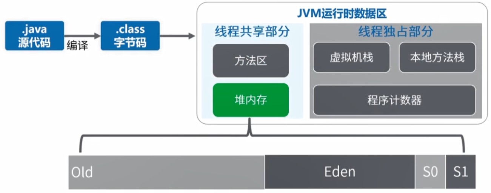
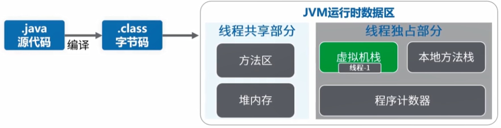
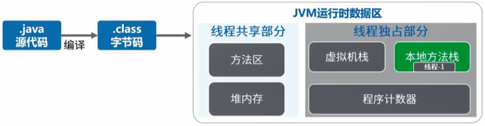
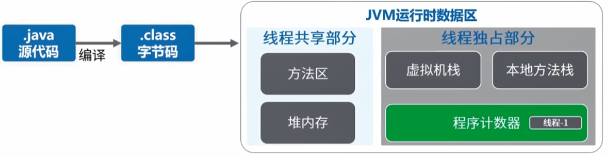

# Java程序运行原理分析

## class文件内容

开发人员编写java文件，经过javac.exe编译得到.class文件，然后经java.exe编译得到结果，class文件即字节码文件，它是可执行的java程序

展示为16进制的class文件内容如下图所示

### 特点

* class文件包含JAVA程序执行的字节码
* 数据严格按照格式紧凑排列在class文件中，中间无任何分隔符
* 文件开头有一个0Xcafebabe（16进制），是特殊的标志
* class文件含有复杂格式，专门给JVM读里面的内容，人工阅读可以借助工具查看，包含如下内容：
  * 版本
  * 访问标志
  * 常量池
  * 当前类
  * 超级类
  * 接口
  * 字段
  * 方法
  * 属性
  
## JVM运行时数据区

* JVM运行时数据区主要包含两大部分：线程独占部分和线程共享部分。  
* 线程共享部分包含：方法区、堆内存，每个线程都会有它独立的空间，随着线程生命周期创建和销毁。  
* 线程独占部分包含：虚拟机栈、本地方法栈、程序计数器，所有线程都能访问到的内存数据区域，随着虚拟机或者GC创建和销毁。  
  
## 方法区

JVM用来存储加载的类信息、常量、静态变量、编译后的代码等数据，在虚拟机规范中，这是一个逻辑区划，具体实现根据不同的虚拟机来实现。  
如：oracle的HotSpot在java7中方法区放在永久代，java8中放在元数据空间，并且通过GC机制对这个区域进行管理。  

## 堆内存

堆内存还可以细分为：老年代、新生代（Eden、From Survivor、To Survivor）
JVM启动时创建，在堆内存里存放着对象的实例，垃圾回收器主要就是管理堆内存。
如果满了，就会出现OutOfMemoryError。  

## 虚拟机栈

虚拟机栈：每个线程都会在这个空间里有一个私有的空间。  
线程栈由多个栈帧（Stack Frame）组成。  
一个线程会执行一个或多个方法，一个方法对应一个栈帧。  
栈帧内容包含：局部变量表、操作数栈、动态链接、方法返回地址、附加信息等。  
栈内存默认最大为1M，超出则抛出StackOverflowError错误。  

## 本地方法栈

和虚拟机栈功能类似，虚拟机栈是为虚拟机执行JAVA方法而准备的，本地方法栈是为虚拟机使用Native本地方法而准备的。  
虚拟机规范没有规定具体的实现，由不同的虚拟机厂商去实现。  
HotSpot虚拟机中虚拟机栈和本地方法栈的实现是一样的，同样，超出默认设置最大栈内存容量值也会抛出StackOverflowError错误。  

## 程序计数器

程序计数器（Program Counter Register）记录当前线程执行字节码的位置，存储的是字节码指令地址，如果执行Native方法，则计数器值为空。  
每个线程都在这个空间里有一个私有的空间，占用内存空间很少。  
CPU同一时间，只会执行一条线程中的指令，JVM多线程会轮流切换并且分配CPU执行时间的方式。  
线程切换后，需要通过程序计数器，来恢复正确的执行位置。  

