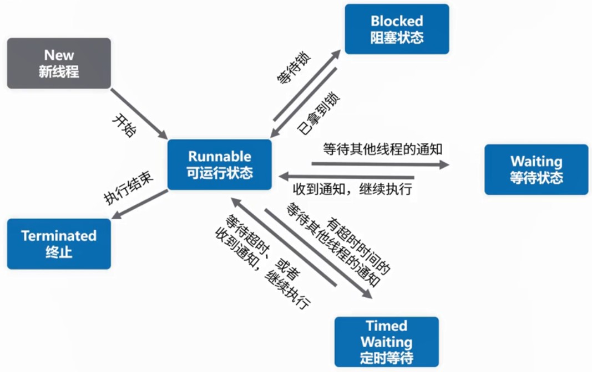
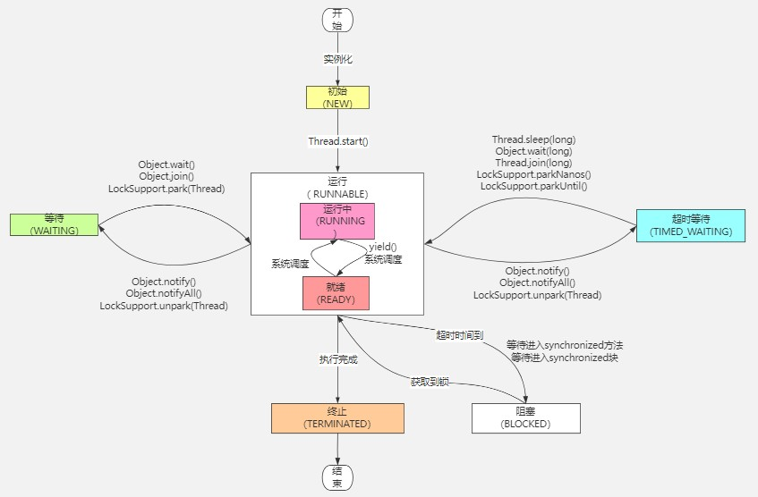

# 线程状态

## JDK中关于线程状态的枚举类：java.lang.Thread.State

这些状态是虚拟机状态，它不反映任何操作系统的线程状态。
```java
    /**
     * A thread state.  A thread can be in one of the following states:
     * <ul>
     * <li>{@link #NEW}<br>
     *     A thread that has not yet started is in this state.
     *     </li>
     * <li>{@link #RUNNABLE}<br>
     *     A thread executing in the Java virtual machine is in this state.
     *     </li>
     * <li>{@link #BLOCKED}<br>
     *     A thread that is blocked waiting for a monitor lock
     *     is in this state.
     *     </li>
     * <li>{@link #WAITING}<br>
     *     A thread that is waiting indefinitely for another thread to
     *     perform a particular action is in this state.
     *     </li>
     * <li>{@link #TIMED_WAITING}<br>
     *     A thread that is waiting for another thread to perform an action
     *     for up to a specified waiting time is in this state.
     *     </li>
     * <li>{@link #TERMINATED}<br>
     *     A thread that has exited is in this state.
     *     </li>
     * </ul>
     *
     * <p>
     * A thread can be in only one state at a given point in time.
     * These states are virtual machine states which do not reflect
     * any operating system thread states.
     *
     * @since   1.5
     * @see #getState
     */
    public enum State {
        /**
         * Thread state for a thread which has not yet started.
         */
        NEW,

        /**
         * Thread state for a runnable thread.  A thread in the runnable
         * state is executing in the Java virtual machine but it may
         * be waiting for other resources from the operating system
         * such as processor.
         */
        RUNNABLE,

        /**
         * Thread state for a thread blocked waiting for a monitor lock.
         * A thread in the blocked state is waiting for a monitor lock
         * to enter a synchronized block/method or
         * reenter a synchronized block/method after calling
         * {@link Object#wait() Object.wait}.
         */
        BLOCKED,

        /**
         * Thread state for a waiting thread.
         * A thread is in the waiting state due to calling one of the
         * following methods:
         * <ul>
         *   <li>{@link Object#wait() Object.wait} with no timeout</li>
         *   <li>{@link #join() Thread.join} with no timeout</li>
         *   <li>{@link LockSupport#park() LockSupport.park}</li>
         * </ul>
         *
         * <p>A thread in the waiting state is waiting for another thread to
         * perform a particular action.
         *
         * For example, a thread that has called <tt>Object.wait()</tt>
         * on an object is waiting for another thread to call
         * <tt>Object.notify()</tt> or <tt>Object.notifyAll()</tt> on
         * that object. A thread that has called <tt>Thread.join()</tt>
         * is waiting for a specified thread to terminate.
         */
        WAITING,

        /**
         * Thread state for a waiting thread with a specified waiting time.
         * A thread is in the timed waiting state due to calling one of
         * the following methods with a specified positive waiting time:
         * <ul>
         *   <li>{@link #sleep Thread.sleep}</li>
         *   <li>{@link Object#wait(long) Object.wait} with timeout</li>
         *   <li>{@link #join(long) Thread.join} with timeout</li>
         *   <li>{@link LockSupport#parkNanos LockSupport.parkNanos}</li>
         *   <li>{@link LockSupport#parkUntil LockSupport.parkUntil}</li>
         * </ul>
         */
        TIMED_WAITING,

        /**
         * Thread state for a terminated thread.
         * The thread has completed execution.
         */
        TERMINATED;
    }
```

## Java线程六种状态定义

操作系统的线程状态里只有就绪、阻塞、运行三种状态。

1. New: 尚未启动的线程的线程状态。
2. Runnable：可运行线程的线程状态，等待CPU调度，处于Runnable状态下的线程正在Java虚拟机中执行，但它可能正在等待来自于操作系统的其他资源，比如处理器，对应就绪和运行两种状态
3. Blocked：线程阻塞等待监视器锁定的线程状态，处于synchronized同步代码块或方法被阻塞，对应阻塞状态，线程需要获得某个锁才能继续执行，但是这个锁目前被其他线程持有，所以进入了被动的等待状态，直到抢到了那把锁，才会再次进入就绪状态。
4. Waiting：等待线程的线程状态，不带超时的方式，对应阻塞状态，此线程正处于无限期的主动等待中，直到有人唤醒它，它才会再次进入就绪状态（Object.wait、Thread.join、LockSupport.park）。
5. Timed Waiting：具有指定等待时间的等待线程的线程状态，带超时的方式，对应阻塞状态，代表线程正处于有限期的主动等待中，要么唤醒它，要么等待一定时间，才会再次进入就绪状态（Thread.sleep、Object.wait、Thread.join、LockSupport.parkNanos、LockSupport.parkUntil）。
6. Terminated：终止线程的线程状态，线程正常完成执行或者出现异常。

## 线程状态流转图

对于Java线程状态而言，不存在running状态，它的runnable状态包含了running状态。





## 多线程运行状态切换代码示例

> 第一种状态切换：新建->运行->终止

多线程运行状态切换示例
```java
import org.junit.Test;
/**
 * 多线程运行状态切换示例
 */
public class ThreadStateSwitchExample {
    /**
     结果：
     第一种状态切换: 新建 -> 运行 -> 终止
     没调用start方法，thread1当前状态：NEW
     thread1当前状态：RUNNABLE
     thread1 执行了
     等待两秒，再看thread1当前状态：TERMINATED
     */
    @Test
    public void firstThreadSwitch() throws Exception{
        /* 第一种状态切换：新建 -> 运行 -> 终止 */
        System.out.println("第一种状态切换：新建 -> 运行 -> 终止");
        Thread thread1 = new Thread(() -> {
            System.out.println("thread1当前状态：" + Thread.currentThread().getState().toString());
            System.out.println("thread1 执行了");
        });
        System.out.println("没调用start方法，thread1当前状态：" + thread1.getState().toString());
        thread1.start();
        Thread.sleep(2000L); // 等待thread1执行结束，再看状态
        System.out.println("等待两秒，再看thread1当前状态：" + thread1.getState().toString());
        /* thread1.start(); TODO 注意，线程终止之后，再进行调用，会抛出IllegalThreadStateException异常 */
    }

}
```

执行结果
```log
第一种状态切换  - 新建 -> 运行 -> 终止
没调用start方法，thread1当前状态：NEW
thread1当前状态：RUNNABLE
thread1 执行了
等待两秒，再看thread1当前状态：TERMINATED
```

> 第二种状态切换：新建 -> 运行 -> 等待 -> 运行 -> 终止(sleep方式)

多线程运行状态切换示例
```java
import org.junit.Test;
/**
 * 多线程运行状态切换示例
 */
public class ThreadStateSwitchExample {

    /**
     结果：
     第二种：新建 -> 运行 -> 等待 -> 运行 -> 终止(sleep方式)
     没调用start方法，thread2当前状态：NEW
     调用start方法，thread2当前状态：RUNNABLE
     等待200毫秒，再看thread2当前状态：TIMED_WAITING
     thread2当前状态：RUNNABLE
     thread2 执行了
     等待3秒，再看thread2当前状态：TERMINATED
     */
    @Test
    public void secondThreadSwitch() throws Exception{
        System.out.println("第二种：新建 -> 运行 -> 等待 -> 运行 -> 终止(sleep方式)");
        Thread thread2 = new Thread(() -> {
            try { /* 将线程2移动到等待状态，1500后自动唤醒 */
                Thread.sleep(1500);
            } catch (InterruptedException e) {
                e.printStackTrace();
            }
            System.out.println("thread2当前状态：" + Thread.currentThread().getState().toString());
            System.out.println("thread2 执行了");
        });
        System.out.println("没调用start方法，thread2当前状态：" + thread2.getState().toString());
        thread2.start();
        System.out.println("调用start方法，thread2当前状态：" + thread2.getState().toString());
        Thread.sleep(200L); /* 等待200毫秒，再看状态 */
        System.out.println("等待200毫秒，再看thread2当前状态：" + thread2.getState().toString());
        Thread.sleep(3000L); /* 再等待3秒，让thread2执行完毕，再看状态 */
        System.out.println("等待3秒，再看thread2当前状态：" + thread2.getState().toString());
    }

}
```

执行结果
```log
第二种：新建 -> 运行 -> 等待 -> 运行 -> 终止(sleep方式)
没调用start方法，thread2当前状态：NEW
调用start方法，thread2当前状态：RUNNABLE
等待200毫秒，再看thread2当前状态：TIMED_WAITING
thread2当前状态：RUNNABLE
thread2 执行了
等待3秒，再看thread2当前状态：TERMINATED
```

> 第三种状态切换：新建 -> 运行 -> 阻塞 -> 运行 -> 终止

多线程运行状态切换示例
```java
import org.junit.Test;
/**
 * 多线程运行状态切换示例
 */
public class ThreadStateSwitchExample {

    /*
    结果：
    第三种：新建 -> 运行 -> 阻塞 -> 运行 -> 终止
    没调用start方法，thread3当前状态：NEW
    调用start方法，thread3当前状态：RUNNABLE
    等待200毫秒，再看thread3当前状态：BLOCKED
    thread3当前状态：RUNNABLE
    thread3 执行了
    等待3秒，让thread3抢到锁，再看thread3当前状态：TERMINATED
     */
    @Test
    public void thirdThreadSwitch() throws Exception{
        System.out.println("第三种：新建 -> 运行 -> 阻塞 -> 运行 -> 终止");
        Thread thread3 = new Thread(() -> {
            synchronized (ThreadStateSwitchExample.class) {
                System.out.println("thread3当前状态：" + Thread.currentThread().getState().toString());
                System.out.println("thread3 执行了");
            }
        });
        synchronized (ThreadStateSwitchExample.class) {
            System.out.println("没调用start方法，thread3当前状态：" + thread3.getState().toString());
            thread3.start();
            System.out.println("调用start方法，thread3当前状态：" + thread3.getState().toString());
            Thread.sleep(200L); /* 等待200毫秒，再看状态 */
            System.out.println("等待200毫秒，再看thread3当前状态：" + thread3.getState().toString());
        }
        Thread.sleep(3000L); /* 再等待3秒，让thread3执行完毕，再看状态 */
        System.out.println("等待3秒，让thread3抢到锁，再看thread3当前状态：" + thread3.getState().toString());
    }
}
```

执行结果
```log
第三种：新建 -> 运行 -> 阻塞 -> 运行 -> 终止
没调用start方法，thread3当前状态：NEW
调用start方法，thread3当前状态：RUNNABLE
等待200毫秒，再看thread3当前状态：BLOCKED
thread3当前状态：RUNNABLE
thread3 执行了
等待3秒，让thread3抢到锁，再看thread3当前状态：TERMINATED
```