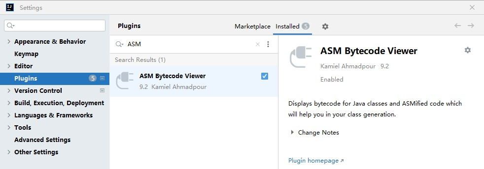
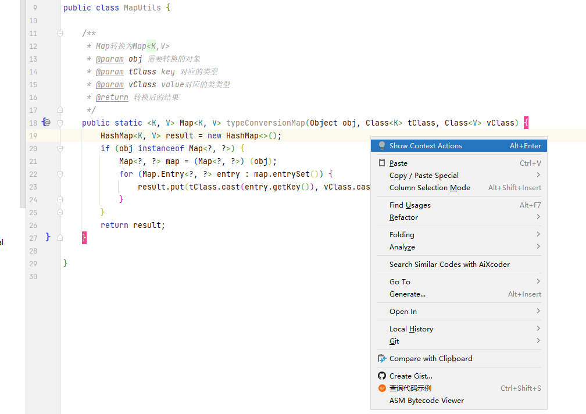

# ASM

ASM偏向于底层，需要了解字节码指令以及操作数栈等知识，最好学习过《Java虚拟机规范》等书籍。

ASM能用来做什么
* 类的代理，如cglib
* 混沌工程
* 反向工程
* 结合javaagent做到非入侵式监控，方法耗时、日志、机器性能等等。
* 破解

ASM是一个Java字节码操控框架。它能被用来动态生成类或者增强既有类的功能。ASM可以直接产生二进制class文件，也可以在类被加载入Java虚拟机之前动态改变类行为。Javaclass被存储在严格格式定义的.class文件里，这些类文件拥有足够的元数据来解析类中的所有元素：类名称、方法、属性以及Java字节码（指令）。ASM从类文件中读入信息后，能够改变类行为，分析类信息，甚至能够根据用户要求生成新类。

## 字节码反编译工具

IDEA集成开发环境中下载插件ASM Bytecode Viewer

选择具体的Java类，右键点击ASM Bytecode Viewer即可查看字节码和生成ASM代码。

