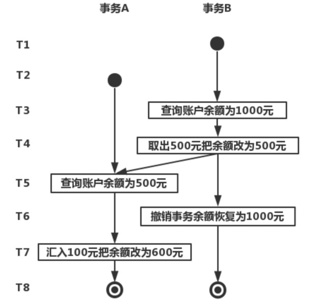
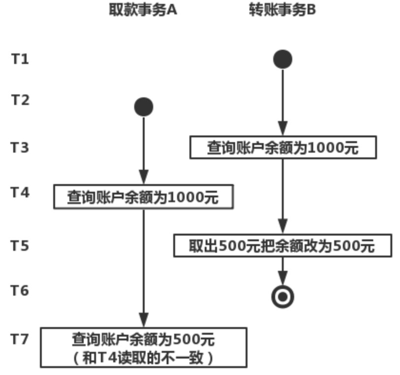
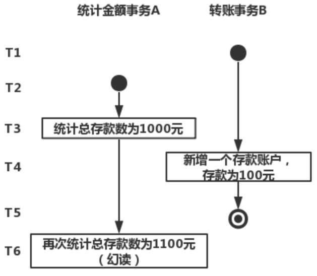

# Spring事务

## 事务回顾

> 事务简介

一组业务ABCD在同一事务下操作，要不ABCD全部成功，要不ABCD全部不成功。

> 事务特性：ACID

* 原子性（atomicity）：整个事务包含的所有操作，要么全部成功，要么全部失败，事务在执行过程中发生错误，会被回滚到事务开始前的状态。
* 一致性（consistency）：一个事务执行之前和执行之后，数据库的完整性约束没有被破坏，完整性约束是一个外在的业务约束，举个例子，假设完整性约束要求事务执行前后数据A和数据B的和为10，那么事务执行完毕后，该完整性约束要依然满足。
* 隔离性（isolation）：对于任意两个并发的事务T1和T2，在事务T1看来，T2要么在T1开始之前就已经结束，要么在T1结束之后才开始，这样每个事务都感觉不到有其他事务在并发地执行，事务的隔离性将确保每一事务在系统中认为只有该事务在使用系统。
* 持久性（durability）：一个事务一旦提交了，那么对数据库中数据的改变就是永久性的，并不会被回滚。

> 事务分类

* 扁平化事务

不能提交或者回滚事务的某一部分，要么都成功，要么都回滚，接触最多的就是扁平化事务。

* 带保存点的扁平事务

允许事务在执行过程中回滚到较早的状态，通过在事务中插入保存点，当操作失败后，可以选择回滚到最近的保存点处。

* 链事务

事务提交时，会将必要的上下文传递给下一个事务，当事务失败时就可以且只能回滚到最近的事务保存点。

* 嵌套事务

类似树的结构，由于顶层事务和子事务构成，如果上层事务回滚，那么所有子事务都会回滚。

* 分布式事务

分布式环境中的扁平化事务。

> 隔离问题

* 脏读：一个事务读到另外一个事务未提交的内容

* 不可重复读

一个事务读到另外一个事务已经提交的内容，重点在于更新（update）。  
A事务读取数据后，B事务执行更新操作，使得A事务无法再现前一次读取结果。  
不可重复读违法了事务的一致性要求。

* 幻读

又叫虚读，一个事务读到另外一个事务已经提交的新增数据，重点在于插入（insert）和删除（delete）。不可重复读是同一条记录，两次读取的值不同，幻读是记录的值增加或删除，导致两次相同条件获取的结果记录数不同。

> 隔离级别

* 读未提交（Read Uncommitted）

读取到其他事务未提交的内容。  
存在三个问题：脏读、不可重复读、幻读。  
在该隔离级别，所有事务都可以看到其他未提交事务的执行结果。本隔离级别很少用于实际应用，因为它的性能并不比其他隔离级别好多少。

* 读已提交（Read Committed）

只能读取到其他事务已经提交的数据，可避免脏读。  
解决脏读，存在两个问题：不可重复读、幻读。  
这是大多数关系型数据库系统默认的隔离级别（但不是MySQL默认的），它满足了隔离的简单定义：一个事务只能看见已经提交的事务所做的改变。

* 可重复读（Repeatable Read）
可以保证整个事务过程中，对同数据的多次读取结果是相同的，可避免脏读不可重复读。  
解决脏读、不可重复读，存在一个问题：幻读。  
理论上，可重复读会导致幻读，简单说，当用户读取某一范围的数据行时，另外一个事务又在该范围内插入了新行，当用户再次读取该范围的数据行时，会发现有新的幻影行。  
产生幻读的原因是，行锁只能锁住行，但是新插入记录这个动作，要更新的是记录之间的间隙。

* 可串行化

这是最高的隔离级别，它提供强制事务排序，所有事务操作都依次顺序执行，使之不可能相互冲突，从而解决幻读、不可重复读、脏读问题。  
简言之，它是在每个读的数据行上加上共享锁，在这个级别上，可能导致大量的超时现象和锁竞争，性能最差。

* 可重复读隔离级别下MySQL是如何解决幻读问题的  

幻读，是一个事务里面的两条相同过滤条件的读取，读取的数据条数不一致。  
可重复读是MySQL的默认事务隔离级别，它确保同一个事务的多个实例在并发读取数据时，会看到同样的数据行。  
MySQL中如果是快照读，那么是通过MVCC（多版本控制）来避免幻读。  
MySQL中如果是当前读，因为行锁只能锁住行，为了解决幻读问题，InnoDB只好引入新的锁，也就是间隙锁（Gap Lock）来解决幻读问题。  
有的公司MySQL数据库默认使用读已提交隔离级别，因为读已提交隔离级别可以避免出现间隙锁，减少死锁的概率。  

你是一位java开发工程师，请解释下面的代码：
@Transactional(value="alphaTransactionManager",propagation = Propagation.REQUIRED,isolation = Isolation.DEFAULT,rollbackFor = Exception.class)
这是一个在Java中使用Spring框架进行事务管理的注解。具体解释如下：

@Transactional：表示这个方法需要被事务管理器管理。
value="alphaTransactionManager"：表示使用名为"alphaTransactionManager"的事务管理器来管理这个方法的事务。
propagation = Propagation.REQUIRED：表示如果当前没有事务，就创建一个新的事务，并在方法执行完毕后提交事务；如果当前已经有事务，则加入到当前事务中。
isolation = Isolation.DEFAULT：表示数据库事务的隔离级别为默认级别。
rollbackFor = Exception.class：表示如果方法执行过程中出现了任何异常，都会回滚事务。

