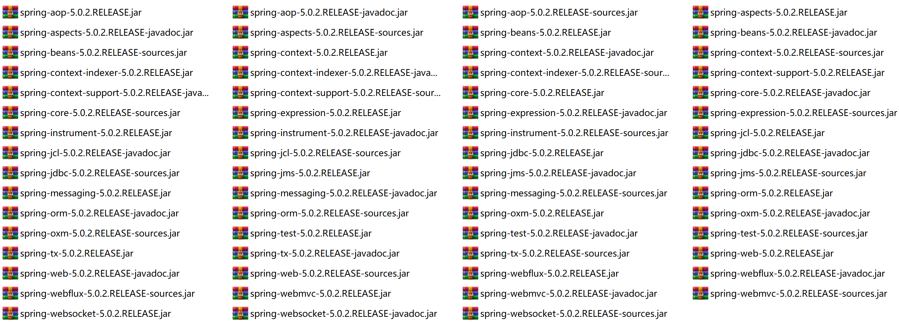
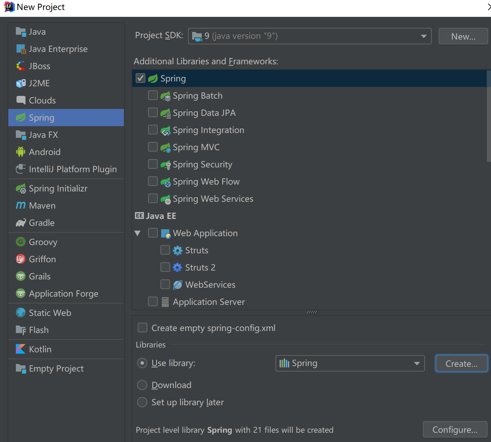

# Spring快速入门

## 目标

1. 掌握Web开发中集成Spring需要哪些包。  
2. 掌握IOC是什么。

## 编写流程

1. 下载Spring开发包。
2. 导入Spring的jar包。
3. 配置Spring的核心xml文件。
4. 在程序中读取Spring的配置文件来获取Bean（Bean其实就是一个new好的对象）。

## 下载相关jar包

Spring现在有很多框架，如Spring Framework、SpringMVC。Spring Data、Spring Boot、Spring Security、Spring WebFlux...。

下载5.0.2版本的spring-framework-5.0.2.RELEASE-dist.zip压缩包，解压后得到spring-framework-5.0.2.RELEASE的文件夹，打开文件夹进入libs文件夹可以看到：



libs下即为jar包，整个spring框架由21个模块组成，每个模块有三种jar包，共三类：
* spring框架class文件的jar包
* spring框架源文件的jar包
* spring框架api文档的压缩包

列举一些核心jar包：
> spring-core.jar

包含Spring框架的基本核心工具类，SPring其他组件都要使用到这个包里的类，是其他组件的基本核心。

> spring-beans.jar

所有应用都要用到的，它包含访问配置文件、创建和管理bean，以及进行控制反转Inversion of Control(IOC)或者依赖注入Dependency Injection(DI)操作相关的所有类。

> spring-context.jar

Spring提供在基本IOC功能上的扩展服务，此外还提供许多企业级服务的支持，如邮件服务、任务调度、JNDI定位、EJB集成、远程访问、缓存以及各种视图层框架的封装等。

> spring-expression.jar

Spring表达式语言。

## Spring的入门案例

1. 创建Spring项目，导入Spring的jar包（全部添加，一共21个jar包）。



2. 写一个接口

```java
/**
 * 用户服务接口
 * @author: yinaicheng
 */
public interface UserService {

    /**
     * 添加用户
     */
    void add();
    
}
```

3.实现接口
```java
/**
 * 用户服务业务逻辑层
 * @author: yinaicheng
 */
public class UserServiceImpl implements UserService{

    /**
     * 添加用户
     */
    @Override
    public void add() {
        System.out.println("添加用户");
    }

    public static void main(String[] args) {
        UserServiceImpl userService=new UserServiceImpl();
        userService.add();
    }
}
```

4. 在resouce目录下，添加bean.xml文件

beans.xml文件配置

```xml
<?xml version="1.0" encoding="UTF-8"?>
<beans xmlns="http://www.springframework.org/schema/beans"
       xmlns:xsi="http://www.w3.org/2001/XMLSchema-instance"
       xsi:schemaLocation="
http://www.springframework.org/schema/beans http://www.springframework.org/schema/beans/spring-beans.xsd">
    <!-- 配置一个bean对象-->
    <bean id="userService" class="top.yinaicheng.demo.UserServiceImpl">
    </bean>
</beans>
```

5. Spring IOC控制反转实例

IOC即Inverse of Control控制反转的概念，就是把原本在程序中手动创建UserService对象的控制权，交由Spring框架管理，简单说，就是创建UserService对象控制权被反转到了Spring框架。

```java
import org.springframework.context.ApplicationContext;
import org.springframework.context.support.ClassPathXmlApplicationContext;
/**
 * 测试类
 * @author: yinaicheng
 */
public class Test {
    @org.junit.Test
    public void test(){
        /*以前需要手动创建对象，new UserServiceImpl()*/
        /*现在可以从Spring容器获取*/
        /*加载beans.xml这个配置文件，其内部就会创建对象*/
        ApplicationContext context=new ClassPathXmlApplicationContext("beans.xml");
        /*从Spring容器获取UserService对象，通过bean的id对象获取*/
        UserService userService1=(UserService)context.getBean("userService");
        userService1.add();
        UserService userService2=(UserService)context.getBean("userService");
        userService2.add();
        /*判断从容器中获取的对象，是不是同一个对象*/
        System.out.println(userService1==userService2?"是同一个对象":"不是同一个对象");
    }
}
```

返回结果

```log
[main] DEBUG org.springframework.context.support.ClassPathXmlApplicationContext - Refreshing org.springframework.context.support.ClassPathXmlApplicationContext@4dfa3a9d
[main] DEBUG org.springframework.beans.factory.xml.XmlBeanDefinitionReader - Loaded 1 bean definitions from class path resource [beans.xml]
[main] DEBUG org.springframework.beans.factory.support.DefaultListableBeanFactory - Creating shared instance of singleton bean 'userService'
添加用户
添加用户
是同一个对象
```

6. Spring DI依赖注入实例

Dependency Injection 依赖注入，在Spring框架负责创建Bean对象时，动态的将依赖对象注入到Bean组件。

在UserService中提供一个get/set的name方法，在beans.xml中通过property去注入。

beans.xml配置
```xml
<?xml version="1.0" encoding="UTF-8"?>
<beans xmlns="http://www.springframework.org/schema/beans"
       xmlns:xsi="http://www.w3.org/2001/XMLSchema-instance"
       xsi:schemaLocation="
http://www.springframework.org/schema/beans http://www.springframework.org/schema/beans/spring-beans.xsd">
    <!-- 配置一个bean对象-->
    <bean id="userService" class="top.yinaicheng.demo.UserServiceImpl">
        <!--依赖注入数据，调用属性的set方法-->
        <property name="name" value="印爱成"/>
    </bean>
</beans>
```

UserServiceImpl添加name属性

```java
import java.text.MessageFormat;
/**
 * 用户服务业务逻辑层
 * @author: yinaicheng
 */
public class UserServiceImpl implements UserService{

    private String name;

    public String getName() {
        return name;
    }

    public void setName(String name) {
        System.out.println(MessageFormat.format("注入数据：{0}",name));
        this.name = name;
    }

    /**
     * 添加用户
     */
    @Override
    public void add() {
        System.out.println("添加用户");
    }

    public static void main(String[] args) {
        UserServiceImpl userService=new UserServiceImpl();
        userService.add();
    }
}
```

测试类
```java
import org.springframework.context.ApplicationContext;
import org.springframework.context.support.ClassPathXmlApplicationContext;
/**
 * 测试类
 * @author: yinaicheng
 */
public class Test {
    @org.junit.Test
    public void test(){
        /*以前需要手动创建对象，new UserServiceImpl()*/
        /*现在可以从Spring容器获取*/
        /*加载beans.xml这个配置文件，其内部就会创建对象*/
        ApplicationContext context=new ClassPathXmlApplicationContext("beans.xml");
        /*从Spring容器获取UserService对象，通过bean的id对象获取*/
        UserService userService=(UserService)context.getBean("userService");
        userService.add();
    }
}
```

执行结果
```log
[main] DEBUG org.springframework.context.support.ClassPathXmlApplicationContext - Refreshing org.springframework.context.support.ClassPathXmlApplicationContext@4dfa3a9d
[main] DEBUG org.springframework.beans.factory.xml.XmlBeanDefinitionReader - Loaded 1 bean definitions from class path resource [beans.xml]
[main] DEBUG org.springframework.beans.factory.support.DefaultListableBeanFactory - Creating shared instance of singleton bean 'userService'
注入数据：印爱成
添加用户
```


