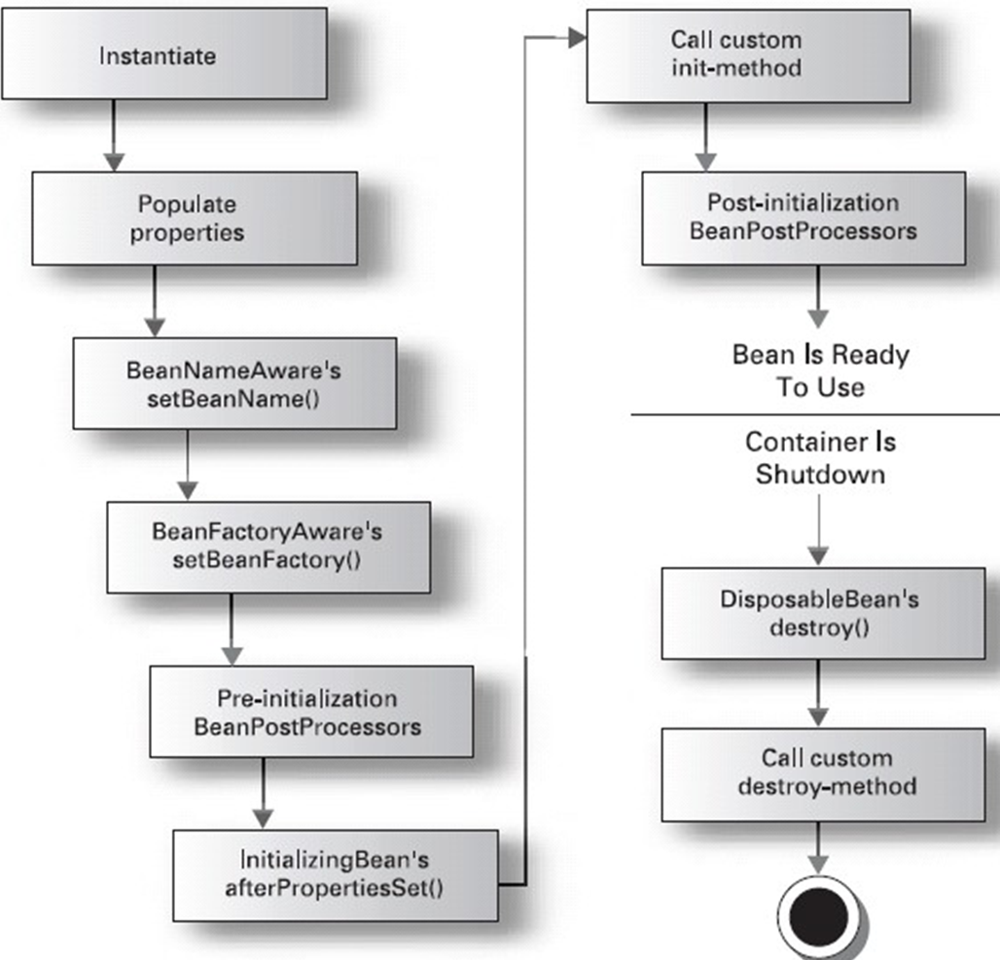

# bean的生命周期

## bean生命周期图



> 生命周期图名词解释

1. Instantiate：对象实例化。
2. Populate properties：封装属性。
3. BeanNameAware's setBeanName()：如果Bean实现BeanNameAware执行setBeanName。
4. BeanFactoryAware's setBeanFactory()：如果Bean实现BeanFactoryAware执行setBeanFactory，获取Spring容器。
5. Pre-initialization BeanPostProcessors：如果存在类实现BeanPostProcessor（后处理Bean），执行postProcessBeforeInitialization。
6. InitializingBean's afterPropertiesSet()：如果Bean实现InitializingBean执行afeterPropertiesSet。
7. Call custom init-method：调用指定初始化方法init（init-method="init"）。
8. Post-initialization BeanPostProcessors：如果存在类实现BeanPostProcessor（处理Bean），执行hipostProcessAfterInitialization执行业务处理。
9. DisposableBean's destory()：如果Bean实现DisposableBean执行destory。
10. Call custom destory-method：调用指定销毁方法customerDestory（destory-method="customerDestory"）。

> 演示instantiate bean对象实例化

用户类
```java
/**
 * @author: yinaicheng
 * @date: 2022/9/20 22:57
 */
public class User {

    /**
     * 用户名
     */
    private String userName;

    /**
     * 用户密码
     */
    private String password;

    public User(){
        System.out.println("实例化");
    }

    public String getUserName() {
        return userName;
    }

    public void setUserName(String userName) {
        this.userName = userName;
    }

    public String getPassword() {
        return password;
    }

    public void setPassword(String password) {
        this.password = password;
    }

    @Override
    public String toString() {
        return "User{" +
                "userName='" + userName + '\'' +
                ", password='" + password + '\'' +
                '}';
    }
}
```

beans.xml文件
```xml
<?xml version="1.0" encoding="UTF-8"?>
<beans xmlns="http://www.springframework.org/schema/beans"
       xmlns:xsi="http://www.w3.org/2001/XMLSchema-instance"
       xsi:schemaLocation="
http://www.springframework.org/schema/beans http://www.springframework.org/schema/beans/spring-beans.xsd">
<!--配置一个bean对象-->
<!--所谓的装配bean就是在xml写一个bean标签-->
<bean id="user" class="top.yinaicheng.demo.User"/>
</beans>
```

测试类
```java
import org.springframework.context.ApplicationContext;
import org.springframework.context.support.ClassPathXmlApplicationContext;
/**
 * 测试类
 * @author: yinaicheng
 */
public class Test {

    @org.junit.Test
    public void test(){
        ApplicationContext context =new ClassPathXmlApplicationContext("beans.xml");
        User user=(User)context.getBean("user");
        System.out.println(user);
    }
}
```

执行结果
```log
23:05:25.612 [main] DEBUG org.springframework.context.support.ClassPathXmlApplicationContext - Refreshing org.springframework.context.support.ClassPathXmlApplicationContext@59ec2012
23:05:25.877 [main] DEBUG org.springframework.beans.factory.xml.XmlBeanDefinitionReader - Loaded 1 bean definitions from class path resource [beans.xml]
23:05:25.939 [main] DEBUG org.springframework.beans.factory.support.DefaultListableBeanFactory - Creating shared instance of singleton bean 'user'
实例化
User{userName='null', password='null'}
```

> 演示populate properties封装属性

用户类
```java
/**
 * @author: yinaicheng
 * @date: 2022/9/20 22:57
 */
public class User {

    /**
     * 用户名
     */
    private String userName;

    /**
     * 用户密码
     */
    private String password;

    public User(){
        System.out.println("实例化");
    }

    public String getUserName() {
        return userName;
    }

    public void setUserName(String userName) {
        System.out.println("赋值userName属性"+userName);
        this.userName = userName;
    }

    public String getPassword() {
        return password;
    }

    public void setPassword(String password) {
        System.out.println("赋值password属性"+password);
        this.password = password;
    }

    @Override
    public String toString() {
        return "User{" +
                "userName='" + userName + '\'' +
                ", password='" + password + '\'' +
                '}';
    }
}
```

beans.xml文件
```xml
<?xml version="1.0" encoding="UTF-8"?>
<beans xmlns="http://www.springframework.org/schema/beans"
       xmlns:xsi="http://www.w3.org/2001/XMLSchema-instance" xmlns:util="http://www.springframework.org/schema/util"
       xsi:schemaLocation="http://www.springframework.org/schema/beans http://www.springframework.org/schema/beans/spring-beans.xsd http://www.springframework.org/schema/util https://www.springframework.org/schema/util/spring-util.xsd">
    <!--配置一个bean对象-->
    <!--所谓的装配bean就是在xml写一个bean标签-->
    <bean id="user" class="top.yinaicheng.demo.User">
        <property name="userName" value="admin"/>
        <property name="password" value="admin_password"/>
    </bean>
</beans>
```

测试类
```java
import org.springframework.context.ApplicationContext;
import org.springframework.context.support.ClassPathXmlApplicationContext;
/**
 * 测试类
 * @author: yinaicheng
 */
public class Test {

    @org.junit.Test
    public void test(){
        ApplicationContext context =new ClassPathXmlApplicationContext("beans.xml");
        User user=(User)context.getBean("user");
        System.out.println(user);
    }
}
```

执行结果
```log
08:42:39.902 [main] DEBUG org.springframework.context.support.ClassPathXmlApplicationContext - Refreshing org.springframework.context.support.ClassPathXmlApplicationContext@59ec2012
08:42:40.114 [main] DEBUG org.springframework.beans.factory.xml.XmlBeanDefinitionReader - Loaded 1 bean definitions from class path resource [beans.xml]
08:42:40.161 [main] DEBUG org.springframework.beans.factory.support.DefaultListableBeanFactory - Creating shared instance of singleton bean 'user'
实例化
赋值userName属性admin
赋值password属性admin_password
User{userName='admin', password='admin_password'}
```

> 演示：如果Bean实现BeanNameAware，执行setBeanName

用户类
```java
import org.springframework.beans.factory.BeanNameAware;
/**
 * @author: yinaicheng
 * @date: 2022/9/20 22:57
 */
public class User implements BeanNameAware {

    /**
     * 用户名
     */
    private String userName;

    /**
     * 用户密码
     */
    private String password;

    public User(){
        System.out.println("实例化");
    }

    public String getUserName() {
        return userName;
    }

    public void setUserName(String userName) {
        System.out.println("赋值userName属性"+userName);
        this.userName = userName;
    }

    public String getPassword() {
        return password;
    }

    public void setPassword(String password) {
        System.out.println("赋值password属性"+password);
        this.password = password;
    }

    @Override
    public String toString() {
        return "User{" +
                "userName='" + userName + '\'' +
                ", password='" + password + '\'' +
                '}';
    }

    @Override
    public void setBeanName(String s) {
        System.out.println("设置bean名字："+s);
    }
}
```

beans.xml文件
```xml
<?xml version="1.0" encoding="UTF-8"?>
<beans xmlns="http://www.springframework.org/schema/beans"
       xmlns:xsi="http://www.w3.org/2001/XMLSchema-instance" xmlns:util="http://www.springframework.org/schema/util"
       xsi:schemaLocation="http://www.springframework.org/schema/beans http://www.springframework.org/schema/beans/spring-beans.xsd http://www.springframework.org/schema/util https://www.springframework.org/schema/util/spring-util.xsd">
    <!--配置一个bean对象-->
    <!--所谓的装配bean就是在xml写一个bean标签-->
    <bean id="user" class="top.yinaicheng.demo.User">
        <property name="userName" value="admin"/>
        <property name="password" value="admin_password"/>
    </bean>
</beans>
```

测试类
```java
import org.springframework.context.ApplicationContext;
import org.springframework.context.support.ClassPathXmlApplicationContext;
/**
 * 测试类
 * @author: yinaicheng
 */
public class Test {

    @org.junit.Test
    public void test(){
        ApplicationContext context =new ClassPathXmlApplicationContext("beans.xml");
        User user=(User)context.getBean("user");
        System.out.println(user);
    }
}
```

执行结果
```log
02:20:59.842 [main] DEBUG org.springframework.context.support.ClassPathXmlApplicationContext - Refreshing org.springframework.context.support.ClassPathXmlApplicationContext@59ec2012
02:21:00.915 [main] DEBUG org.springframework.beans.factory.xml.XmlBeanDefinitionReader - Loaded 1 bean definitions from class path resource [beans.xml]
02:21:01.087 [main] DEBUG org.springframework.beans.factory.support.DefaultListableBeanFactory - Creating shared instance of singleton bean 'test'
实例化
赋值userName属性admin
赋值password属性admin_password
设置bean名字：test
User{userName='admin', password='admin_password'}
```

> 演示：如果Bean实现BeanFactoryAware执行setBeanFactory，获取Spring容器，把对象放进工厂，放进容器

User类
```java
import org.springframework.beans.BeansException;
import org.springframework.beans.factory.BeanFactory;
import org.springframework.beans.factory.BeanFactoryAware;
import org.springframework.beans.factory.BeanNameAware;
/**
 * @author: yinaicheng
 * @date: 2022/9/20 22:57
 */
public class User implements BeanNameAware, BeanFactoryAware {

    /**
     * 用户名
     */
    private String userName;

    /**
     * 用户密码
     */
    private String password;

    public User(){
        System.out.println("1.实例化");
    }

    public String getUserName() {
        return userName;
    }

    public void setUserName(String userName) {
        System.out.println("2.赋值userName属性"+userName);
        this.userName = userName;
    }

    public String getPassword() {
        return password;
    }

    public void setPassword(String password) {
        System.out.println("2. 赋值password属性"+password);
        this.password = password;
    }

    @Override
    public String toString() {
        return "User{" +
                "userName='" + userName + '\'' +
                ", password='" + password + '\'' +
                '}';
    }

    @Override
    public void setBeanName(String s) {
        System.out.println("3.设置bean名字："+s);
    }

    @Override
    public void setBeanFactory(BeanFactory beanFactory) throws BeansException {
        System.out.println("4.bean工厂"+beanFactory);
    }
}
```

beans.xml文件
```xml
<?xml version="1.0" encoding="UTF-8"?>
<beans xmlns="http://www.springframework.org/schema/beans"
       xmlns:xsi="http://www.w3.org/2001/XMLSchema-instance" xmlns:util="http://www.springframework.org/schema/util"
       xsi:schemaLocation="http://www.springframework.org/schema/beans http://www.springframework.org/schema/beans/spring-beans.xsd http://www.springframework.org/schema/util https://www.springframework.org/schema/util/spring-util.xsd">
    <!--配置一个bean对象-->
    <!--所谓的装配bean就是在xml写一个bean标签-->
    <bean id="user" class="top.yinaicheng.demo.User">
        <property name="userName" value="admin"/>
        <property name="password" value="admin_password"/>
    </bean>
</beans>
```

测试类
```java
import org.springframework.context.ApplicationContext;
import org.springframework.context.support.ClassPathXmlApplicationContext;
/**
 * 测试类
 * @author: yinaicheng
 */
public class Test {

    @org.junit.Test
    public void test(){
        ApplicationContext context =new ClassPathXmlApplicationContext("beans.xml");
        User user=(User)context.getBean("user");
        System.out.println(user);
    }
}
```

执行结果
```log
22:18:44.081 [main] DEBUG org.springframework.context.support.ClassPathXmlApplicationContext - Refreshing org.springframework.context.support.ClassPathXmlApplicationContext@59ec2012
22:18:44.429 [main] DEBUG org.springframework.beans.factory.xml.XmlBeanDefinitionReader - Loaded 1 bean definitions from class path resource [beans.xml]
22:18:44.481 [main] DEBUG org.springframework.beans.factory.support.DefaultListableBeanFactory - Creating shared instance of singleton bean 'user'
1.实例化
2.赋值userName属性admin
2. 赋值password属性admin_password
3.设置bean名字：user
4.bean工厂org.springframework.beans.factory.support.DefaultListableBeanFactory@28c4711c: defining beans [user]; root of factory hierarchy
User{userName='admin', password='admin_password'}
```

> 演示：如果Bean实现InitializingBean执行afterPropertiesSet

User类
```java
import org.springframework.beans.BeansException;
import org.springframework.beans.factory.BeanFactory;
import org.springframework.beans.factory.BeanFactoryAware;
import org.springframework.beans.factory.BeanNameAware;
import org.springframework.beans.factory.InitializingBean;

/**
 * @author: yinaicheng
 * @date: 2022/9/20 22:57
 */
public class User implements BeanNameAware, BeanFactoryAware, InitializingBean {

    /**
     * 用户名
     */
    private String userName;

    /**
     * 用户密码
     */
    private String password;

    public User(){
        System.out.println("1.实例化");
    }

    public String getUserName() {
        return userName;
    }

    public void setUserName(String userName) {
        System.out.println("2.赋值userName属性"+userName);
        this.userName = userName;
    }

    public String getPassword() {
        return password;
    }

    public void setPassword(String password) {
        System.out.println("2. 赋值password属性"+password);
        this.password = password;
    }

    @Override
    public String toString() {
        return "User{" +
                "userName='" + userName + '\'' +
                ", password='" + password + '\'' +
                '}';
    }

    @Override
    public void setBeanName(String s) {
        System.out.println("3.设置bean名字："+s);
    }

    @Override
    public void setBeanFactory(BeanFactory beanFactory) throws BeansException {
        System.out.println("4.bean工厂"+beanFactory);
    }

    @Override
    public void afterPropertiesSet() throws Exception {
        System.out.println("6.属性赋值完成");
    }
}
```

beans.xml文件
```xml
<?xml version="1.0" encoding="UTF-8"?>
<beans xmlns="http://www.springframework.org/schema/beans"
       xmlns:xsi="http://www.w3.org/2001/XMLSchema-instance" xmlns:util="http://www.springframework.org/schema/util"
       xsi:schemaLocation="http://www.springframework.org/schema/beans http://www.springframework.org/schema/beans/spring-beans.xsd http://www.springframework.org/schema/util https://www.springframework.org/schema/util/spring-util.xsd">
    <!--配置一个bean对象-->
    <!--所谓的装配bean就是在xml写一个bean标签-->
    <bean id="user" class="top.yinaicheng.demo.User">
        <property name="userName" value="admin"/>
        <property name="password" value="admin_password"/>
    </bean>
</beans>
```

测试类
```java
import org.springframework.context.ApplicationContext;
import org.springframework.context.support.ClassPathXmlApplicationContext;
/**
 * 测试类
 * @author: yinaicheng
 */
public class Test {

    @org.junit.Test
    public void test(){
        ApplicationContext context =new ClassPathXmlApplicationContext("beans.xml");
        User user=(User)context.getBean("user");
        System.out.println(user);
    }
}
```

执行结果
```log
22:32:47.645 [main] DEBUG org.springframework.context.support.ClassPathXmlApplicationContext - Refreshing org.springframework.context.support.ClassPathXmlApplicationContext@42dafa95
22:32:47.992 [main] DEBUG org.springframework.beans.factory.xml.XmlBeanDefinitionReader - Loaded 1 bean definitions from class path resource [beans.xml]
22:32:48.072 [main] DEBUG org.springframework.beans.factory.support.DefaultListableBeanFactory - Creating shared instance of singleton bean 'user'
1.实例化
2.赋值userName属性admin
2. 赋值password属性admin_password
3.设置bean名字：user
4.bean工厂org.springframework.beans.factory.support.DefaultListableBeanFactory@49070868: defining beans [user]; root of factory hierarchy
6.属性赋值完成
User{userName='admin', password='admin_password'}
```

> 演示：调用bean init-method="init"指定初始化init

User类
```java
import org.springframework.beans.BeansException;
import org.springframework.beans.factory.BeanFactory;
import org.springframework.beans.factory.BeanFactoryAware;
import org.springframework.beans.factory.BeanNameAware;
import org.springframework.beans.factory.InitializingBean;

/**
 * @author: yinaicheng
 * @date: 2022/9/20 22:57
 */
public class User implements BeanNameAware, BeanFactoryAware, InitializingBean {

    /**
     * 用户名
     */
    private String userName;

    /**
     * 用户密码
     */
    private String password;

    public User(){
        System.out.println("1.实例化");
    }

    public String getUserName() {
        return userName;
    }

    public void setUserName(String userName) {
        System.out.println("2.赋值userName属性"+userName);
        this.userName = userName;
    }

    public String getPassword() {
        return password;
    }

    public void setPassword(String password) {
        System.out.println("2. 赋值password属性"+password);
        this.password = password;
    }

    @Override
    public String toString() {
        return "User{" +
                "userName='" + userName + '\'' +
                ", password='" + password + '\'' +
                '}';
    }

    @Override
    public void setBeanName(String s) {
        System.out.println("3.设置bean名字："+s);
    }

    @Override
    public void setBeanFactory(BeanFactory beanFactory) throws BeansException {
        System.out.println("4.bean工厂"+beanFactory);
    }

    @Override
    public void afterPropertiesSet() throws Exception {
        System.out.println("6.属性赋值完成");
    }

    public void myInit(){
        System.out.println("7.自定义初始化方法");
    }

}
```

beans.xml文件
```xml
<?xml version="1.0" encoding="UTF-8"?>
<beans xmlns="http://www.springframework.org/schema/beans"
       xmlns:xsi="http://www.w3.org/2001/XMLSchema-instance" xmlns:util="http://www.springframework.org/schema/util"
       xsi:schemaLocation="http://www.springframework.org/schema/beans http://www.springframework.org/schema/beans/spring-beans.xsd http://www.springframework.org/schema/util https://www.springframework.org/schema/util/spring-util.xsd">
    <!--配置一个bean对象-->
    <!--所谓的装配bean就是在xml写一个bean标签-->
    <bean id="user" class="top.yinaicheng.demo.User" init-method="myInit">
        <property name="userName" value="admin"/>
        <property name="password" value="admin_password"/>
    </bean>
</beans>
```

测试类
```java
import org.springframework.context.ApplicationContext;
import org.springframework.context.support.ClassPathXmlApplicationContext;
/**
 * 测试类
 * @author: yinaicheng
 */
public class Test {

    @org.junit.Test
    public void test(){
        ApplicationContext context =new ClassPathXmlApplicationContext("beans.xml");
        User user=(User)context.getBean("user");
        System.out.println(user);
    }
}
```

执行结果
```log
22:38:35.146 [main] DEBUG org.springframework.context.support.ClassPathXmlApplicationContext - Refreshing org.springframework.context.support.ClassPathXmlApplicationContext@59ec2012
22:38:35.368 [main] DEBUG org.springframework.beans.factory.xml.XmlBeanDefinitionReader - Loaded 1 bean definitions from class path resource [beans.xml]
22:38:35.419 [main] DEBUG org.springframework.beans.factory.support.DefaultListableBeanFactory - Creating shared instance of singleton bean 'user'
1.实例化
2.赋值userName属性admin
2. 赋值password属性admin_password
3.设置bean名字：user
4.bean工厂org.springframework.beans.factory.support.DefaultListableBeanFactory@28c4711c: defining beans [user]; root of factory hierarchy
6.属性赋值完成
7.自定义初始化方法
User{userName='admin', password='admin_password'}
```

> 演示：如果Bean实现DisposableBean执行destroy

User类
```java
import org.springframework.beans.BeansException;
import org.springframework.beans.factory.*;

/**
 * @author: yinaicheng
 * @date: 2022/9/20 22:57
 */
public class User implements BeanNameAware, BeanFactoryAware, InitializingBean, DisposableBean {

    /**
     * 用户名
     */
    private String userName;

    /**
     * 用户密码
     */
    private String password;

    public User(){
        System.out.println("1.实例化");
    }

    public String getUserName() {
        return userName;
    }

    public void setUserName(String userName) {
        System.out.println("2.赋值userName属性"+userName);
        this.userName = userName;
    }

    public String getPassword() {
        return password;
    }

    public void setPassword(String password) {
        System.out.println("2. 赋值password属性"+password);
        this.password = password;
    }

    @Override
    public String toString() {
        return "User{" +
                "userName='" + userName + '\'' +
                ", password='" + password + '\'' +
                '}';
    }

    @Override
    public void setBeanName(String s) {
        System.out.println("3.设置bean名字："+s);
    }

    @Override
    public void setBeanFactory(BeanFactory beanFactory) throws BeansException {
        System.out.println("4.bean工厂"+beanFactory);
    }

    @Override
    public void afterPropertiesSet() throws Exception {
        System.out.println("6.属性赋值完成");
    }

    public void myInit(){
        System.out.println("7.自定义初始化方法");
    }

    @Override
    public void destroy() throws Exception {
        System.out.println("9.bean被销毁");
    }
}
```

beans.xml文件
```xml
<?xml version="1.0" encoding="UTF-8"?>
<beans xmlns="http://www.springframework.org/schema/beans"
       xmlns:xsi="http://www.w3.org/2001/XMLSchema-instance" xmlns:util="http://www.springframework.org/schema/util"
       xsi:schemaLocation="http://www.springframework.org/schema/beans http://www.springframework.org/schema/beans/spring-beans.xsd http://www.springframework.org/schema/util https://www.springframework.org/schema/util/spring-util.xsd">
    <!--配置一个bean对象-->
    <!--所谓的装配bean就是在xml写一个bean标签-->
    <bean id="user" class="top.yinaicheng.demo.User" init-method="myInit">
        <property name="userName" value="admin"/>
        <property name="password" value="admin_password"/>
    </bean>
</beans>
```

测试类
```java
import org.springframework.context.ApplicationContext;
import org.springframework.context.support.ClassPathXmlApplicationContext;
import java.lang.reflect.InvocationTargetException;
/**
 * 测试类
 * @author: yinaicheng
 */
public class Test {

    @org.junit.Test
    public void test() throws NoSuchMethodException, InvocationTargetException, IllegalAccessException {
        ApplicationContext context =new ClassPathXmlApplicationContext("beans.xml");
        User user=(User)context.getBean("user");
        System.out.println(user);
        /*关闭容器，需要关闭容器后才能调用destroy方法*/
        context.getClass().getMethod("close").invoke(context);
    }
}
```

执行结果
```log
22:49:15.831 [main] DEBUG org.springframework.context.support.ClassPathXmlApplicationContext - Refreshing org.springframework.context.support.ClassPathXmlApplicationContext@4f7d0008
22:49:16.115 [main] DEBUG org.springframework.beans.factory.xml.XmlBeanDefinitionReader - Loaded 1 bean definitions from class path resource [beans.xml]
22:49:16.180 [main] DEBUG org.springframework.beans.factory.support.DefaultListableBeanFactory - Creating shared instance of singleton bean 'user'
1.实例化
2.赋值userName属性admin
2. 赋值password属性admin_password
3.设置bean名字：user
4.bean工厂org.springframework.beans.factory.support.DefaultListableBeanFactory@6e38921c: defining beans [user]; root of factory hierarchy
6.属性赋值完成
7.自定义初始化方法
User{userName='admin', password='admin_password'}
22:49:16.358 [main] DEBUG org.springframework.context.support.ClassPathXmlApplicationContext - Closing org.springframework.context.support.ClassPathXmlApplicationContext@4f7d0008, started on Mon Sep 26 22:49:15 CST 2022
9.bean被销毁
```

> 演示：调用bean destroy-method="customerDestroy"，指定销毁方法

User类
```java
import org.springframework.beans.BeansException;
import org.springframework.beans.factory.*;

/**
 * @author: yinaicheng
 * @date: 2022/9/20 22:57
 */
public class User implements BeanNameAware, BeanFactoryAware, InitializingBean, DisposableBean {

    /**
     * 用户名
     */
    private String userName;

    /**
     * 用户密码
     */
    private String password;

    public User(){
        System.out.println("1.实例化");
    }

    public String getUserName() {
        return userName;
    }

    public void setUserName(String userName) {
        System.out.println("2.赋值userName属性"+userName);
        this.userName = userName;
    }

    public String getPassword() {
        return password;
    }

    public void setPassword(String password) {
        System.out.println("2. 赋值password属性"+password);
        this.password = password;
    }

    @Override
    public String toString() {
        return "User{" +
                "userName='" + userName + '\'' +
                ", password='" + password + '\'' +
                '}';
    }

    @Override
    public void setBeanName(String s) {
        System.out.println("3.设置bean名字："+s);
    }

    @Override
    public void setBeanFactory(BeanFactory beanFactory) throws BeansException {
        System.out.println("4.bean工厂"+beanFactory);
    }

    @Override
    public void afterPropertiesSet() throws Exception {
        System.out.println("6.属性赋值完成");
    }

    public void myInit(){
        System.out.println("7.自定义初始化方法");
    }

    @Override
    public void destroy() throws Exception {
        System.out.println("9.bean被销毁");
    }
    public void myDestroy(){
        System.out.println("10.自定义的销毁方法");
    }
}
```

beans.xml文件
```xml
<?xml version="1.0" encoding="UTF-8"?>
<beans xmlns="http://www.springframework.org/schema/beans"
       xmlns:xsi="http://www.w3.org/2001/XMLSchema-instance" xmlns:util="http://www.springframework.org/schema/util"
       xsi:schemaLocation="http://www.springframework.org/schema/beans http://www.springframework.org/schema/beans/spring-beans.xsd http://www.springframework.org/schema/util https://www.springframework.org/schema/util/spring-util.xsd">
    <!--配置一个bean对象-->
    <!--所谓的装配bean就是在xml写一个bean标签-->
    <bean id="user" class="top.yinaicheng.demo.User" init-method="myInit" destroy-method="myDestroy">
        <property name="userName" value="admin"/>
        <property name="password" value="admin_password"/>
    </bean>
</beans>
```

测试类
```java
import org.springframework.context.ApplicationContext;
import org.springframework.context.support.ClassPathXmlApplicationContext;
import java.lang.reflect.InvocationTargetException;
/**
 * 测试类
 * @author: yinaicheng
 */
public class Test {

    @org.junit.Test
    public void test() throws NoSuchMethodException, InvocationTargetException, IllegalAccessException {
        ApplicationContext context =new ClassPathXmlApplicationContext("beans.xml");
        User user=(User)context.getBean("user");
        System.out.println(user);
        /*关闭容器，需要关闭容器后才能调用destroy方法*/
        context.getClass().getMethod("close").invoke(context);
    }
}
```

执行结果
```log
02:23:57.480 [main] DEBUG org.springframework.context.support.ClassPathXmlApplicationContext - Refreshing org.springframework.context.support.ClassPathXmlApplicationContext@4f7d0008
02:23:58.543 [main] DEBUG org.springframework.beans.factory.xml.XmlBeanDefinitionReader - Loaded 1 bean definitions from class path resource [beans.xml]
02:23:58.771 [main] DEBUG org.springframework.beans.factory.support.DefaultListableBeanFactory - Creating shared instance of singleton bean 'user'
1.实例化
2.赋值userName属性admin
2. 赋值password属性admin_password
3.设置bean名字：user
4.bean工厂org.springframework.beans.factory.support.DefaultListableBeanFactory@6e38921c: defining beans [user]; root of factory hierarchy
6.属性赋值完成
7.自定义初始化方法
User{userName='admin', password='admin_password'}
02:23:59.528 [main] DEBUG org.springframework.context.support.ClassPathXmlApplicationContext - Closing org.springframework.context.support.ClassPathXmlApplicationContext@4f7d0008, started on Tue Sep 27 02:23:57 CST 2022
9.bean被销毁
10.自定义的销毁方法
```

> 演示：如果存在类实现BeanPostProcessor，并且重写postProcessBeforeInitialization（预处理）和postProcessAfterInitialization（后处理）

MyBeanPostProcessor类（实现BeanPostProcessor）
```java
import org.springframework.beans.BeansException;
import org.springframework.beans.factory.config.BeanPostProcessor;
/**
 * 如果存在类实现BeanPostProcessor，并且重写postProcessBeforeInitialization（预处理）和postProcessAfterInitialization（后处理）
 * @author: yinaicheng
 */
public class MyBeanPostProcessor implements BeanPostProcessor {

    /**
     * 预处理
     */
    @Override
    public Object postProcessBeforeInitialization(Object bean,String beanName) throws BeansException{
        System.out.println("5.预处理"+bean+":"+beanName);
        return bean;
    }

    /**
     * 后处理
     */
    @Override
    public Object postProcessAfterInitialization(Object bean,String beanName) throws BeansException{
        System.out.println("8.后处理"+bean+":"+beanName);
        return bean;
    }

}
```

User类
```java
import org.springframework.beans.BeansException;
import org.springframework.beans.factory.*;

/**
 * @author: yinaicheng
 * @date: 2022/9/20 22:57
 */
public class User implements BeanNameAware, BeanFactoryAware, InitializingBean, DisposableBean {

    /**
     * 用户名
     */
    private String userName;

    /**
     * 用户密码
     */
    private String password;

    public User(){
        System.out.println("1.实例化");
    }

    public String getUserName() {
        return userName;
    }

    public void setUserName(String userName) {
        System.out.println("2.赋值userName属性"+userName);
        this.userName = userName;
    }

    public String getPassword() {
        return password;
    }

    public void setPassword(String password) {
        System.out.println("2. 赋值password属性"+password);
        this.password = password;
    }

    @Override
    public String toString() {
        return "User{" +
                "userName='" + userName + '\'' +
                ", password='" + password + '\'' +
                '}';
    }

    @Override
    public void setBeanName(String s) {
        System.out.println("3.设置bean名字："+s);
    }

    @Override
    public void setBeanFactory(BeanFactory beanFactory) throws BeansException {
        System.out.println("4.bean工厂"+beanFactory);
    }

    @Override
    public void afterPropertiesSet() throws Exception {
        System.out.println("6.属性赋值完成");
    }

    public void myInit(){
        System.out.println("7.自定义初始化方法");
    }

    @Override
    public void destroy() throws Exception {
        System.out.println("9.bean被销毁");
    }
    public void myDestroy(){
        System.out.println("10.自定义的销毁方法");
    }
}
```

beans.xml文件
```xml
<?xml version="1.0" encoding="UTF-8"?>
<beans xmlns="http://www.springframework.org/schema/beans"
       xmlns:xsi="http://www.w3.org/2001/XMLSchema-instance" xmlns:util="http://www.springframework.org/schema/util"
       xsi:schemaLocation="http://www.springframework.org/schema/beans http://www.springframework.org/schema/beans/spring-beans.xsd http://www.springframework.org/schema/util https://www.springframework.org/schema/util/spring-util.xsd">
    <!--配置一个bean对象-->
    <!--所谓的装配bean就是在xml写一个bean标签-->
    <bean id="user" class="top.yinaicheng.demo.spring.User" init-method="myInit" destroy-method="myDestroy">
        <property name="userName" value="admin"/>
        <property name="password" value="admin_password"/>
    </bean>
    <!--配置bean处理器-->
    <bean id="beanProcess" class="top.yinaicheng.demo.spring.MyBeanPostProcessor"/>
</beans>
```

测试类
```java
import org.springframework.context.ApplicationContext;
import org.springframework.context.support.ClassPathXmlApplicationContext;
import java.lang.reflect.InvocationTargetException;
/**
 * 测试类
 * @author: yinaicheng
 */
public class Test {

    @org.junit.Test
    public void test() throws NoSuchMethodException, InvocationTargetException, IllegalAccessException {
        ApplicationContext context =new ClassPathXmlApplicationContext("beans.xml");
        User user=(User)context.getBean("user");
        System.out.println(user);
        /*关闭容器，需要关闭容器后才能调用destroy方法*/
        context.getClass().getMethod("close").invoke(context);
    }
}
```

执行结果
```log
02:01:46.550 [main] DEBUG org.springframework.context.support.ClassPathXmlApplicationContext - Refreshing org.springframework.context.support.ClassPathXmlApplicationContext@59ec2012
02:01:47.078 [main] DEBUG org.springframework.beans.factory.xml.XmlBeanDefinitionReader - Loaded 2 bean definitions from class path resource [beans.xml]
02:01:47.214 [main] DEBUG org.springframework.beans.factory.support.DefaultListableBeanFactory - Creating shared instance of singleton bean 'beanProcess'
02:01:47.285 [main] DEBUG org.springframework.beans.factory.support.DefaultListableBeanFactory - Creating shared instance of singleton bean 'user'
1.实例化
2.赋值userName属性admin
2. 赋值password属性admin_password
3.设置bean名字：user
4.bean工厂org.springframework.beans.factory.support.DefaultListableBeanFactory@28c4711c: defining beans [user,beanProcess]; root of factory hierarchy
5.预处理User{userName='admin', password='admin_password'}:user
6.属性赋值完成
7.自定义初始化方法
8.后处理User{userName='admin', password='admin_password'}:user
User{userName='admin', password='admin_password'}
02:01:47.493 [main] DEBUG org.springframework.context.support.ClassPathXmlApplicationContext - Closing org.springframework.context.support.ClassPathXmlApplicationContext@59ec2012, started on Tue Oct 11 02:01:46 CST 2022
9.bean被销毁
10.自定义的销毁方法
```