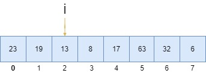

# 线性查找法

> 线性查找法介绍

线性查找法，也称为顺序查找法，是一种简单的搜索算法。它从列表的开头开始逐个比较每个元素，直到找到目标元素或搜索完整个列表。如果找到目标元素，则返回其位置；否则返回未找到的结果。线性查找法适用于小型列表或未排序的列表，时间复杂度为O(n)。对于大型或已排序的列表，应该使用更高效的搜索算法。

* 问题描述  
在人群中，找到生日是7月20号的人 
* 解决方案  
&emsp;第一个人：不是  
&emsp;第二个人：不是  
&emsp;第三个人：不是  
&emsp;...  
&emsp;第947个人：是  
&emsp;...  

其实就是通过遍历的方式查找到目标值

> 需要解决的实际编程问题

* 整型数组



* 问题：在整型数组中查找到目标元素16
* 输入：数组，目标元素
* 输出：目标元素所对应的索引，如果不存在该目标元素，返回-1

> 实现线性查找法

```java
/**
 * 线性查找法
 */
public class LinearSearch {

    /**
     * 如果不想要外部用户去创建该对象，可以私有
     */
    private LinearSearch(){};

    /**
     * @param data 查找的数组
     * @param target 要查找的值
     * @return 查找到的值的位置
     */
    private static int search(int[] data,int target){
        for(int i=0;i<data.length;i++){
            if(data[i]==target){
                return i;
            }
        }
        return -1;
    }

    /**
     * 启动方法
     */
    public static void main(String[] args) {
        int[] data={23,19,13,8,17,63,32,6};
        int result=LinearSearch.search(data,32);
        System.out.println(result);
        int result2=LinearSearch.search(data,666);
        System.out.println(result2);
    }
}
```

> 类对象的线性查找

如果类对象数组需要实现线性查找操作，需要用到泛型

* 注意点
    - 泛型支持的类型不可以是基本数据类型（boolean、byte、char、short、int、long、float、double），只能是类对象
    - 每个基本数据类型都有对应的包装类（Boolean、Byte、Character、Short、Integer、Long、Float、Double）
```java
/**
 * 线性查找法
 */
public class LinearSearch {

    /**
     * 不想要外部用户去new，可以私有
     */
    private LinearSearch(){};

    /**
     * 这个方法用到类型E，具体是什么，不指定
     * @param data 查找的数组
     * @param target 要查找的值
     * @return 查找到的值的位置
     */
    private static <E> int search(E[] data,E target){
        for(int i=0;i<data.length;i++){
            /*==判断的是引用相等，equals判断的是值相等*/
            if(data[i].equals(target)){
                return i;
            }
        }
        return -1;
    }

    /**
     * 启动方法
     */
    public static void main(String[] args) {
        /*Java无法把基础数据类型数组转化成包装的数据类型数组*/
        Integer[] data={23,19,13,8,17,63,32,6};
        /*泛型只能接受类对象，而不能接受基本数据类型，java也支持<Integer>代表泛型类型是Integer，可以省略的（类型推断）*/
        int result=LinearSearch.search(data,32);
        System.out.println(result);
        int result2=LinearSearch.search(data,666);
        System.out.println(result2);
    }

}
```

> 使用自定义类验证线性查找法

自定义类：学生类
```java
import java.util.Objects;
/**
 * 学生类
 */
public class Student{

    /**
     * 学生姓名
     */
    private String name;

    public Student(String name) {
        this.name = name;
    }

    public String getName() {
        return name;
    }

    public void setName(String name) {
        this.name = name;
    }

    /**
     * equals根据需求重写，根据自己需要如何判断学生相等，这里只要学生姓名名字相同就认定是同一个人
     */
    @Override
    public boolean equals(Object o) {
        /*比较内存引用地址*/
        if (this == o){
            return true;
        }
        /*判空*/
        if (o == null){
            return false;
        }
        /*判断是不是同一个类*/
        if(getClass() != o.getClass()){
            return false;
        }
        Student student = (Student) o;
        return Objects.equals(this.name, student.name);
    }

    @Override
    public int hashCode() {
        return Objects.hash(name);
    }

}
```

实现线性查找法
```java
/**
 * 线性查找法
 */
public class LinearSearch {

    /**
     * 不想要外部用户去new，可以私有
     */
    private LinearSearch(){};

    /**
     * 这个方法用到类型E，具体是什么，不指定
     * @param data 查找的数组
     * @param target 要查找的值
     * @return 查找到的值的位置
     */
    private static <E> int search(E[] data,E target){
        for(int i=0;i<data.length;i++){
            /*==判断的是引用相等，equals判断的是值相等，如果是对象，要重写equals方法*/
            if(data[i].equals(target)){
                return i;
            }
        }
        return -1;
    }

    /**
     * 启动方法
     */
    public static void main(String[] args) {
        /*对象数组*/
        Student[] students={new Student("滕媛艳"),new Student("云栋"),new Student("穆卿"),new Student("时瑗琰"),new Student("杨钧冠")};
        /*要查找的对象*/
        Student needSearchStudent=new Student("穆卿");
        int result3=LinearSearch.search(students,needSearchStudent);
        System.out.println(result3);
    }

}
```