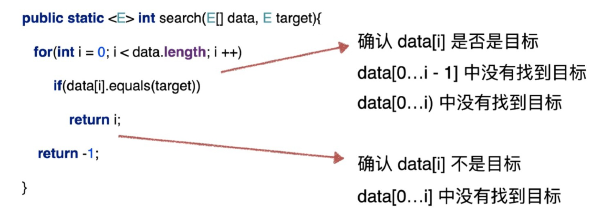

# 循环不变量

> 含义

循环的任务就是维护循环不变量。循环不变量是指在循环体内部，某个条件始终保持不变的一个表达式或性质。在循环开始之前，循环不变量已经成立；在每次循环迭代之后，循环不变量仍然保持成立。通过使用循环不变量，我们可以证明循环的正确性，即在循环结束时，我们可以保证所需的条件已经满足。循环不变量在程序设计和算法分析中都有广泛的应用。

> 示例

循环体本质就是在维持循环不变量，如果循环不变量不能维持，那么循环逻辑也就终止了。在写循环逻辑的时候，一点要清楚，循环的目的是在干什么，一定要清楚函数的功能。

以线性查找法为例，当使用线性查找法查找某个元素时，我们可以定义一个循环不变量，以确保搜索的正确性：
假设我们要在列表中查找元素x，我们可以定义循环不变量为：在前i个元素中，x不在列表中，或者x是第j个元素（j<i），即x要么不存在于前i个元素中，要么存在于前i个元素中的某个位置j上。
在每次循环迭代中，我们检查当前元素是否等于x，如果相等，则返回该元素的位置；如果不相等，则将i加1，继续循环。通过每次检查当前元素是否等于x，我们可以保证循环不变量在每次迭代后仍然成立。
当循环结束时，如果x存在于列表中，那么x一定是第j个元素（j<i），因为在前i个元素中，x要么不存在，要么存在于某个位置j上。如果x不存在于列表中，那么i会增加到n，循环结束，返回未找到的结果。
因此，可以使用循环不变量来证明线性查找法的正确性，即在循环结束时，如果目标元素存在于列表中，则返回其位置，否则返回未找到的结果。

* 输入：数组和目标元素。
* 输出：目标元素所在的索引，如果不存在，返回-1。
* 线性查找法的循环不变量：data[0...i-1]中没有找到目标。

