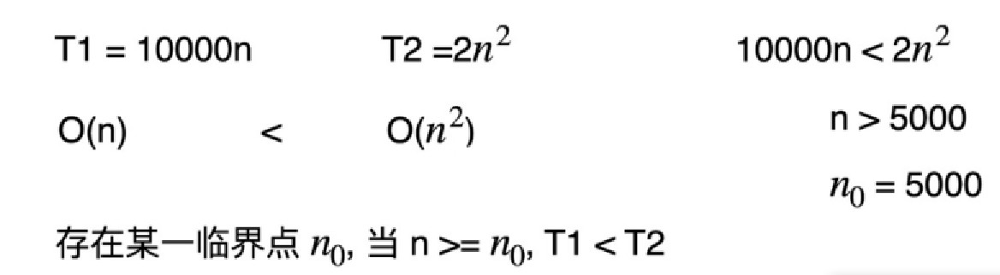
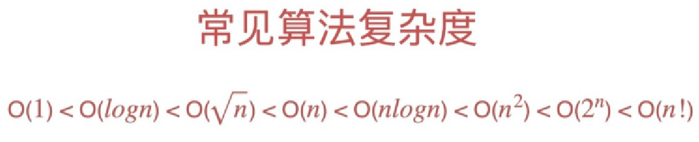

# 复杂度分析

复杂度分析：表示算法的性能

注重工程的程序员，是不需要特别理论化的内容来进行复杂度分析，可以通过运行测试用例评估一下算法，比较不同算法
带来的性能差异，运行不同算法进行比较的时候，需要保证运行程序的机器性能是完全一致的，系统的状态也是完全一致的，
测试的结果只和测试用例相关。

一般来说，先了解这个算法的思想，通过简单计算得到的时间和空间复杂度，来评估性能是优是劣，然后再决定是否使用编码实现这个算法。

也根据测试用例的不同，同一算法，对于同样规模的数据量，执行的时间也是不一样的，比如线性查找算法，可能正好循环第一个就命中结果，糟糕的
情况下循环到最后一个值才命中结果，所以要多次测试，选择不同的测试用例进行测试，通常是看最差的情况，算法复杂度的评估要反映出最差的情况。

以线性查找法为例

```java
/**
 * 线性查找法
 */
public class LinearSearch {

    /**
     * 这个方法用到类型E，具体是什么，不指定
     * @param data 查找的数组
     * @param target 要查找的值
     * @return 查找到的值的位置
     */
    private static <E> int search(E[] data,E target){
        for(int i=0;i<data.length;i++){
            /*==判断的是引用相等，equals判断的是值相等*/
            if(data[i].equals(target)){
                return i;
            }
        }
        return -1;
    }

}
```
我们不去仔细的分析执行这一轮循环需要多少指令，我们只需要知道整个线性查找算法的时间复杂度和数组的大小即数组的长度的数据规模成正比就好了，如果成正比关系，就计做O(n)算法。

复杂度描述的是随着数据规模n的增大，算法性能的变化趋势，一个O(n)的算法是优于O(n^2)的，数据规模越大，算法性能差距越明显。

如图所示：当数据规模超过5000，O(n)的算法性能优于O(n^2)  


## 常见的算法复杂度

下面列的常见复杂度的例子大都是关于时间复杂度，空间复杂度和时间复杂度是完全同理的，空间复杂度表示的是开辟的空间大小和数据规模的关系，平时在工作中，不太强调空间复杂度，更加强调时间复杂度的重要性。


### O(1)

> O(1)的时间复杂度

无论数据规模n是多大，只需要判断一次

```java
public class Demo {

    /**
     * 判断数据规模n的数量是否是偶数
     */
    public static boolean judgeEvenNumber(int n){
        return n%2==0;
    }

}
```

> O(1)的空间复杂度

线性查找法的空间复杂度为O(1)
```java
/**
 * 线性查找法
 */
public class LinearSearch {

    /**
     * 这个方法用到类型E，具体是什么，不指定
     * @param data 查找的数组
     * @param target 要查找的值
     * @return 查找到的值的位置
     */
    private static <E> int search(E[] data,E target){
        for(int i=0;i<data.length;i++){
            /*==判断的是引用相等，equals判断的是值相等*/
            if(data[i].equals(target)){
                return i;
            }
        }
        return -1;
    }

}
```

### O(logn)

O(logn)复杂度不关注它的底是多少，O(log2^n)、O(log10^n)的复杂度都是O(logn)

以二分查找法为例，n的数据规模每次都会除以2得到新的数据规模，每次循环都是除以2，数据规模越来越小，所以得到结果的速度很快，是O(logn)的级别
```java
class ArrayDemo
{
  public static void main(String[] args)
  {
    int[] arr={13,15,19,28,33,45,78,106};
    int index=binarySearch(arr,78);
    System.out.println("index="+index);
  }
  static int binarySearch(int[] arr,int key)
  {
    int max,min,mid;
    min=0;
    max=arr.length-1;
    mid=(max+min)/2;
    while(arr[mid]!=key)
    {
      if(key>arr[mid])
        min=mid+1;
      else if(key<arr[mid])
        max=mid-1;
      if(max<min)
        return -1;
      mid=(max+min)/2;
    }
    return mid;
  }
}
```
如果一段代码的时间复杂度是O(logn)，我们循环执行n遍，时间复杂度就是O(nlogn)了

### O(n^2)

一个数组中的元素可以组成哪些数据对，需要对数据规模n，双重遍历

```java
public class Demo {

    /**
     * 判断一个数组中的元素可以组成哪些数据对
     */
    public static int count(int[] data){
        int count=0;
        for(int i=0;i<data.length;i++){
            for(int j=i+1;j<data.length;j++){
                count++;
            }
        }
        return count;
    }

    public static void main(String[] args) {
        System.out.println(count(new int[]{1,2,3}));
    }


}
```

### O(2^n)

获取长度为n的二进制数字，的各种组合  
每个位置都可能填0或者1，每个位置都有两种可能性，连续多个2乘起来

```java
public class Demo {

    /**
     * 长度为n的二进制数字
     */
    public static int count(int length){
        int count=1;
        for(int i=0;i<length;i++){
            count=count*2;
        }
        return count;
    }

    public static void main(String[] args) {
        System.out.println(count(3));
    }

}
```

### O(n!)

阶乘

举例：获取长度为n的数组的所有排列

```java
public class Demo {

    static void printAllRecursive(
            int n, int[] elements, char delimiter) {

        if(n == 1) {
            printArray(elements, delimiter);
        } else {
            for(int i = 0; i < n-1; i++) {
                printAllRecursive(n - 1, elements, delimiter);
                if(n % 2 == 0) {
                    swap(elements, i, n-1);
                } else {
                    swap(elements, 0, n-1);
                }
            }
            printAllRecursive(n - 1, elements, delimiter);
        }
    }

    private static void swap(int[] input, int a, int b) {
        int tmp = input[a];
        input[a] = input[b];
        input[b] = tmp;
    }

    private static void printArray(int[] input,char delimiter) {
        System.out.print('\n');
        for(int i = 0; i < input.length; i++) {
            System.out.print(input[i]+String.valueOf(delimiter));
        }
    }

    public static void main(String[] args) {
        printAllRecursive(5,new int[]{3,7,8,9,5},' ');
    }
}
```

## 常见算法复杂度比较



我们的目标是尽可能写出时间复杂 度低的算法。