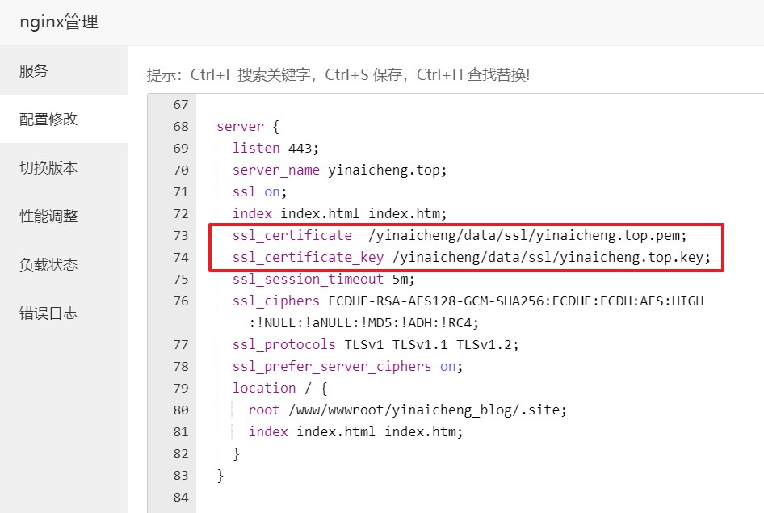

# 其他

nginx网关如果设置了超时时间会怎么样
如果Nginx网关设置了超时时间，当客户端请求的响应时间超过该超时时间时，Nginx网关将主动终止连接并返回一个错误响应。这可以避免无限期等待响应，从而减少资源消耗和提高系统的可用性。然而，过短的超时时间可能会导致有效请求被误报为超时，因此需要根据具体情况权衡超时时间的设置。

# 申请免费的SSL证书

https://yundun.console.aliyun.com/

阿里云_数字证书管理服务

下载SSL证书

上传证书到linux服务器，并且Nginx配置SSL证书

