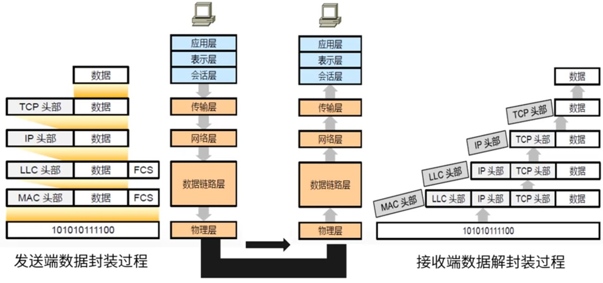
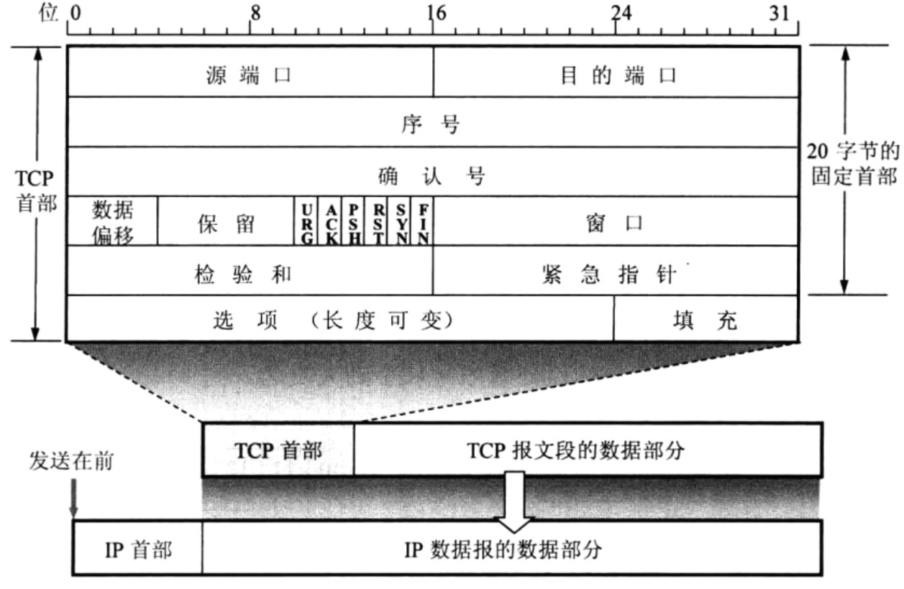
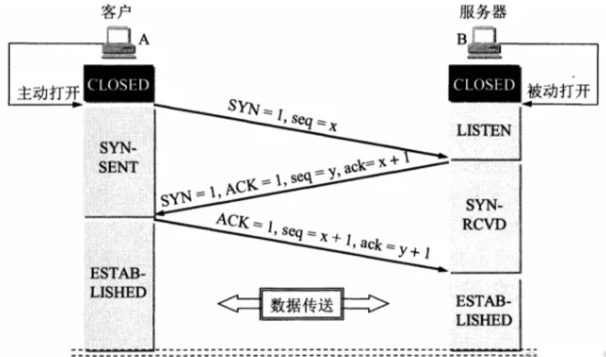
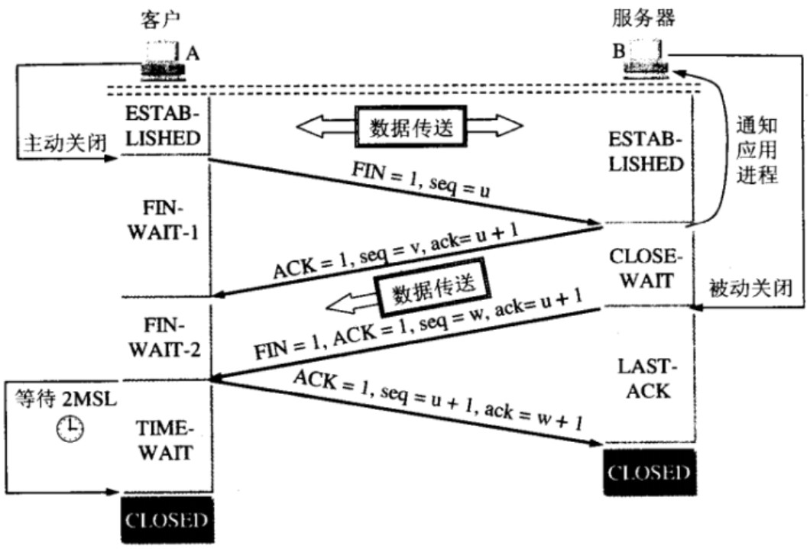
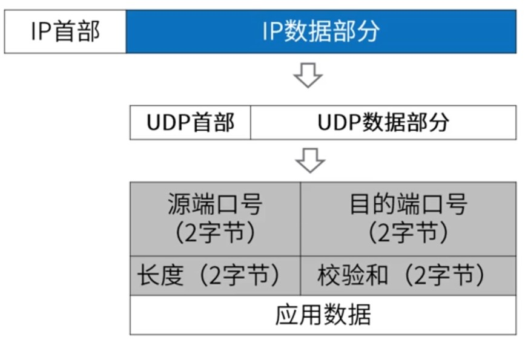

# TCP_UDP协议

## OSI网络七层模型

为使不同计算机厂家的计算机能够互相通信，以便在更大的范围内建立计算机网络，有必要建立一个国际范围的网络体系结构标准。  
此标准就是OSI网络七层模型，OSI全称为Open System Interconnection，即开放系统互连，这是网络知识的基础。



各层的主要功能：
1. 低三层

* 物理层：主要定义物理设备标准，如网线的接口类型、光纤的接口类型、各种传输介质的传输速率等。它的主要作用是传输比特流，使得原始的数据比特流能够在物理介质上传输（由1、0转化为电流强弱来进行传输，到达目的地后再转化为1、0，也就是我们常说的数模转换与模数转换），这一层的数据叫做比特。
* 数据链路层：主要将从物理层接收的数据进行MAC地址（网卡的地址，每个网卡的MAC地址都是全球唯一的）的封装与解封装，通过校验、确认和反馈重发等手段，形成稳定的数据链路。常把这一层的数据叫做帧。在这一层工作的设备是交换机，数据通过交换机来传输。
* 网络层：进行路由选择和流量控制，主要将下层接收到的数据进行IP地址（例如192.168.0.1）的封装与解封装。在这一层工作的设备是路由器，路由器实现将数据包发送到指定的地点，常把这一层的数据叫做数据包。

2. 传输层

提供了可靠的端口到端口的数据传输服务，定义了一些传输数据的协议和端口号，如：TCP（Transmission Control Protocol传输控制协议，传输效率低、可靠性强，用于传输可靠性要求高、数据量大的数据），UDP（USer Datagram Protocol用户数据报协议，与TCP特性恰恰相反，用于传输可靠性要求不高、数据量小的数据）。主要是将从下层接收的数据进行分段和传输，到达目的地址后再进行重组，常常把这一层叫做段。
      

3. 高三层
* 会话层：通过传输层（端口号：传输端口与接收端口）建立数据传输的通路，负责建立、管理和终止进程之间的会话和数据交换。主要在你的系统之间发起会话或者接收会话请求（设备之间需要互相认识可以是IP也可以是MAC或者是主机名）。
* 表示层：主要是进行对接收的数据进行格式转化、数据加密与解密、压缩与解压缩等（也就是把计算机能够识别的东西转换成人能够识别的东西，如图片、声音等）。
* 应用层：主要是为用户终端的应用进程提供网络服务，比如说FTP（各种文件下载）、WEB（IE浏览）、QQ之类的，可以把终端应用理解成我们在设备屏幕上可以看到的东西，应用软件之间通信的过程就是层与层之间封包与解封包的过程。

OSI网络七层模型虽然设计精细，但是过于麻烦，效率不高，因此才产生了简化版的TCP/IP四层网络模型。

## Socket编程

Internet中应用最广泛的网络应用编程接口，实现与3种应用协议接口：
* 数据报类型套接字SOCK_DGRAM（面向UDP接口）
* 流式套接字SOCK_STREAM（面向TCP接口）
* 原始套接字SOCK_RAW（面向网络层协议接口IP、ICMP等）

主要socket API及其调用过程


Socket API函数定义
* listen()、accept()函数只能用于服务器段；
* connect()函数只能用于客户端；
* socket()、bind()、send()、recv()、sendto()、recvfrom()、close()

服务端代码示例
```java
import org.slf4j.Logger;
import org.slf4j.LoggerFactory;
import java.io.BufferedReader;
import java.io.InputStream;
import java.io.InputStreamReader;
import java.net.ServerSocket;
import java.net.Socket;
import java.nio.charset.Charset;
/**
 * BIO服务端
 * @author: yinaicheng
 */
public class BIOServer {

    /**
     * 默认编码格式
     */
    private static final Charset UTF8=Charset.forName("UTF-8");

    /**
     * BIO服务端日志
     */
    private static final Logger logger = LoggerFactory.getLogger(BIOServer.class);

    /**
     * 服务端提供服务的端口号
     */
    private static final Integer PORT=8080;

    public static void main(String[] args) {
        try(ServerSocket serverSocket=new ServerSocket(PORT)){
            logger.info("服务器启动成功");
            /*如果服务器没关闭*/
            while (!serverSocket.isClosed()){
                /*阻塞请求*/
                Socket request=serverSocket.accept();
                logger.info("收到新连接：{}",request.toString());
                /*接收数据并且打印*/
                try(InputStream inputStream=request.getInputStream();
                    BufferedReader reader=new BufferedReader(new InputStreamReader(inputStream,UTF8))){
                    String msg;
                    while((msg=reader.readLine())!=null){
                        /*没有数据，阻塞*/
                        if(msg.length()==0){
                            break;
                        }
                        /*有数据打印*/
                        System.out.println(msg);
                    }
                    logger.info("收到数据，来自{}",request.toString());
                }
                catch (Exception exception){
                    logger.error("接收数据并且打印异常，原因是{}",exception.getMessage());
                }
            }
        }
        catch (Exception exception){
            logger.error("ServerSocket异常，原因是{}",exception.getMessage());
        }
    }

}
```

客户端代码示例
```java
import org.slf4j.Logger;
import org.slf4j.LoggerFactory;
import java.io.OutputStream;
import java.net.Socket;
import java.nio.charset.Charset;
import java.util.Scanner;
/**
 * BIO客户端
 * @author: yinaicheng
 */
public class BIOClient {

    /**
     * BIO客户端日志
     */
    private static final Logger logger = LoggerFactory.getLogger(BIOClient.class);

    /**
     * 端口号，通过端口号定位要发送的计算机的程序
     */
    private static final Integer PORT=8080;

    /**
     * 默认编码格式
     */
    private static final Charset UTF8=Charset.forName("UTF-8");

    public static void main(String[] args){
        try(Socket s=new Socket("localhost",PORT);
            OutputStream out=s.getOutputStream();
            Scanner scanner=new Scanner(System.in)){
            logger.info("请输入：");
            String message=scanner.nextLine();
            /*阻塞，写完成*/
            out.write(message.getBytes(UTF8));
        }
        catch (Exception exception){
            logger.error("Socket或OutputStream或Scanner异常，原因是{}",exception.getMessage());
        }
    }
}
```

先启动服务端，控制台输出

```log
02:37:18.160 [main] INFO top.yinaicheng.demo.networkprogramme.BIOServer - 服务器启动成功
```

再启动客户端，控制台输出
```log
02:37:31.891 [main] INFO top.yinaicheng.demo.networkprogramme.BIOClient - 请输入：
```

客户端控制台输出一些内容
```log
02:37:31.891 [main] INFO top.yinaicheng.demo.networkprogramme.BIOClient - 请输入：
测试
```

服务端控制台能够打印出一些结果
```log
02:37:18.160 [main] INFO top.yinaicheng.demo.networkprogramme.BIOServer - 服务器启动成功
02:37:31.879 [main] INFO top.yinaicheng.demo.networkprogramme.BIOServer - 收到新连接：Socket[addr=/127.0.0.1,port=65375,localport=8080]
测试
02:37:36.840 [main] INFO top.yinaicheng.demo.networkprogramme.BIOServer - 收到数据，来自Socket[addr=/127.0.0.1,port=65375,localport=8080]
```

## 传输控制协议TCP

传输控制协议（TCP）是Internet一个重要的传输层协议，TCP提供面向连接、可靠、有序、字节流传输服务，主要解决传输的可靠、有序、无丢失和不重复问题。应用程序在使用TCP之前，必须先建立TCP连接。

> TCP报文段

TCP传送的数据单元称为报文段，一个TCP报文段分为TCP首部和TCP数据两部分，整个TCP报文段作为IP数据报的数据部分封装在IP数据报中。

TCP报文段，既可以用来运载数据，又可以用来建立连接、释放连接和应答。



各字段意义如下：
1. 源端口和目的端口字段：各占2B，端口是运输层与应用层的服务端口，运输层的复用和分用功能都要通过端口实现。
2. 序号字段：占4B，TCP是面向字节流的，所以TCP连接传送的数据流中的每个字节都编上一个序号，序号字段的值指的是本报文段所发送的数据的第一个字节的序号。
3. 确认号字段：占4B，是期望收到对方的下一个报文段的数据的第一个字节的序号，若确认号为N，则表明到序号N-1的所有数据都已正确收到。
4. ...

标志位说明：
* URG：紧急指针
* ACK：确认序号
* PSH：有DATA数据传输
* RST：连接重置
* SYN：建立连接
* FIN：关闭连接

> TCP的三次握手建连过程

TCP是基于连接的，所以在传输数据前需要先建立连接，TCP在传输上是双工传输，不区分客户端与服务端，为了便于理解，我们把主动发起建立连接请求的一端称为客户端，把被动建立连接请求的一端称为服务端。

首先建立连接前需要服务端先监听端口，因此服务端建立连接前的初始状态是LISTEN状态，这时候客户端准备先建立连接，先发送一个SYN同步包，发送完同步包后，客户端的连接状态变成SYN_SENT状态，服务端收到SYN后并且同意建立连接后，会向客户端回复一个ACK。

由于TCP是双工传输，服务端也会同时向客户端发送一个SYN，申请服务端向客户端方向建立连接，发送完ACK和SYN后，服务端的连接状态就变成了SYN_RCVD。

客户端收到服务端的ACK后，客户端的连接状态就变成了ESTABLISHED状态，同时，客户端向服务端发送ACK，回复服务端的SYN请求。

服务端收到客户端的ACK后，服务端的连接状态就变成了ESTABLISHED状态，此时建连完成，双方随时可以进行数据传输。




> TCP的四次挥手断连过程

TCP连接的关闭，通信双方都可以先发起，我们暂时把先发起的一方看作客户端，从图中看出，通信中客户端和服务端两端的连接都是ESTABLISHED状态，然后客户端先主动发起了关闭连接请求，客户端向服务端发送了一个FIN包，表示客户端已经没有数据要发送了，然后客户端进入了FIN_WAIT_1状态。

服务端收到FIN后，返回ACK，然后进入CLOSE_WAIT状态，此时服务端属于半关闭状态，因为此时客户端向服务端方向已经不会发送数据了，可是服务端向客户端可能还有数据要发送。

当服务端数据发送完毕后，服务端会向客户端发送FIN，表示服务端也没有数据要发送了，此时服务端进入LAST_ACK状态，就等待客户端的应答就可以关闭连接了。

客户端收到服务端的FIN后，回复ACK，然后进入TIME_WAIT状态，TIME_WAIT状态下需要等待2倍的最大报文段生存时间，来保证连接的可靠关闭，之后才会进入CLOSED关闭状态，而服务端收到ACK后直接就进入CLOSED状态。



## 用户数据报协议UDP

用户数据报协议UDP是Internet传输层协议，提供无连接、不可靠、数据报尽力传输服务，它只是做了传输协议能够做的最少工作，它仅在IP的数据报服务之上增加了两个最基本的服务：复用和分用以及差错检测。

开发应用人员在UDP上构建应用，关注以下几个优点：
1. 应用进程更容易控制发送什么数据以及何时发送
2. 无需建立连接
3. 无连接状态
4. 首部开销小

> udp报文段

UDP数据报包含两部分：UDP首部和用户数据，整个UDP数据报作为IP数据报的数据部分封装在IP数据报中



各字段意义如下：
1. 源端口：在需要对方回信时选用，不需要时可用全0。
2. 目的端口：目的端口号，这在终点交付报文时必须使用到。
3. 长度：UDP数据报的长度，包括首部和数据，其最小值是8（仅有首部的情况）。
4. 校验和：检测UDP数据报在传输中是否有错，有错就丢弃，该字段是可选的，当源主机不想计算校验和时，则直接令该字段全为0。

什么情况下用到UDP：对数据可靠性要求不高的场景，如语言视频聊天、看直播等，丢失一些数据没有太大影响的场景。

## UDP和TCP比较

|      TCP       |    UDP     |
| :------------: | :--------: |
|    面向连接    |   无连接   |
| 提供可靠性保证 |   不可靠   |
|       慢       |     快     |
|   资源占用多   | 资源占用少 |
